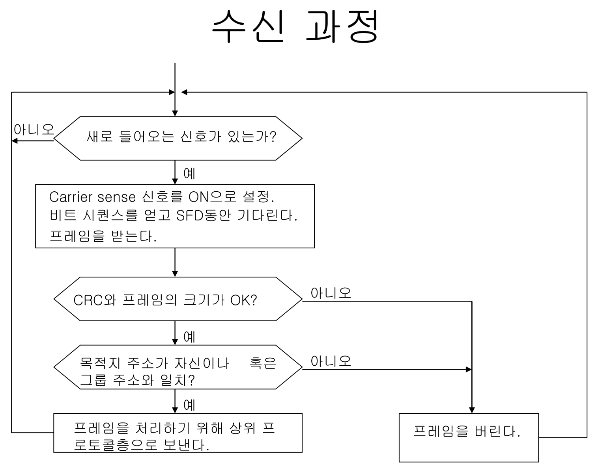

# <span style="color: #D6ABFA;">⚪이더넷이란</span>

- LAN, WAN 등 대부분의 네트워크 환경에서 사용되는 프로토콜
- IEEE 802.3 규약으로 표준화되어 있음
- OSI 7계층에서 2계층에 속함 (1계층에도 약간 연관)

<br>

<br>

<br>

# <span style="color: #D6ABFA;">⚪이더넷 헤더</span>


OSI 모델이나 TCP/IP모델에서는 각 계층에 헤더를 붙임

이더넷은 OSI모델에서는 데이터 링크 계층(2계층), TCP/IP모델에서는 네트워크 계층에 해당됨

이 (osi 2계층)계층에서 **이더넷 헤더** 와 **트레일러** 를 붙이게됨

그리고 이렇게 ''이더넷 헤더와 트레일러가 추가된 데이터''를 **프레임**이라고 함

- **헤더 ( Header )** : 네트워크 전송을 할 수 있게 데이터를 인캡슐레이션 할 때 데이터의 앞에 넣는 제어 정보
- **트레일러 ( Trailer )** : 네트워크 전송을 할 수 있게 데이터를 인캡슐레이션 할 때 데이터에 덧붙여지는 제어 정보

<br>


이더넷 헤더는 총 14바이트로 이루어져 있다

여기서 **이더넷 유형(Ethernet type)**은 이더넷으로 전송되는 상위 계층 프로토콜의 종류를 나타내는데, 식별하는 16진수 번호가 들어감


<br>


프레임(이더넷 헤더와 트레일러가 추가된 데이터)는 위와 같은 형식임

> 요약: 🔸데이터 링크 계층에서 데이터에 이더넷 헤더와 트레일러를 추가하여 **프레임**을 만들고, 🔸물리 계층에서 이 프레임 비트열을 전기 신호로 변환하여 네트워크를 통해 전송함

<br>

<br>

<br>

# <span style="color: #D6ABFA;">⚪CSMA/CD</span>


여러 컴퓨터가 동시에 데이터를 전송했을때 충돌(Collision)이 발생하면 안되기때문에, 이더넷은 이를 해결할 수 있는 방법인 CSMA/CD를 사용한다. (여러 노드가 하나의 bus(링크)를 공유하는 상황. 버스 토폴로지 라고도 함)

- **CS** : carrier sense. 전송 전에 회선의 상태를 확인
- **MA** : multiple access. 2개 이상의 노드가 동시에 네트워크 상에 데이터를 실어 보내는 다중 접근
- **CD** : collision Detection. 충돌 감지

## 🔹CSMA/CD의 작동 방식


- CS를 했을때 아무것도 링크를 지나지 않은 **idle** 상태라면

  - 즉시 전송. 1-persistent라 불림 (p-persistent란 p의 확률로 들어가고 (1-p)의 확률로 대기하고 들어가는 것)

  - 링크를 독점하면 안되기때문에 메시지 사이즈의 상한선은 1500바이트

  - 마찬가지로 독점을 방지하기 위해서 9.6**µ** sec만큼 기다렸다가 다음 프레임을 보낼 수 있음  

- 회선이 사용중이라면

  - 유휴 상태가 될때까지 대기하였다가 즉시 전송 

- 충돌이 발생하였다면(CD)

  - 송신자는 최악 충돌 시나리오인 51.2μs 동안 cd를 해야함
  - 10Mbps기준, 최악충돌 시나리오를 고려했을때  51.2μs X 10Mbps= 512 bit 크기가 전송 프레임의 최소 길이(64바이트)
  - 512bit보다 작으면 이더넷은 padding으로 크기를 키워서 보냄
  - 충돌을 감지하면 잼(jam signal. 충돌났으니까 버려)신호를 발송하고 프레임 전송을 멈춤
  - 지수 백오프(exponential backoff)를 수행함.

```
오늘날에는 대부분 이더넷 스위치를 사용하여 스위치 방식의 네트워크를 구성하기 떄문에, 
이 경우는 충돌이 일어나지 않아서 CSMA/CD를 사용할 필요가 없음. 위 예시들은 리피터를 사용했을때의 문제임
```

<br>

<br>

<br>

# <span style="color: #D6ABFA;">⚪전송/수신 과정 요약</span>

## 🔹전송 과정


## 🔹수신 과정



<br>

<br>

<br>

# <span style="color: #D6ABFA;">⚪이더넷 사용 경험</span>

## 🔹실제 관찰 결과

- 10~200개의 호스트(1024개가 사용되지는 않음)
- 길이는 1500m보다 짧음 (RTT의 경우는 51μs보다 5μs에 가깝다)
- 패킷의 길이는 bimodal(짧은건 약 80, 긴건 약 1500)의 형태로 나타남  
  
- 상위 수준의 흐름 제어(flow control)와 호스트 성능이 부하를 제한

## 🔹권장 사항

- 과부화를 피할 것(최대 30%의 효율)  
  
- 컨트롤러를 정확하게 구현
- 큰 패킷을 사용
