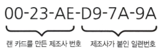

# ⚪MAC 주소란

- Media Access Control Address
- NIC(Network Interface Card = 랜카드) 에 할당된 고유 주소
- 전 세계에서 유일한 번호로 할당되어 있음
- OSI 7계층 중 2계층에서 네트워크 통신을 위해 할당된 고유 식별자 (이더넷헤더에서 사용됨)

 

 

# ⚪형식

- 48비트 숫자로 구성되어 있음
- 앞쪽 24비트는 랜카드를 만드는 제조사 번호
- 뒤쪽 24비트는 랜카드에 붙인 일련번호
