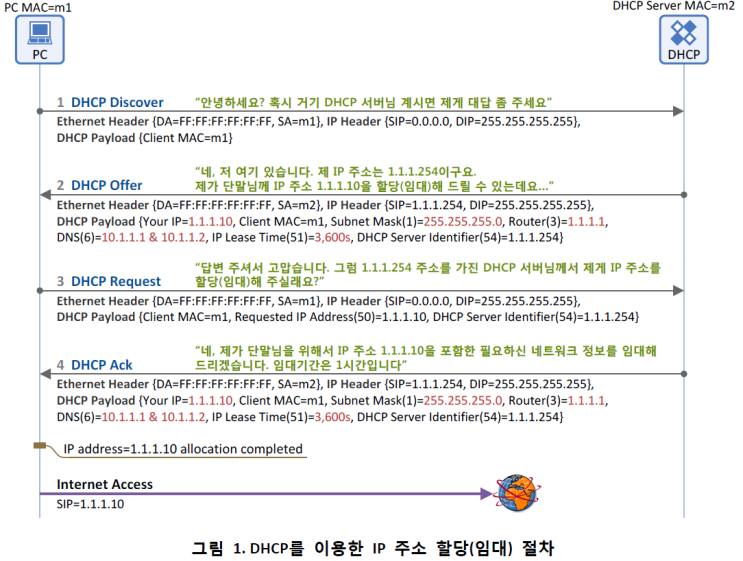
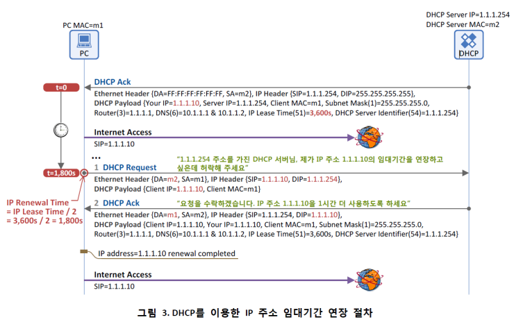
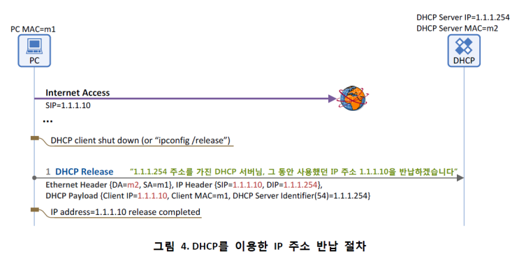

# ⚪DHCP란

- Dynamic Host Configuration Protocol의 약자
- 호스트의 IP주소와 각종 TCP/IP프로토콜의 기본 설정을 자동으로 제공해주는 프로토콜
- 자동으로 DNS서버 주소, ip주소, 게이트웨이 주소를 호스트에게 자동으로 할당해줌

 

 

 

# ⚪DHCP 작동 방식

## 🔹IP 할당(임대) 절차

1. **DHCP Discover** :   
   - 단말이 부팅을 하면 동일 서브넷(랜)에 위치하는 DHCP 서버를 찾기 위해 DHCP Discover 메시지를 이더넷 망에 브로드캐스팅함(이더넷 헤더의 Destination MAC이 Broadcast MAC=FF:FF:FF:FF:FF:FF)
   - [주요 파라미터]
     - **Client MAC** : 단말의 MAC 주소
2. **DHCP Offer** :   
   - 메시지 내에는 단말이 필요로 하는 네트워크 정보들(단말 IP 주소, Subnet Mask, Default Gateway IP 주소, DNS IP 주소, Lease Time 등)이 포함되어 있음
   - 브로드캐스트 메시지 (Destination MAC = FF:FF:FF:FF:FF:FF)이거나 유니캐스트일수 있음. 이는 단말이 보낸 DHCP Discover 메시지 내의 Broadcast Flag의 값에 따라 달라지는데, 이 Flag=1이면 DHCP 서버는 DHCP Offer 메시지를 Broadcast로, Flag=0이면 Unicast로 보내게 됨
   - [주요 파마리터]
     - **Client MAC** : 단말의 MAC 주소
     - **Your IP** : 단말에 할당(임대)할 IP 주소
     - **Subnet Mask** (Option 1)
     - **Router** (Option 3) : 단말의 Default Gateway IP 주소
     - **DNS** (Option 6) : DNS 서버 IP 주소
     - **IP Lease Time** (Option 51) : 단말이 IP 주소(Your IP)를 사용(임대)할 수 있는 기간(시간)
     - **DHCP Server Identifier** (Option 54) : 본 메시지(DHCP Offer)를 보낸 DHCP 서버의 주소. 2개 이상의 DHCP 서버가 DHCP Offer를 보낼 수 있으므로 각 DHCP 서버는 자신의 IP 주소를 본 필드에 넣어서 단말에 보
3. **DHCP Request** :
   -  단말은 DHCP 서버(들)의 존재를 알았고, DHCP 서버가 단말에 제공할 네트워크 정보(IP 주소, subnet mask, default gateway등)를 알았음
   - 이제 단말은 DHCP Request 메시지를 통해 하나의 DHCP 서버를 선택하고 해당 서버에게 "단말이 사용할 네트워크 정보"를 요청함 
   - 모든 DHCP 서버들이 DHCP Request 메시지를 받을 수 있도록 브로드캐스팅하는 이유는 각 DHCP 서버가 DHCP Offer 메시지를 보내면서 해당 단말에 할당해 줄 IP 주소와 기타 정보를 내부적으로 저장해 놓기 때문에 선택 받지 못한 DHCP 서버들이 이 IP 주소와 기타 정보들을 삭제할 수 있도록 하기 위함임
   - [주요 파라미터]
     - **Client MAC** : 단말의 MAC 주소
     - **Requested IP Address (Option 50)** : 난 이 IP 주소를 사용하겠다. (DHCP Offer의 Your IP 주소가 여기에 들어감)
     - **DHCP Server Identifier (Option 54)** : 2대 이상의 DHCP 서버가 DHCP Offer를 보낸 경우, 단말은 이 중에 마음에 드는 DHCP 서버 하나를 고르게 되고, 그 서버의 IP 주소가 여기에 들어감. 즉, DHCP Server Identifier에 명시된 DHCP 서버에게 "DHCP Request" 메시지를 보내어 단말 IP 주소를 포함한 네트워크 정보를 얻는 것임
4. **DHCP Ack**
   - 의미: DHCP 절차의 마지막 메시지로, DHCP 서버가 단말에게 "네트워크 정보"를 전달해 주는 메시지. 앞에 설명한 DHCP Offer의 '네트워크 정보' 와 동일한 파라미터가 포함됨
   - 브로드캐스트 메시지 (Destination MAC = FF:FF:FF:FF:FF:FF) 혹은 유니캐스트일수 있으며 이는 단말이 보낸 DHCP Request 메시지 내의 Broadcast Flag=1이면 DHCP 서버는 DHCP Ack 메시지를 Broadcast로, Flag=0이면 Unicast로 보내게 됨
   - [주요 파라미터]
     - **Client MAC** : 단말의 MAC 주소
     - **Your IP** : 단말에 할당(임대)할 IP 주소
     - **Subnet Mask** (Option 1)
     - **Router**(Option 3) : 단말의 Default Gateway IP 주소
     - **DNS** (Option 6) : DNS 서버 IP 주소
     - **IP Lease Time (Option 51)** : 단말이 본 IP 주소(Your IP)를 사용(임대)할 수 있는 기간(시간)
     - **DHCP Server Identifier** (Option 54) : 본 메시지(DHCP Ack)를 보낸 DHCP 서버의 주소

## 🔹IP 임대기간 연장 절차

1. **DHCP Request**
   - IP Lease Time(그림 3에서 임대기간은 1시간)의 절반이 되었을 때(1,800초, 즉 30분) 단말은 IP 주소 임대기간 연장을 위해 DHCP 서버에 DHCP Request 메시지를 송신함 (IP 주소 임대기간 연장 시에는 DHCP Discover/Offer 과정 없음)
2. **DHCP Ack**
   - DHCP Request 메시지를 수신한 DHCP 서버가 단말의 요청(IP 주소 연장 사용)을 수락하게 되면, DHCP Ack 메시지에 단말이 사용할 IP 주소, Subnet Mask, Default Gateway IP 주소, DNS IP 주소, Lease Time(단말이 IP 주소를 사용할 수 있는 시간) 등을 포함하여 단말에 전송
   - 이를 수신한 단말은 DHCP Ack 메시지에 포함된 IP Lease Time 동안 IP 주소를 연장 사용할 수 있게 됨

## 🔹IP 반납 절차

1. **DHCP Release**
   - 더 이상 임대 받았던 IP 주소가 필요치 않은 단말은 DHCP Release 메시지를 유니캐스팅(Destination MAC=DHCP Server MAC(m2), Destination IP=DHCP Server IP(1.1.1.254))으로 DHCP 서버에 전달하고, DHCP 서버는 DHCP Release 메시지 내에 Client IP 필드에 기록된 IP 주소(1.1.1.10)를 반환하게 됨