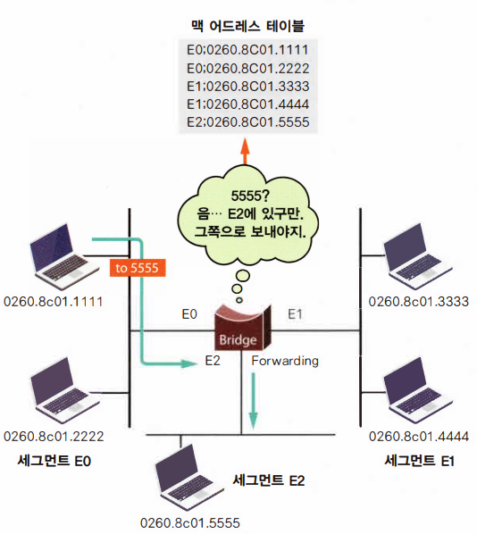

# ⚪리피터(Repeater)

  

    
  

  

    
  

- 1계층(Physical Layer, 물리계층)에서 동작
- 신호를 단순 증폭하기만 함 (노이즈도 같이 증폭됨)
- 가격이 싸고 단순한 구조
- 플러그 앤 플레이
- 무제한 길이는 불가능. 보통 최대 4개로 제한

 

 

 

# ⚪허브(Hub)

- 1계층(Physical Layer, 물리 계층)에서 동작
- 플러그 앤 플레이
- 리피터와 비슷하지만 리피터와 다르게 여러 호스트를 연결할 수 있음
- CSMA/CD 방식을 적용하고 있기 때문에 여러 장비에서 동시에 데이터를 전송하지 못함

 

 

 

# ⚪브릿지(Bridge)

- 2계층(DataLink Layer, 데이터 링크 계층)에서 동작

- 플러그 앤 플레이

- 패킷 프레임이 도착하면 출발 주소지를 해석해서 라우팅테이블을 만든다

- 세그먼트(콜리전 도메인)를 나눠 줌

- 5가지 기능이 존재

  - **Learning** :   
        
    맥 어드레스 테이블을 생성함
  - **Flooding** :  
      
    프레임이 찾아가는 주소를 보니 맥 어드레스 테이블에 존재하지 않는경우나 브로드캐스트 또는 멀티캐스트일때, 들어온 포트를 제외한 나머지 포트로 뿌려줌
  - **Forwarding** :  
       
    프레임의 목적지 주소가 어느 포트쪽에 있는지를 알고있을 경우, 그 쪽으로만 넘겨줌
  - **Filtering** :  
      
    출발지와 목적지가 같은 세그먼트에 위치할 경우, 다른 포트로 넘어가지 않게 막음.  
    즉, **콜리전 도메인을 나눠줌** (허브와의 큰 차이점)
  - **Aging** :  
    저장해둔 맥 어드레스 테이블을 영원히 유지하지 않고, 디폴트로 300초가 지나도록 더 이상 특정 출발지 주소를 가진 프레임이 들어오지 않으면 맥 어드레스 테이블에서 삭제함

  

 

 

 

# ⚪스위치(Switch)

- 2계층(DataLink Layer, 데이터 링크 계층)에서 동작

- 플러그 앤 플레이

- 브릿지의 업그레이드 판. 이제는 브릿지대신 스위치를 대부분 사용

- 브릿지와의 차이  

  >1. 스위치는 처리 방식이 하드웨어로 이루어지기 때문에 소프트웨어적으로 프레임을 처리하는 브 
  >리지에 비해서 훨씬 빠름
  >즉, 브리지의 경우는 프레임의 처리 방식이 소프트웨어적 프로그램에 의해서 처리되는 방식을 취하지만, 스위치의 경우는 처리 절차를 미리 집에 구워서 하드웨어 방식으로 만드는 ASIC(‘에이직’이라고 읽음. Appl ication-Specific Integrated Circuit의 약자) 방식이기 때문에 프레임 처리 속도가 브리지에 바해서 훨씬 빠름
  >
  >2. 브리지는 포트들이 같은 속도를 지원하는 반면, 스위치는 서로 다른 속도를 연결해줄 수 있는 기능을 제공함.
  >예를 들어 스위치는 10메가 포트와 100메가 포트가 한 장비에 같이 있게 되는데, 이는 서로 다른 속도를 연결해주는 기능을 수행함
  >
  >3. 스위치는 브릿지에 비해 제공하는 포트 수가 훨씬 많음. 즉 브리지는 대부분 2개에서 3개정도의 포트를 가지고 있는 반면 스위치는 몇십 또는 몇백 개의 포트를 제공할 수 있음

  

 

 

 

# ⚪라우터(Router)

- 3계층(Network Layer, 네트워크 계층)에서 동작
- 브로드캐스트 도메인을 나눠줌
- 패킷 필터링 기능을 제공
- 로드 분배(데이터가 여러 경로를 타고 날아갈 수 있게 하는 것. 스위치도 가능하나 제한적임)
- 상황에 따라 트래픽의 전송 순서를 조정해주는 QOoS(Quality of Service)기능 제공
- 라우터 기능을 하는 스위치를 L3 스위치라고도 부름