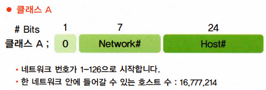
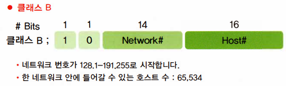
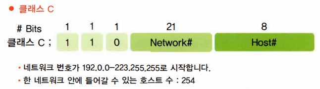
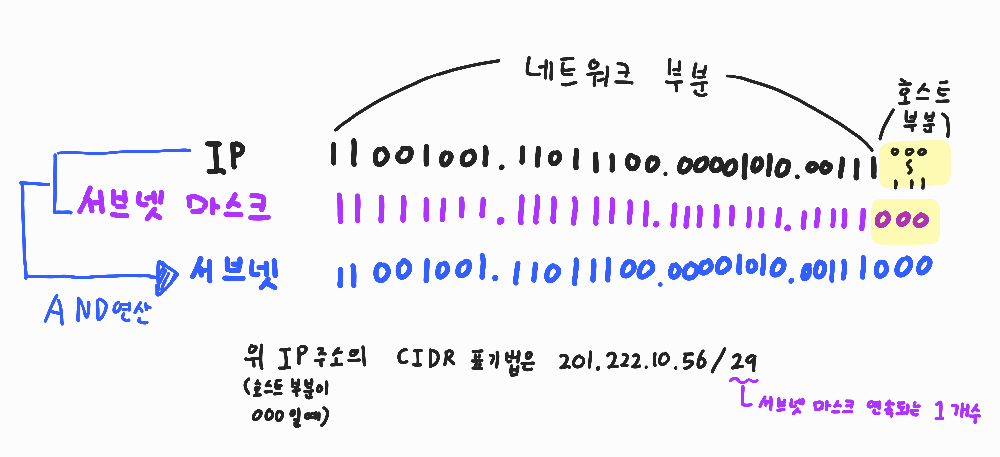

# ⚪IP주소의 Class

- IP주소는 32비트로 구성
- 8비트씩 끊어서 10진수로 변환하여 '.' 을 통해서 각 자리를 구분하여 표현
- 같은 네트워크 안이라면, IP들은 네트워크 영역은 같아야하고 호스트부분은 다 달라야 함
- IP를 부여해줄떄 클래스를 나누는 이유는 IP주소가 무한하지 않기 때문에 상황에 따라 적절하고 효율적으로 배분하기 위해서임
- 네트워크가 다른 두 장비의 통신은 라우터를 통해서만 가능함
- 호스트부분을 모두 0으로 채웠을때는 해당 네트워크를 나타날때임
- 호스트 부분을 모두 1로 채웠을때는 해당 네트워크에 대한 브로드캐스트주소를 의미함

## 🔹클래스 A

- 네트워크 부분이 0인것과 127은 제외됨

## 🔹클래스 B

## 🔹클래스 C

## 🔹클래스 D,E

- **클래스 D** : 224~239, 멀티캐스트용 주소
- **클래스 E** : 240~255, 연구용 주소

 

 

 

# ⚪서브넷마스크

- 할당받은 네트워크를 작은 네트워크 여러 개로 나누어 쓰기 위해서 서브넷 마스크를 사용함
- 서브넷 마스크를 가지고 나눈 서브넷들은 엄연히 다른 네트워크로 취급되기 때문에, 서로 간의 통신은 라우터를 통해서만 가능
- 서브넷 마스크를 이진수로 봤을 때 여러개의 1 사이에 0이 오면 안됨

위 IP는 C클래스이기 때문에 원래는 네트워크 부분이 24bit, 호스트 부분이 8bit였지만, 

위 서브넷 마스크를 쓰면 네트워크부분이 29bit, 호스트 부분이 3bit로 변경되어서, 

네트워크를 여러개의 서브넷으로 나누면서 각 네트워크당 호스트의 개수는 줄어드는 효과를 가져다 줌