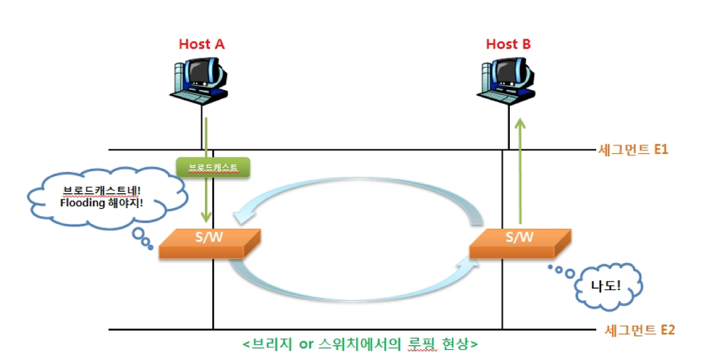
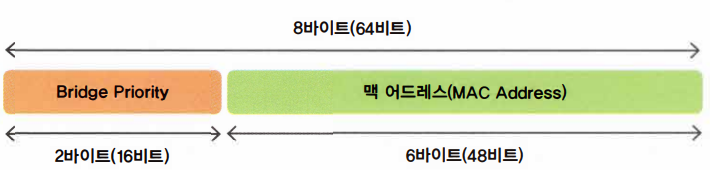
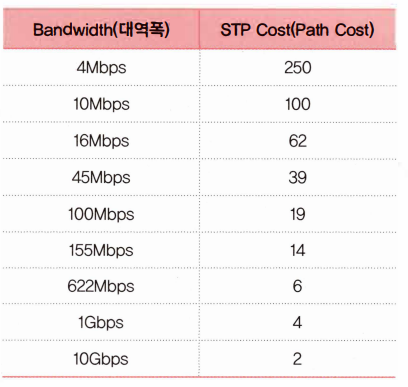
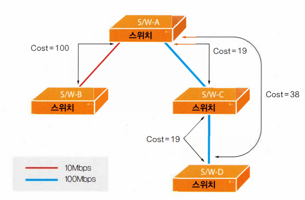
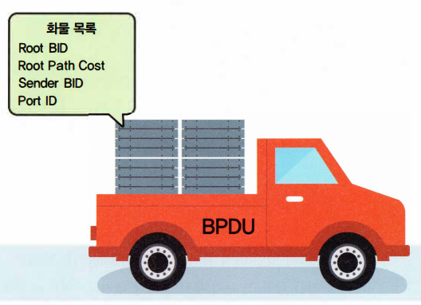
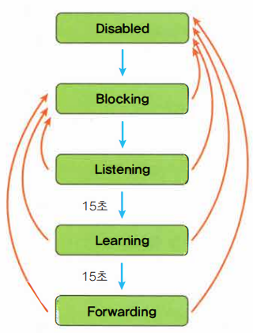
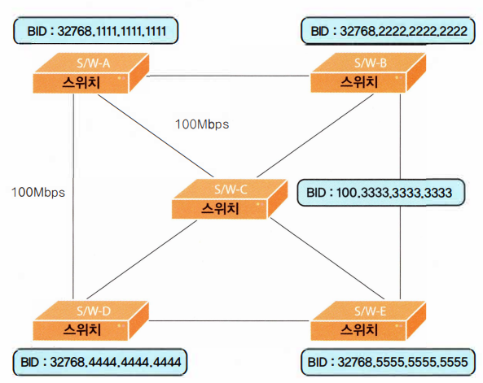
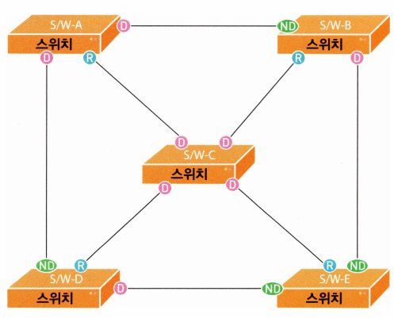
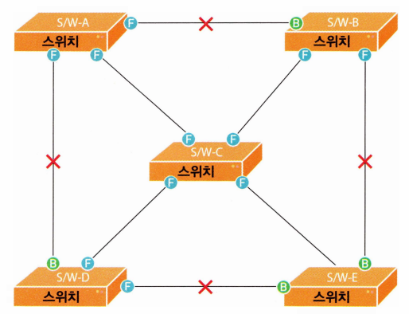
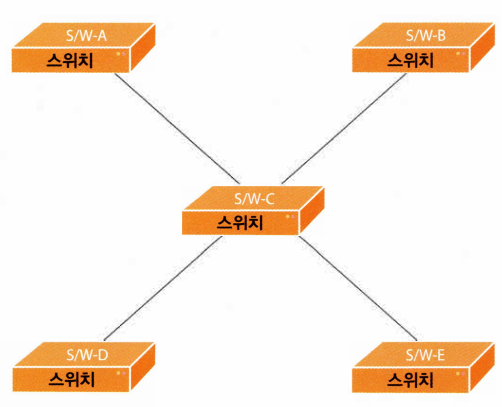

# ⚪스패닝 트리?

스패닝 트리 프로토콜(Spanning Tree Protocol, STP)은 스위치나 브리지에서 발생하는 **루핑**을 막아주기 위한 프로토콜임

**[루핑 이란?]**

스위치나 브리지 구성에서 출발지부터 목적지까지의 경로가 2개 이상 존재할 때, 1개의 경로만을 남겨두고 나머지는 모두 끊어두는 것이 근본적인 해결법임. 

 

 

 

# ⚪사전 지식

## 🔹브리지 ID (Bridge ID)

- 브리지뿐만이 아닌 스위치도 이 ID를 사용하는데, 마찬가지로 브리지 ID라고 부름
- 디폴트 Bridge Priority는 32768 (0~65535의 숫자중 중간값)

## 🔹Path Cost

- 브리지(스위치)가 얼마나 가까이, 그리고 빠른 링크로 연결되어 있는지를 알아내기 위한 값

- 낮을수록 우위에 있는 것

  

 

 

 

# ⚪3가지 기본 동작

1. 네트워크당 하나의 루트 브리지(Root Bridge)를 갖는다
2. 루트 브리지가 아닌 나머지 모든 브리지(Non Root Bridge)는 무조건 하나씩의 루트포트(Root Port)를 갖는다
3. 세그먼트(Segment)당 하나씩의 데지그네이티드 포트(Designated Port)를 갖는다

- **루트 브리지(Root Bridge)** : 스패닝 트리 프로토콜을 수행할 때 기준이 되는 브리지(스위치)
- **루트 포트(Root Port)** : 루트 브리지에 가장 빨리 갈 수 있는 포트
- **세그먼트(Segment)** : 브리지(스위치)간에 서로 연결된 링크
- **데지그네이티드 포트(Designated Port)** : 지정 포트

> 스패닝 트리 프로토콜에서 루트 포트나 데지그네이티드 포트가 아닌 나머지 모든 포트는 모두 **막음**!!!!!!!

 

 

 

# ⚪우선순위 비교

누가 루트 브리지가 될지를 정하고, 누가 루트 포트나 데지그네이티드 포트가 될지를 정하려면 순서가 필요함

아래의 4단계를 통해서 이런 순서를 정하게 됨

1. 누가 더 작은 Root BID를 가졌는가?
2. 루트 브리지까지의 Path Cost 값은 누가 더 작은가?
3. 누구의 BID(Sender BID)가 더 낮은가?
4. 누구의 포트 ID가 더 낮은가?

 

 

 

# ⚪BDPU

브리지(스위치)들은 스패닝 트리 정보를 주고받기 위해서 특수한 프레임을 사용하는데,

이를 **BDPU(Bridge Protocol Data Unit)** 라고 함

 

 

 

# ⚪5가지 상태 변화

스패닝 트리 프로토콜을 구현해 나가는 과정에서 모든 스위치나 브리지의 포트들은 언제나 5가지 상태중 하나에 속함

## 🔹1. Disabled

포트가 고장나서 사용할 수 없거나 네트워크 관리자가 포트를 일부러 Shut Down시켜 놓은 상태

- 데이터 전송 X
- 맥 어드레스 배우기 X
- BDPU 송수신 X  

## 🔹2. Blocking

스위치를 맨 처음 켜거나 Disabled되어 있는 포트를 관리자가 다시 살렸을 때 그 포트는 블로킹 상태로 들어감

- 데이터 전송 X
- 맥 어드레스 배우기 X
- BDPU 송수신 O

## 🔹3. Listening

블로킹 상태에 있던 포트가 루트 포트나 데지그네이티드 포트로 선정되면 리스닝 상태로 넘어감. 

물론 리스닝 상태에 있던 포트도 네트워크에 새로운 스위치가 접속했거나 브리지(스위치)의 구성값이 바뀌면 루트 포트나 데지그네이티드 포트에서 Non Designated 포트로 변할수 있음. 이 경우 블로킹 상태로 돌아감

- 데이터 전송 X
- 맥 어드레스 배우기 X
- BDPU 송수신 O

## 🔹4. Learning

리스닝 상태의 포트가 포워딩 딜레이(Forwarding Delay) 디폴트 시간인 15초 동안 그 상태를 유지하면 러닝 상태로 넘어감. 이때부터 맥 어드레스를 배워 맥 어드레스 테이블을 만들게 됨

- 데이터 전송 X
- 맥 어드레스 배우기 O
- BDPU 송수신 O

## 🔹Forwarding

러닝 상태의 포트가 포워딩 딜레이(Forwarding Delay) 디폴트 시간인 15초 동안 그 상태를 유지하면 포워딩 상태로 넘어감. 이때부터 데이터 프레임을 주고받을 수 있게 됨. 즉, 블로킹 상태에 있던 포트가 리스닝과 러닝을 거쳐 포워딩 상태로 오려면 디폴트 포워딩 딜레이인 15초가 2번 지난 30초가 소요됨.

- 데이터 전송 O
- 맥 어드레스 배우기 O
- BDPU 송수신 O

 

 

 

# ⚪예시

  

    
  

  

    
  

  

    
  

  

    
  

좌측위, 우측위, 좌측아래, 우측아래 순서