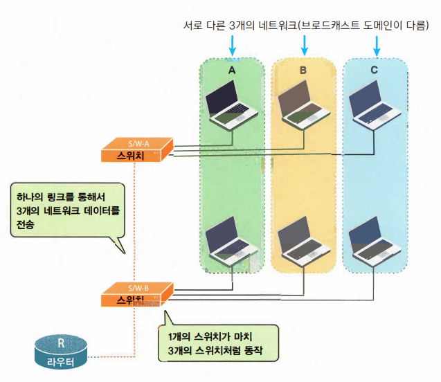
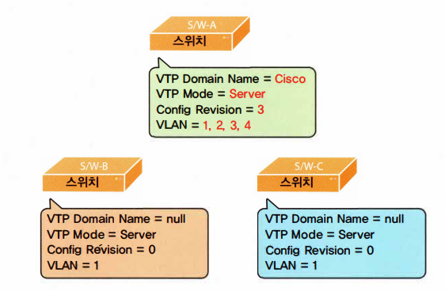
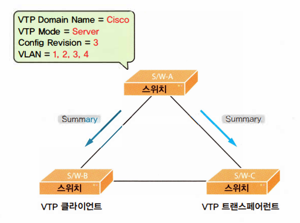
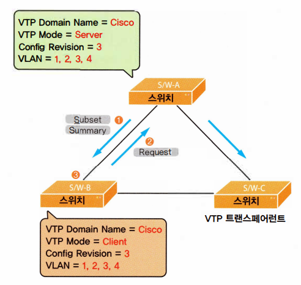
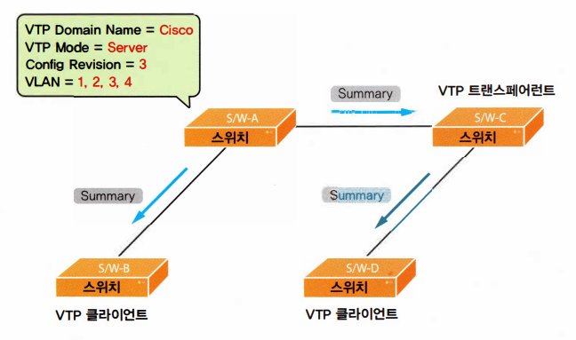
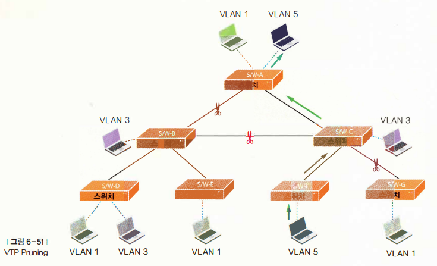
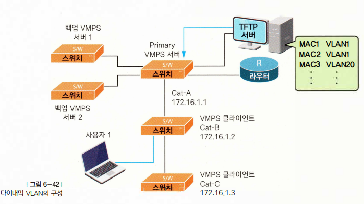

# ⚪VLAN?

- Virtual LAN의 줄이말
- 한 대의 스위치를 마치 여러대의 분리된 스위치처럼 사용하게 해줌 (한 대의 스위치를 여러 개의 네트워크로 나누기 위해서 사용)
- VLAN을 이용하면 하나의 스위치에 연결된 장비들도 브로드캐스트 도메인이 서로 다를 수 있음
- 스위치 이상의 장비에서만 VLAN을 지원함
- 스위치가 VLAN으로 나누어지면 나누어진 VLAN간의 통신은 오직 **라우터**를 통해서만 가능함 (서로 다른 네트워크 취급이기 떄문)
- 하나의 포트를 통해 서로 다른 여러개의 VLAN을 전송할 수 있게 하는 포트를 **트렁크 포트(Trunk Port)**라고 함

 

 

 

# ⚪트렁킹

**트렁킹(Trunking)**은 여러 개의 VLAN들을 함께 실어나르는 것을 의미함.

즉 , 각 스위치에 여러 개의 VLAN이 있기 때문에 원래는 각 VLAN별로 링크를 만들어주어야 하지만, 그렇게 되면 너무 많은 링크가 필요하기 때문에 마치 셔틀버스처럼 모든 VLAN이 하나의 링크를 통해 다른 스위치나 라우터로 이동하기 위해 트렁킹이란 것을 만들었음.

모든 VLAN이 하나의 링크를 통해서 이동하기 때문에, 도착하고 나서 제대로 찾아가기 위해서는 VLAN별로 이름표가 필요한데, 이 이름표를 어떻게 붙여주느냐에 따라 트렁킹도 2가지 방식으로 나뉨.

## 🔹IEEE 802.1Q

- 표준 트렁크 프로토콜
- 네이티브 VLAN (Native VLAN) 이라는 특색있는 VLAN이 존재

네이티브 VLAN이란, 트렁킹이 셔틀버스에 올라타는 모든 VLAN패킷에 각각의 VLAN 정보를 써서 이름표로 붙여주게 되는데, 이 네이티브 VLAN에만 이름표를 붙이지 않음. 

이 패킷의 VLAN을 찾는방법은 단 하나의 VLAN만 이름표를 달지 않았기때문에 이름표를 달지 않은 패킷은 모두 네이티브 VLAN으로 취급하면 됨.

즉 네이티브 VLAN은 패 킷에 VLAN 정보를 붙이지 않고 보내는  VLAN('Untagged 트래픽 ’ 이라고도 말합니다.）으로, 모든 스위치 네트워크에서 유일하게 한 개의 VLAN만을 네이티브 VLAN으로 세팅할 수 있음. 그래야 냐중에 이름표 없는 패킷이 어느  VLAN인지 알 수 있기 때문.

## 🔹ISL 트렁킹

- ISL은 시스코에서 만든 트렁킹 프로토콜로, 시스코 장비끼리만 사용하는 방식임
- 네이티브 VLAN이라는 개념이 없이 모든 VLAN에 이름표를 붙임

 

 

 

# ⚪VTP

- **VTP는 VLAN Trunking Protocol**의 줄임말임.
- 스위치들 간에 VLAN 정보를 서로 주고받아 스위치들이 가지고 있는 VLAN 정보를 항상 일치시켜 주기 위한 프로토콜
- 시스코만의 프로토콜임
- 기존 VLAN하나를 제거하거나 추가하면 모든 스위치의 구성에 들어가서 설정해줄 필요 없이, VTP 서버에서 한번만 VLAN정보를 설정하면 VTP 서버는 다른 스위치와의 트렁크 링크를 통해서 VLAN 정보를 자동으로 업데이트함
- VTP에서의 VLAN정보는 스위치 간 트렁크 링크를 통해서만 전달됨
- 두 스위치간의 트렁킹 방식이 IEEE802.1Q든 ISL이든 상관없이 전달이 가능함

VTP 간에 주고받는 메시지는 다음 3가지 형식이 있음

## 🔹Summary Advertisement

VTP 서버가 자기에게 연결되어 있는 스위치들에게 5분마다 한번씩 전달하는 메시지로, 자신이 관리하는 VTP 도메인의 구성에 대한 Revision 넘버(Revision  Number)를 보냄. 

스위치들은 바로 이 Revision 넘버를 보고 자신들의 VLAN 정보가 최신 버전인지, 아닌지를 판단함. 

또한 Summary Advertisement는 VLAN 구성에 변화가 생겼을때도 전달이 되는데. 이때는 5분을 기다리지 않고 즉시 전달됨.

## 🔹Subset Advertisement

이 메시지는 VLAN의 구성이 변경되었을 때나 VTP 클라이언트로부터 Advertisement Request 메시지를 받았을 때 전송됨.

실제 VLAN 정보는 바로 이 Subset  Advertisement에 저장되어 전달됨

## 🔹Advertisement Request

이 메시지는 클라이언트가 VTP 서버에 Summary Advertisement  와 Subset Advertisement를 요청하는 용도로 사용됨.

클라이언트는 자신의 Revision 넘버보다 더 높은 Revision 넘버를 갖은 Summary Advertisement를 전달받거나, VTP 도메인 이름이 바뀌거나, Subset Advertisement 메시지를 잃어버렸거나, 스위치가 새로 리셋되었을 경우 Advertisement Request 메시지를 VTP 서버에 보냄.

 

VTP를 위해서는 3가지 모드를 알고 있어야 함

## 🔹VTP의 3가지 모드

### 🔸VTP 서버 모드

VTP 서버 모드에 서는 VLAN을 생성하고, 삭제하고, VLAN의 이름을 바꿔줄 수 있으며,  VTP 도메인 안에 있는 나머지 스위치들에게 VTP 도메인 이름과 VLAN 구성, Configuration Revision 넘버를 전달해 줄 수 있음.

 VTP 서버는 VTP 도메인의 모든 VLAN에  대한 정보를 NVRAM에서 관리하며, 스위치가 꺼졌다 다시 켜지더라도 VLAN 정보를 모두 가지  고 있음 (여기서 NVRAM이란 비휘발성 RAM)

### 🔸VTP 클라이언트 모드

VTP 클라이언트 모드에서는 VLAN을 만들거나 삭제하고, VLAN 이름을 바꿔주는 일이 불가능.

VTP 클라이언트는 VTP 서버가 전달해준 VLAN 정보를 받고, 또 받은 정보를 자기와 연결된 다른 쪽 스위치에 전달하는 것만 가능.

또한 VTP 클라이언트는 이  정보를 NVRAM에 저장하지 않기 때문에 만약 스위치가 리부팅하면 모든 VLAN 정보를 잃게되어 VTP 서버로부터 다시 받아와야 함. 

### 🔸VTP 트랜스페어런트 모드(Transparent Mode)

VTP 트랜스페어런트 모드는 VTP 도메인 영역 안에 있지만, 서버로부터 메시지를 받아 자신의 VLAN을 업데이트하거나 자신의 VLAN을업데이트한 정보를 다른 스위치에 전달하지 않음. 

VTP 도메인안에서는 살지만 완전히 혼자 노는 방식. 

따라서 직접 VLAN을 만들고 삭제할 수 있으며, 이 정보를 자기만 알면 되기 때문에 다른 스위치들에게 알리지 않음.

다만 VTP 트랜스페어런트 모드는 서버로부터 들어온 메시지를 자기를 통해 연결된 다른 스워치쪽으로 전달해 주거나 자기와 연결된 다른 스위치쪽에서 서버쪽으로 가는 VTP 메시지(여기서의 메시지는 위에서 설명한 3가지 Advertisement를 말함)를 전달해 주는 역할만 함.

VTP 트랜스페어런트 모드 스워치 역시 자신의 VLAN 정보를 NVRAM에 저장하고 있음

 

 

 

# ⚪VTP 동작 예시

스위치 A를 VTP서버로서의 세팅을 완료한 상태. 

VLAN1은 기본으로 구성된거싱기 때문에, 총 3개의 VLAN을 만들었으므로 Config Revision은 3.

스위치B와 C는 디폴트 설정 상태

 

스위치B는 VTP클라이언트, 스위치C는 VTP 트랜스페어런트로 설정하였음.

Summary Advertisement를 받은 스위치B는 자신의 VTP도메인 이름을 Cisco로 변경하게 되고, **Configuration Revision넘버(3)**가 자신(0)보다 높기 때문에 VLAN 정보를 업데이트 해야함.

 

따라서 스위치B는 VTP 서버인 스위치 A에게 Advertisement Request를 보내 업데이트된 VLAN정보를 요청함.

그럼 스위치 A는 다시 Summary Advertisement와 Subset Advertisement를 스위치 B에게 보내주게 됨.

이제 스위치 B는 자신의 VLAN 정보에 그림 처럼 VLAN 2, 3, 4를 추가하고 Configuration Revision 넘버를 3으로 변경함.. 

스위치 B와 스위치 A간의 VLAN 정보가 일치됨.

 

스위치 C의 경우는 스위치 A로부터 VTP 도메인 이름과 Configuration Revision 넘버가 들어 있는 Summary Advertisement를 받았지만, 스위치 C는 이 메시지를 자신의 VLAN 정보에 반영하지 않고 원래 상태 그대로 유지함. VTP 트랜스페어런트 모드이기 때문

위 그림처럼 스위치 D가 스위치 C(VTP 트랜스페어런트 모드)에 새로 연결된다면 스위치 C는 스위치 A로부터 전달받은 VTP 메시지를 스위치 D에 전달해 주고, 또 스위치 D에서 전달받은 VTP 메시지를 스위치 A에 전달하는 릴레이 역할을 해줌. 

 

 

 

# ⚪기타...

## 🔹 VTP Pruning

스위치 F에 연결된 VLAN5에 속하는 PC에서 브로드캐스트가 발생하였을때, VTP Prunning이 설정된 상태라면 위처럼 모든 스위치로 전달되지 않고 필요한 곳으로만 보냄.

VTP Pruning은 한마디로 내가 가지고 있지 않은 VLAN 정보에 대한 트래픽은 비록 모든 VLAN을 전송해 주는 트렁크라고 해도 받지 않겠다는 것.

그래서 트렁크쪽의 대역폭을 절약함. (물론 스위치 C처럼 중간에 있어 어쩔 수 없는 겅우에는 별수 없음.) 

## 🔹스태틱 VLAN, 다이내믹 VLAN

- **스태틱 VLAN**은 가장 일반적인 방식으로 스위치의 각 포트들을 원하는 VLAN에 하나씩 배정

 

- **다이내믹 VLAN**은 스태틱 VLAN처럼 포트별로 고정 VLAN을 배정하는 것이 아니라 그 포트에 접속하는 장비의 맥 어드레스를 보고 고 주소에 따라 VLAN을 달리 배정하는 방식

즉 어떤 장비가 스위치에 접속하면(그림을 보면 사용자 1이라는 노트북이 스워치에 접속）스위치는 자신의 기본 기능인 Learning을 이용해 그 장비의 맥 어드레스를 배우게 됨. 

그 장비의 맥 어드레스를 알게 된 스위치는 곧바로 VMPS(VLAN Membership Policy Server) 서버에 이 장비의 맥 어드레스를 알려주고, 맥  어드레스를 알게 된 VMPS 서버는 자신이 가지고 있는 데이터베이스를 뒤져 지금 들어온 맥 어드레스에 해당하는 VLAN을 찾은 후 그 정보를 해당 스워치에 알려줌. 

VLAN 정보를 받은 해당 스워치는 장비의 VLAN을 방금 전달받은 그 VLAN 값으로 세팅함.

따라서 장비가 스워치의 포트에 접속하기 전까지는 스위치의 포트에  VLAN이 세팅되어 있지 않았다가, 장바가 접속하면 그 장비 의 맥 어드레스에 따라 VLAN을 세팅하는 방법임.

다이내믹 VLAN에서 VMPS는 들어온 맥 어드레스를 가지고 주소에 해당하는 VLAN을 찾아주는 통제 센터 역할을 하는데, 주로 대형 스워치에서 이 기능을 제공해줌.

여기서 VMPS 서버가 프라이머리 백업으로 나누어져 있는 것은 혹시 프라이머리 서버가 축게 되면 백업 서버가 그 역할을 대신하도록 하기 위한 것.

TFTP 서버는 실제 맥 어드레스와 이에 해당하는 VLAN 정보를 가진  FTP 서버임. VMPS 서버는 항상 TFTP 서버와 통신해서 어떤 녀석이 어떤 VLAN에 속했는지를 알아내게 됨.