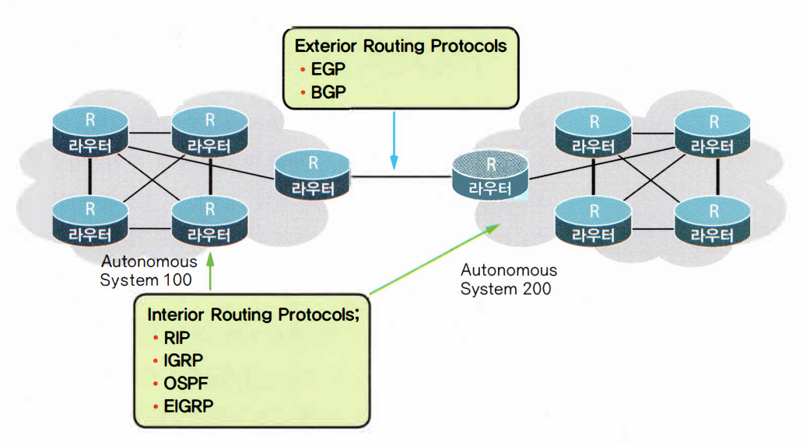

[라우터 기초 설명 링크](https://igh01gi.github.io/network/RepeaterHubBridgeSwitchRouter/)

# ⚪라우터가 하는 일

- Path Determination (경로 설정)
- Switching (결정된 길 쪽으로 데이터패킷을 스위칭)
- 참고) 이더넷(Ethernet)포트는 LAN 장비들과 연결되는 인터페이스, 시리얼(Serial)포트는 WAN 구간과 연결되는 인터페이스

 

 

 

# ⚪라우티드, 라우팅 프로토콜

- **Routed Protocol** 
  - 라우팅을 당하는 프로토콜
  - 자동차의 승객에 해당
  - TCP/IP나 IPX등이 여기에 속함
- **Routing Protocol**
  - 자동차의 운전사에 해당
  - 라우팅 알고리즘이라고도 함
  - 라우팅 알고리즘은 자신의 라우팅 테이블을 가지고 있으며, 자기가 찾아갈 경로에 대한 정보를 이곳에 기억해둠
  - RIP(Routing Information Protocol), IGRP(Interior Gateway Routing Protocol), OSPF(Open Shortest Path First), EIGRP(Enhanced Interior Gateway Routing Protocol)등이 여기에 해당 (이 종류들은 전부 다이내믹 라우팅 프로토콜임)
  - **스태틱 라우팅 프로토콜** 과 **다이내믹 라우팅 프로토콜**로 구분됨
  - 다이내믹 라우팅 프로토콜은 **(IGP, Interior Gateway Protocol)** 와 **(EGP, Exterior Gateway Protocol)**로 구분됨
  - 다이내믹 라우팅 프로토콜은 라우팅 테이블을 유지관리하는 방식에 따라서 **디스턴스 벡터 알고리즘(Distance Vector Algorithm)**과 **링크 스테이트 알고리즘(Link State Algorithm)**으로 구분됨

 

 

 

# ⚪AS(Autonomous System)

- 동일한 라우팅 정책으로 하나의 관리자에 의하여 운영되는 네트워크
- AS가 도입되면서 라우터는 인터넷에 있는 모든 네트워크의 도달가능정보를 가질 필요 없이 자신의 AS 내에 있는 라우터에 대한 도달가능정보만을 가짐
- 외부 AS와 통신하고자 할 때에는 **ASBR(Autonomous System Boundary Router)**을 이용하여 외부 네트워크의 도달가능정보를 얻음
- ASBR은 자신의 AS와 인접한 다른 AS에 대한 정보를 가지며 자신을 경유하는 라우터에 외부 AS에 대한 정보를 제공
- 이에 따라 라우팅 프로토콜은 AS 내부에서 도달가능정보를 주고받기 위해 사용하는 프로토콜**(IGP, Interior Gateway Protocol)**과 외부의 AS와 통신을 하고자 할 때 도달가능정보를 교환하기 위해 사용하는 프로토콜**(EGP, Exterior Gateway Protocol)**로 나누어짐
-  IGP의 예로는 RIP, IGRP, EIGRP, OSPF 등이 있고, EGP에는 EGP, BGP 등이 있음

