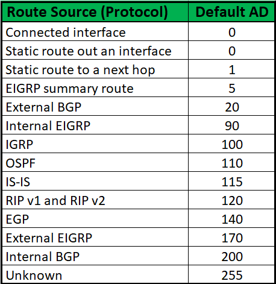

# ⚪Administrative Distance

한 라우터에 라우팅 프로토콜을 2개 이상 사용해야 하는 상황일때 필요함.

예를들어서 한 라우터 왼쪽에 있는 라우터는 RIP를 쓰고 오른쪽에 있는 라우터는 IGRP를 쓴다면 중간에 있는 해당 라우터는 둘 다 써야만 함. 이때 어떤 경로에 대한 정보를 얻으려고 보니까 RIP를 쓰는 라우터도 경로에 대한 정보를 알고 있고, IGRP를 쓰는 라우터도 알고있을때 어떤 정보를 이용해서 경로를 찾아야 할까?

이에 대한 답이 Administrative Distnace임

해당 값이 작을수록 높은 우선순위(신뢰성)를 지님

 

 

 

