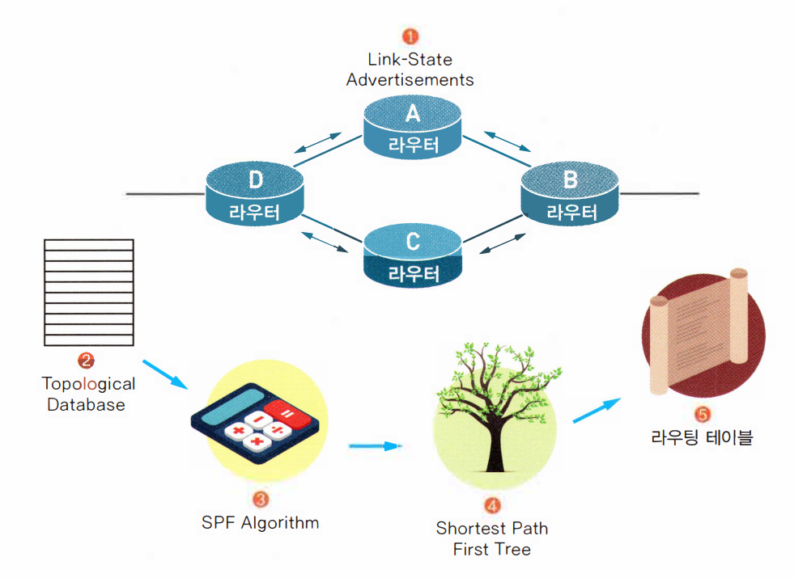

라우팅 프로토콜은 '스태틱 라우팅 프로토콜'과 '다이내믹 라우팅 프로토콜'로 나눌수 있음.

'다이내믹 라우팅 프로토콜'은 AS(Autonomous System) 안에서 사용되는 IGP(Interior Gateway Protocol)와 AS간에 사용되는 EGP(Exterior Gateway Protocol)로 나눌수 있음.

 

이것 외에도 라우팅 프로토콜은 **'디스턴스 벡터 알고리즘(Distance Vector Algorithm)'**과 **'링크 스테이트 알고리즘(Link State Algorithm)'**으로 나눌 수 있음. 

이것은 라우팅 테이블을 어떤 식으로 관리하는가에 따른 분류임

 

 

 

# ⚪디스턴스 벡터 알고리즘

- Distance(거리)와 Vector(방향)만을 위주로 만들어징 라우팅 알고리즘
- 라우터는 목적지까지의 모든 경로를 자신의 라우팅 테이블 안에 저장하는 것이 아니라 목적지까지의 거리(홉 카운트 등)와 그 목적지까지 가려면 어떤 Neighbor Router를 거쳐가야 하는지에 대한 방향만을 저장함
- Neighbor Router들과 주기적(RIP의 경우 30초에 한번)으로 라우팅 테이블을 교환해서 정보를 최신화함
- 모든 라우팅 정보를 가질 필요가 없기에 메모리를 절약하고 구성이 간단하다는 장점
- 라우팅 테이블에 변화가 없어도 업데이트가 일어나기 때문에 트래픽을 낭비한다는 단점
- 라우팅 테이블에 변화가 생길 경우 이 변화를 모든 라우터가 알때까지 걸리는 시간(Convergence Time)이 너무 느리다는 단점
- 이런 느린 업데이트 때문에 RIP의 경우는 최대 홉 카운트가 15를 넘지 못하게 되어 있음
- 대표적인 디스턴스 벡터 알고리즘에는 RIP(Routing Information Protocol)와 IGRP(Interior Gateway Routing Protocol)이 있음

 

 

 

# ⚪링크 스테이트 알고리즘

- 링크에 대한 정보를 토폴로지 데이터베이스로 만들음
- 만들어진 토폴로지 데이터베이스를 가지고 라우터는 SPF(Shortest Path FIrst)라는 알고리즘을 계산함
- 계산 결과를 가지고 라우터는 SPF 트리를 만들음.
- 만들어진 트리 정보를 이용해서 라우팅 테이블을 만들음
- 한 라우터에서 목적지까지의 모든 경로를 알고 있기 때문에 중간 링크의 변화가 생겨도 이를 알아내는 데 걸리는 시간이 비교적 짧음
- 이웃 라우터들과 라우팅 테이블을 교환하는 과정에서도 모든 라우팅 테이블을 교환하는 디스턴스 벡터 방식과는 달리 라우팅 테이블 교환이 자주 발생하지 않고, 교환이 일어나는 경우에도 테이블에 변화가 있는 것만을 교환하기 때문에 트래픽 발생을 줄여줄 수 있음
- 그러나 메모리 소모가 많고 계산량이 많아서 라우터 CPU가 일을 많이해야함
- 대표적인 링크 스테이트 알고리즘에는 OSPF(Open Shortest Path First) 라우팅 프로토콜이 있음

[SPF의 상세한 작동 원리 링크](https://sahngoh.tistory.com/75)
