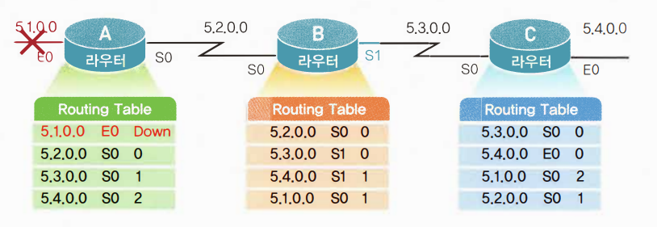
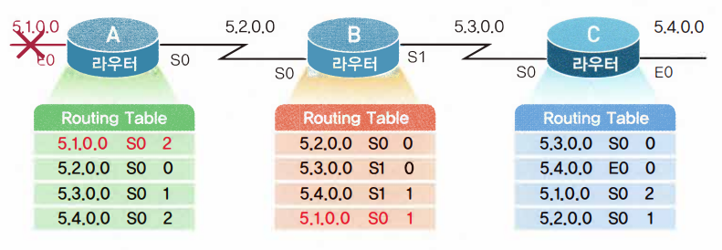
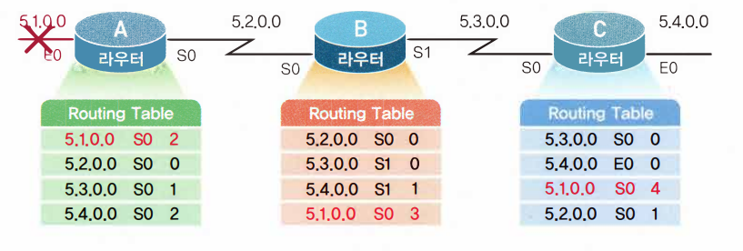
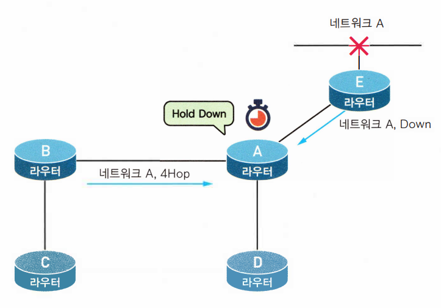
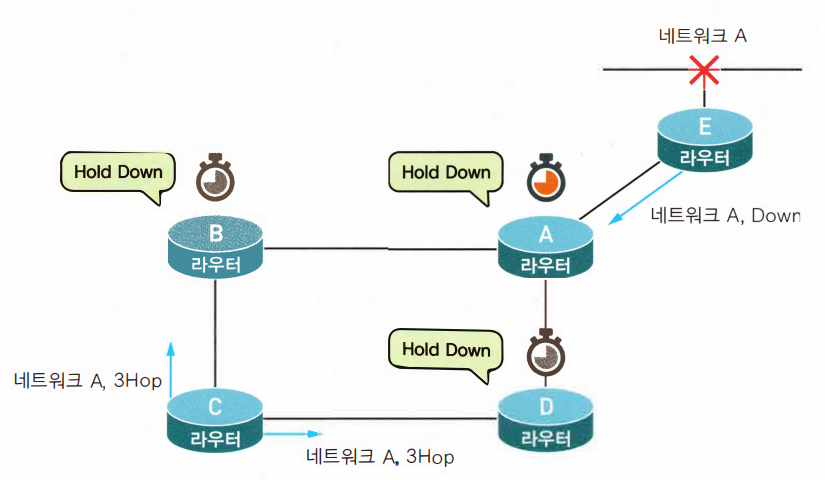
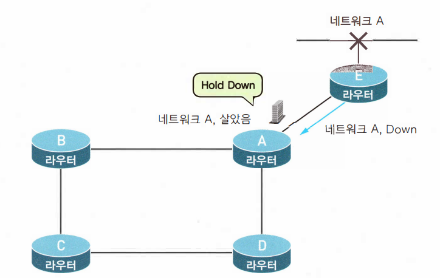
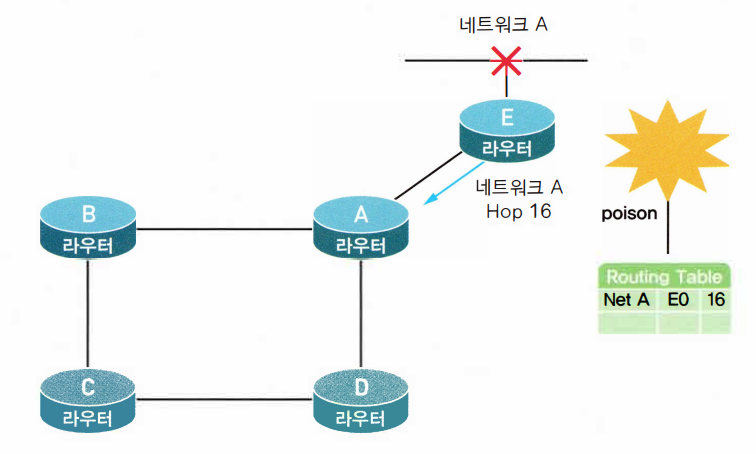
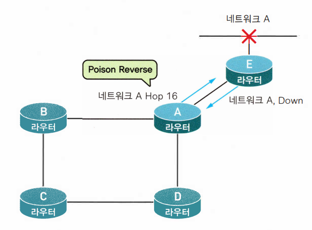

라우팅 프로토콜은 '스태틱 라우팅 프로토콜'과 '다이내믹 라우팅 프로토콜'로 나눌수 있음.

'다이내믹 라우팅 프로토콜'은 AS(Autonomous System) 안에서 사용되는 IGP(Interior Gateway Protocol)와 AS간에 사용되는 EGP(Exterior Gateway Protocol)로 나눌수 있음.

 

이것 외에도 라우팅 프로토콜은 **'디스턴스 벡터 알고리즘(Distance Vector Algorithm)'**과 **'링크 스테이트 알고리즘(Link State Algorithm)'**으로 나눌 수 있음. 

이것은 라우팅 테이블을 어떤 식으로 관리하는가에 따른 분류임

 

 

 

# ⚪디스턴스 벡터 알고리즘

- Distance(거리)와 Vector(방향)만을 위주로 만들어징 라우팅 알고리즘
- 라우터는 목적지까지의 모든 경로를 자신의 라우팅 테이블 안에 저장하는 것이 아니라 목적지까지의 거리(홉 카운트 등)와 그 목적지까지 가려면 어떤 Neighbor Router를 거쳐가야 하는지에 대한 방향만을 저장함
- Neighbor Router들과 주기적(RIP의 경우 30초에 한번)으로 라우팅 테이블을 교환해서 정보를 최신화함
- 모든 라우팅 정보를 가질 필요가 없기에 메모리를 절약하고 구성이 간단하다는 장점
- 라우팅 테이블에 변화가 없어도 업데이트가 일어나기 때문에 트래픽을 낭비한다는 단점
- 라우팅 테이블에 변화가 생길 경우 이 변화를 모든 라우터가 알때까지 걸리는 시간(Convergence Time)이 너무 느리다는 단점
- 이런 느린 업데이트 때문에 RIP의 경우는 최대 홉 카운트가 15를 넘지 못하게 되어 있음
- 대표적인 디스턴스 벡터 알고리즘에는 RIP(Routing Information Protocol)와 IGRP(Interior Gateway Routing Protocol)이 있음

 

## 🔹문제점

라우팅 테이블을 전달하면서 업데이트하는 시간인 **convergence time**이 너무 오래 걸림  

이로 인해서 루핑이 발생할 수 있음

라우터A에 연결되어 있는 5.1.0.0 네트워크에 문제가 발생했을때, 라우터 A는 즉시 자신의 라우팅 테이블에 5.1.0.0을 다운이라고 업데이트를 함

하지만 아직 업데이트 주기가 되지 않았기 때문에 라우터 B나 라우터C는 이 정보를 알지 못함

이때 라우터 B가 라우팅 테이블을 업데이트하면

네트워크 5.1.0.0에 대한 라우팅 정보를 라우터 B로부터 받은 라우터 A는 5.1.0.0 네트워크를 라우터 B를 통해서 갈 수 있다고 생각하고 자신의 라우팅 테이블을 바꿔줌 

이번에는 라우터B가 라우터 A로부터 온 5.1.0.0을 보고 또 홉카운트를 수정하고... 이에 영향받아서 라우터 C도 수정하고... 이런식으로 계속 루핑을 돌기 시작해서, 죽어 있는 네트워크로 향하는 데이터는 엄청난 트래픽을 유도하고 라우팅테이블이 꼬이게 됨

 

## 🔹해결책

### 🔸Maximum Hop Count

RIP 라우팅 프로토콜의 경우 최대 홉 카운트를 15로 규정하고 이를 넘기는 라우팅 경로에 대해서는 unreachable로 간주함

그리고 flush time이 지난 후에는라우팅 테이블에서 아예 삭제함

이렇게 최대 홉 카운트를 정하면 라우팅의 루핑이 발생하더라도 16까지 이르면 멈추 수 있음

그러나 네트워크의 규모가 크다면 15홉 카운트 제한때문에 사용할 수 없음

### 🔸Hold Down Timer

라우터E가 네트워크A가 다운되었다고 라우터 A에 알리면, 라우터 A는 네트워크 A에 대한 Hold Down 타이머를 시작함

만약 이때 라우터 B가 라우팅 테이블을 업데이트하면서 라우터 A에 네트워크 A를 자신을 통해서 갈 수있는데, 홉 카운트 4라고 이야기 하면 라우터 A는 이 정보를 무시함

즉, Hold Down 타이머가 동작하고 있는 동안에는 외부에서 해당 네트워크에 대한 라우팅 경로 정보를 받았을 때 원래 가지고 있던 메트릭 값(목적지까지의 거리에 대한 값으로, RIP의 경우는 Hop 카운트)보다 큰 값이 들어오면 무시함

Hold Down 카운터가 종료되거나 목적지에 대한 새로운 경로가 지금 갖고 있던 메트릭과 같거나 좋은 경로가 들어올때만 이웃 라우터로부터의 업데이트를 받아들임

라우터 A가 라우터 B,D 쪽으로 업데이트를 하게 되면 이제 두 라우터도 네트워크 A에 대해서 Hold Down 타이머를 작동시킴

그러다가 네트워크 A가 살아나면 라우터 A는 라우터 B와 D에 홉카운트 1로 네트워크 A에 갈 수있다고 알리게되고, 라우터 B와 D는 Hold Down 타이머를 풀고 업데이트를 받아들이게 됨

### 🔸Split Horizon

라우팅 정보가 들어온 곳으로는 같은 정보를 내보낼 수 없는 것

라우터 A는 네트워크 A에 대한 정보를 이미 라우터 E에서 받았기 때문에 네트워크 A에 대한 정보를 다시 라우터 E쪽으로는 내보낼 수 없다는 것

(만약 하냐의 라우터가 어느 네트워크 정보를 인접한 라우터에서 받았다면, 그 인접한 라우터가 그 네트워크에 더 가까이 있을 것이 분명하며 , 이러한 정보를 다른 라우터들로부터 더 이상 받을 필요가 없다는 것)

스플릿 호라이즌은 두 라우터 간의 루핑만을 막기 위해서 만들어진 기술이기 때문에, 전체 라우터 네트워크의 루핑을 막기는 어려움

### 🔸Route Poisoning

네트워크 A가 다운되자 라우터E는 네트워크 A에 대한 메트릭 값(여기서는 홉카운트)을 16으로 바꿈(RIP기준 unreachable 값). 대신 라우팅 테이블에서 지우지는 않음

이때 라우터 A에서 네트워크 A에 대한 업데이트 정보가 들어와도 라우터 E는 그것을 무시하고, 라우터E는 네트워크 A에 대한 메트릭 값을 16으로해서 라우터 A에게 보내기됨. 

그럼 라우터 A도 네트워크 A에 대한 메트릭이 16으로 갖게되고.... 이런식으로 다운된 네트워크를 먼저 무한대치로 바꾸어 버리는 방식이 라우트 포이즈닝임

### 🔸Posion Reverse

Split Horizon의 변형판. 

포이즌 리버스 업데이트를 사용한 스플릿 호라이즌 (Split horizon with posion reverse update)라고도 함

스플릿 호라이즌처럼 라우팅 정보를 보내온 쪽으로 알려주지 않는 것이 아니라 라우팅 정보를 되돌려 보내기는 하되 이 값을 무한대 값으로 쓰는 방식임

홉 개수가 무한대라는 뜻은 경로를 사용할 수 없다는 것이라서 라우터는 이 경로에 대한 라우팅 업데이트를 무시하는 것이 됨. 따라서 경로의 정보를 아주 없애는 것보다 무한대 홉 값을 포함해서 라우팅 업데이트를 실시한다면 다른 모든 라우터들은 실수로 잘못된 경로 정보를 사용하는 경우를 줄일 수 있음

중요한 것은 스플릿 호라이즌은 포이즌 리버스 기능이 첨가되든 안되든, 라우팅 루프를 자기 라우터랑 붙어있는 인접 라우터에서만 방지할 수 있다는 것임

 

 

# ⚪링크 스테이트 알고리즘

- 링크에 대한 정보를 토폴로지 데이터베이스로 만들음
- 만들어진 토폴로지 데이터베이스를 가지고 라우터는 SPF(Shortest Path FIrst)라는 알고리즘을 계산함
- 계산 결과를 가지고 라우터는 SPF 트리를 만들음.
- 만들어진 트리 정보를 이용해서 라우팅 테이블을 만들음
- 한 라우터에서 목적지까지의 모든 경로를 알고 있기 때문에 중간 링크의 변화가 생겨도 이를 알아내는 데 걸리는 시간이 비교적 짧음
- 이웃 라우터들과 라우팅 테이블을 교환하는 과정에서도 모든 라우팅 테이블을 교환하는 디스턴스 벡터 방식과는 달리 라우팅 테이블 교환이 자주 발생하지 않고, 교환이 일어나는 경우에도 테이블에 변화가 있는 것만을 교환하기 때문에 트래픽 발생을 줄여줄 수 있음
- 그러나 메모리 소모가 많고 계산량이 많아서 라우터 CPU가 일을 많이해야함
- 대표적인 링크 스테이트 알고리즘에는 OSPF(Open Shortest Path First) 라우팅 프로토콜이 있음

[SPF의 상세한 작동 원리 링크](https://sahngoh.tistory.com/75)

