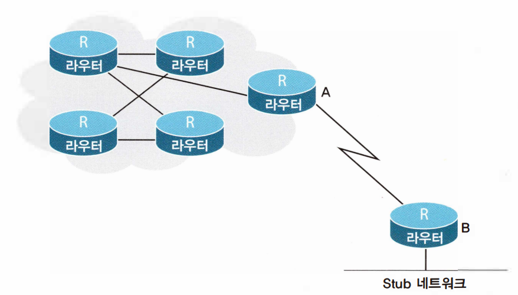
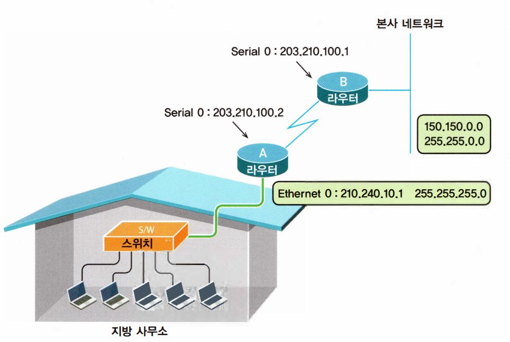
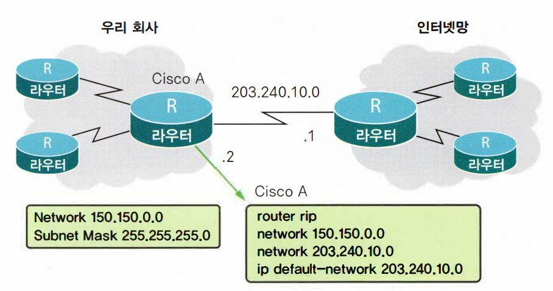

# <span style="color: #D6ABFA;">⚪스태틱 라우팅 프로토콜?</span>



- 라우터 운영자가 직접 경로를 입력해줌
- 라우팅 테이블을 적게 사용한다는 장점이 있지만 설정해둔 경로에 문제가 생기면 수정해줄때까지 기다려야한다는 단점
- 갈 수 있는 경로가 하나밖에 없는 Stub 라우터용으로 많이 사용됨
- B라우터는 오직 A 라우터를 통해서만 외부 네트워크로 연결되어 있기 때문에 B라우터는 Stub 네트워크 상에 있음

<br>

<br>

<br>

# <span style="color: #D6ABFA;">⚪명령어</span>

```
Router(config) #ip route network [mask] {address | interface} [distance] 
```

- 맨 앞을 보면 ‘Router(config) ＃'이라고 되어있는데, 스태틱 라우팅 명령은 구성 모드 중에서도 일반 구성 모드에서 내리는 명령임

- network부분에는 목적지 네트워크주소를 적어 넣음

- [mask]부분은 목적지 네트워크의 서브넷 마스크를 쓰는 부분인데 옵션임

- {address | interface} 부분은 address 또는 interface를 적는 부분. address는 목적지 네트워크를 가려면 여기 나오는 address(1홉을 건너뒨 address)로 가라는 의미. interface는 라우터의 어떤 인터페이스를 통해서 가야 하는가를 입력

- address를 입력할 때는 상대편 라우터의 주소를 넣지만 interface를 입력할 때는 자기 라우터의 인터페이스를 입력함

- distance는 라우팅 정보의 가치. distance 값이 클수록 가치가 떨어짐. 디폴트는 1 

  <br>

  



라우터A에서 본사 네트워크인 150.150.0.0 에 접속하기 위한 스태틱 구성 명령어는 다음과 같이 할 수 있음

```
ip route 150.150.0.0 255.255.0.0 203.210.100.1
또는 
ip route 150.150.0.0 255.255.0.0 serial 0
```

<br>

<br>

<br>

# <span style="color: #D6ABFA;">⚪디폴트 라우트</span>

디폴트 라우트란 경로를 찾아내지 못한 모든 네트워크들은 모두 이곳으로 가라고 미리 정해놓은 길임

자주 사용하는 경우로는 먼저 인터넷을 사용하는 라우터와 Stub 네트워크에 있는 라우터임.

## 🔹디폴트 라우트 만드는 방법

1. 디폴트 네트워크를 이용한 방법
2. 스태틱 명령을 이용한 방법

<br>

디폴트 네트워크를 이용한 방법은 두 가지 규칙을 준수해야함.

1. ip default-network 뒤에 오는 네트워크 주소는 항상 클래스를 맞춰주어야 한다. (150.100.10.0처럼 주면 X)
2. RIP에서 디폴트 네트워크를 구성하는 경우 ip default-network 뒤에 오는 네트워크 주소는 반드시 rip 프로토콜이 돌고 있는 네트워크여야 함 (IGRP의 경우에는 반대로 IGRP 프로토콜이 돌고 있지 않는 네트워크를 지정해야 함)



```
ip default-network 203.240.10.0
```

라고 라우터 A에서 입력하면 라우팅 테이블에 없는 모든 목적지는 무조건 203.240.10.0 네트워크로 보내라는 의미임

<br>

그러나 위 처럼 디폴트 네트워크를 사용한 방법은 복잡하기 때문에 스태틱 명령을 이용한 방법이 더 추천됨

```
ip route 0.0.0.0 0.0.0.0 203.240.10.1
```

스태틱 명령에서 목적지 네트워크와 서브넷마스크가 모두 0.0.0.0 으로 주는것은 디폴트 네트워크를 의미함
