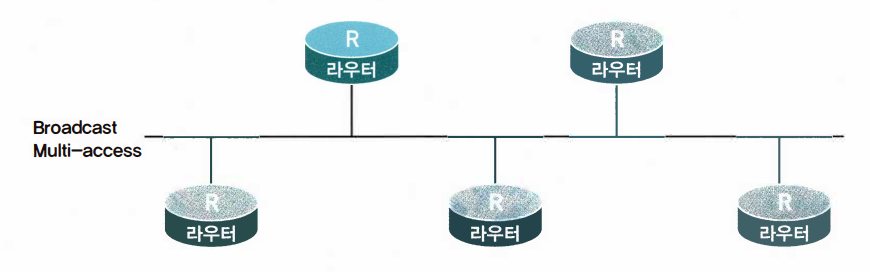
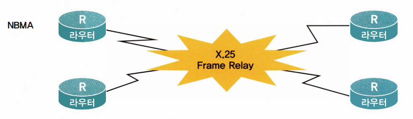
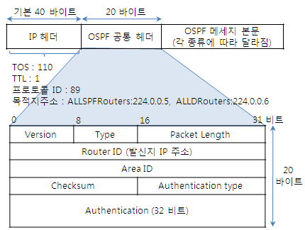
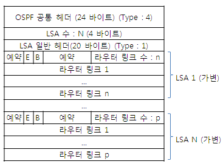

# ⚪OSPF?

- Open Shortest Path First 줄임말
- 표준 라우팅 프로토콜
- 다이내믹 라우팅 프로토콜
- 내부용 라우팅 프로토콜(IGP)
- 링크 스테이트 라우팅 프로토콜
- VLSM 지원 O
- Area 개념을 사용해서 독립적으로 구역에 따라 각각의 라우팅 환경의 세부 조정 가능
- 홉카운트에 제한이 없음
- 라우팅 정보 업데이트 시 224.0.0.5와 224.0.0.6의 Multicast 주소와 89번의 포트 번호를 사용
  - 224.0.0.5는 OSPF를 사용하는 모든 라우터용으로 사용
  - 224.0.0.6은 DR(Designated Router)와 BDR(Backup Designated Router)에 사용
- 토폴로지에 따라서 동작의 차이가 있음

 

 

 

# ⚪토폴로지

**토폴로지(topology)**란 망 구성방식을 의미함.  (물리,논리적 통틀어서) 

OSPF는 네트워크를 3가지 토폴로지로 나누어서 지원하기 때문에 3가지 방식에 대해서 먼저 설명함

## 🔹Broadcast Multi-access

네트워크에 2개 이상의 라우터가 연결되는 경우로, 하나의 메시지를 내보내면 이 네트워크상에 있는 모든 녀석들이 정보를 받아볼 수 있는 구조 (ex. 이더넷 세그먼트)

## 🔹Point-to-Point

네트워크에 한 쌍의 라우터만 존재하는 경우 (ex. 전용선)

## 🔹NBMA (Non Broadcast Multiple Access)

네트워크에 2개 이상의 라우터가 연결되지만, 브로드캐스트 멀티액세스와다르게 보로드캐스트 기능이 지원되지 않음

대부분의 NBMA 네트워크는 내부에서 가상회로(Virtual Circuit)방식을 사용하여 Multi-Access를 구현함 즉, 하나의 물리적 회선으로 연결되어 있지만, 내부적으로는 복수개의 가상 회선을 사용하여 각각 연결되어 있음

NBMA 네트워크에서는 한 포트로 브로드캐스트 패킷을 보내도 기본적으로 다른 모든 포트로 전송해주지 않는다. 라우터가 하나의 가상회로당 하나씩의 Bcast 패킷을 별도로 복사하여 전송해야 함

대표적인 NBMA 네트워크로는 **ATM, X.25, Frame Rela**y 네트워크가 있다.

 

 

 

# ⚪DR과 BDR

OSPF에는 라우팅 정보(LSA) 전송에 있어 효율을 위해 **DR(Designated Router,반장)**과 **BDR(Backup Designated Router부반장)**이란 개념이 존재함

>- OSPF는 네트워크 토폴로지, 인터페이스 등에 변경이 생기면 변경 대용을 같은 영역(area)에 소속된 라우터들 간에 LSA를 주고받음. 이때 영역의 규모가 작으면 상관이 없지만, 영역의 규모가 커지는 경우 과도한 LSA 플러딩이 발생해 네트워크의 성능 저하를 초래할 수 있음.
>
>- 그렇다고 필요하지도 않은데 이런 LSA 플러딩의 규모를 줄이기 위해 영역(area)을 나누는 것도 그닥 권장되는 방법은 아닌데, 이런 문제를 해결하기 위해서 OSPF는 **DR(Designated Router)/BDR(Backup DR)**을 선정함. 해당 area 내에서 각각 반장, 부반장 정도의 역할을 하는 라우터라고 보면 됨. 그 외 라우터는 **DROthers**라고 불림.
>
>- DR이 다운되면 BDR이 DR자리를 이어받음
>
>- DROthers 라우터들은 자신의 LSA 정보를 224.0.0.6 주소를 사용해 DR에게 보내며, 224.0.0.5 주소를 통해 정보를 수신받는다. 이를 통해 서로 모든 상대방에과 LSA를 주고받지 않아도 되는데, 이로 인한 **효율성**은 네트워크 규모가 커질수록 **기하급수적으로 증가**함
>
>-  DR/BDR의 경우 Point-to-Point 네트워크(모든 노드나 네트워크가 서로 1:1로 연결된 모양의 네트워크) 환경에서는 사용되지 않음

## 🔹DR,BDR 선출 방법

아래의 우선순위를 따름

1. 라우터 인터페이스에 설정되어 있는 **priority**값을 비교해 가장 큰 라우터가 DR, 2등으로 큰것이 BDR이 된다. 기본값은 1
2. '1'의 조건이 같다면 **router-id**를 비교해 가장 큰 라우터가 DR, 그 다음으로 큰 라우터가 BDR

 

 

 

# ⚪패킷 구조

## 🔹 공통 헤더 부분

- Version
  - IPv4 = Version 2
  - IPv6 = Version 3
- Type: OSPF 패킷 유형 정의
- 패킷 길이 : OSPF 패킷 헤더 포함 전체 길이를 바이트 단위로 표현
- 라우터 ID
  - OSPF 패킷을 생성한 해당 라우터의 router-id 값
  - 통상 그 라우터의 IP 주소 중 가장 높은 IP 주소
  - 안정된 인터페이스를 사용하기 위해서 **Loopback 인터페이스**를 사용함. 그러면 IP주소의 높낮이와 상관없이 무조건 Loopback주소가 라우터 ID가 됨. Loopback 인터페이스는 다운되는 인터페이스가 아니기 때문에 라우터ID가 바뀔 염려를 줄여줌

메시지 본문은 OSPF Message Type 종류에 따라 내용이 다름

## 🔹OSPF Message Type

| 패킷 종류 | 설명                                                         |
| --------- | ------------------------------------------------------------ |
| Hello     | OSPF가 설정된 이웃 라우터들끼리의 인접 관계를 맺고 유지하기 위해 사용되는 메시지이다. neighbor를 찾거나, 매개변수 교환, keep-alive 상태 교환, DR/BDR 선출 등에서 다양하게 사용된다. |
| DBD(=DD)  | ▶ Data Base Description *▶ Database Description packet* 링크 상태 정보에 대한 데이터베이스.  인접 관계를 맺은 다음 링크 상태에 대한 요약 정보(LSA)를 서로 교환하는데, 이때 주고받는 메시지 유형.  주로 자기가 소속된 영역에 대한 라우팅 정보를 서로 교환한다. |
| LSR       | ▶ Link State Request DBD(DD)를 받은 후 자신에게 없는 경로가 있는 경우 해당 경로에 대한 보다 상세한 정보를 요청할 때 사용하는 메시지.  이를 통해 LSDB(Link-State Data Base)를 장비간 서로 동기화시킬 수 있다. |
| LSU       | ▶ Link State Update LSR에 대한 응답으로 사용되며, 이웃 라우터, 경로 비용과 같은 링크 상태 정보(LSA)를 알려주는 메시지이다.  또한, 자신의 링크 상태 정보(LSA)를 스스로 광고할 때도 사용한다. |
| LSAck     | ▶ Link State ACKnowledgement 위에서 언급한 데이터들에 대한 수신 확인을 위해 사용된다. 응답용 패킷. |

## 🔹LSA (Link State Advertisement)

LSA는 Link-State 라우팅 계열 알고리즘에서 기본 라우팅 정보가 담긴 기본 정보 단위임

OSPF에서는 아래 종류들이 존재함

| **LSA 유형** | **설명**                                                     | **라우팅 테이블 코드값** |
| ------------ | ------------------------------------------------------------ | ------------------------ |
| 1            | 라우터 LSA - 하나의 라우터에 있는 모든 링크들에 대해 광고함  | **O**                    |
| 2            | 네트워크 LSA                                                 |                          |
| 3            | 네트워크 요약상태 LSA                                        | **O IA**                 |
| 4            | ASBR 링크 요약상태 LSA - ASBR(Autonomous System Boundary Router) ; 네트워크의 경계점에 위치하는 라우터. 서로 다른 라우팅 프로토콜을 사용하는 지점에 걸쳐져 있음.*Area 경계에는 있지만 OSPF를 사용하는 영역에만 걸쳐져 있는 경우의 라우터는 ABR(Area Border Router)라 한다. |                          |
| 5            | 자율시스템 외부 LSA - OSPF 외부 LSA - OSPF 도메인 밖의 경로를 나타낸다. | **O E1**또는**O E2**     |
| 6            | 멀티캐스트 OSPF LSA                                          | (없음)                   |
| 7            | Not-So-Stubby 영역에 의해 정의                               | **O N1**또는**O N2**     |
| 8            | BGP를 위한 외부 속성 LSA                                     | (없음)                   |
|              |  ▶ 아무 일이 없어도 30분마다 주기적으로 LSA 패킷이 만들어져 교환됨 |                          |

>참고한 사이트
>
>[a novice trailblazer 블로그](https://blog.naver.com/PostView.naver?blogId=luexr&logNo=222460005000)

