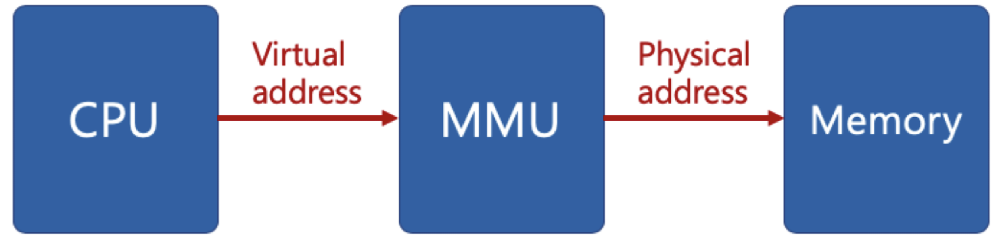
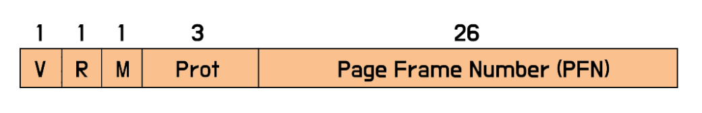
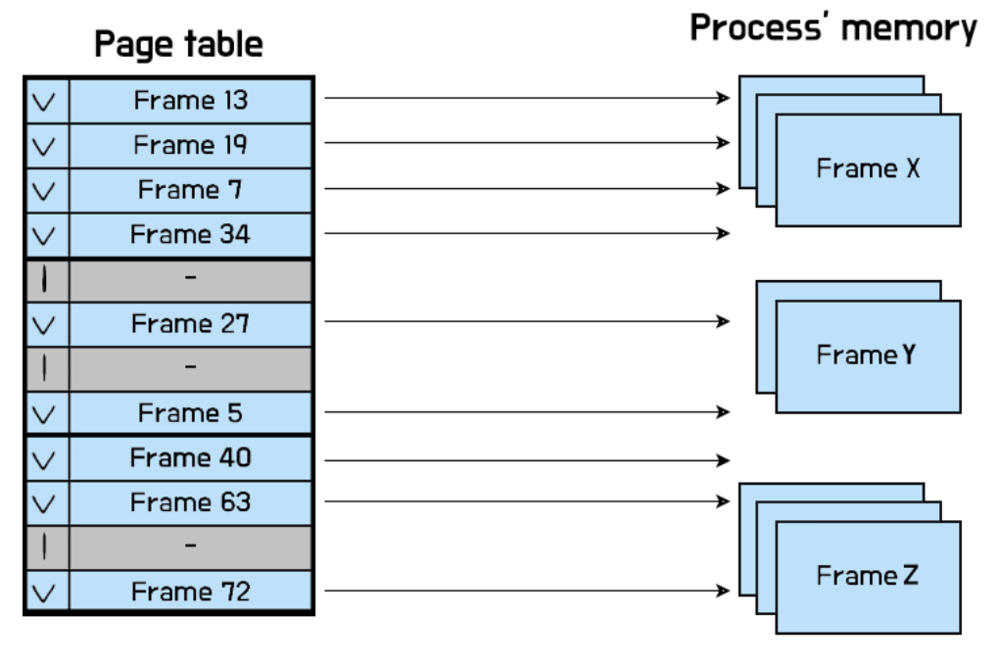
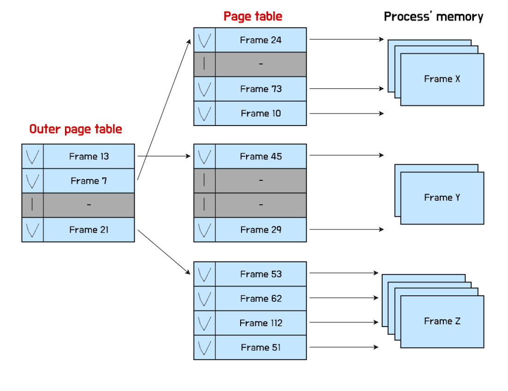
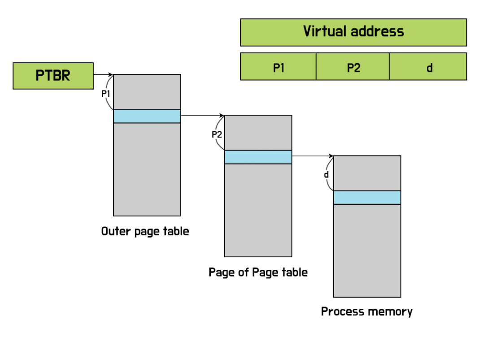
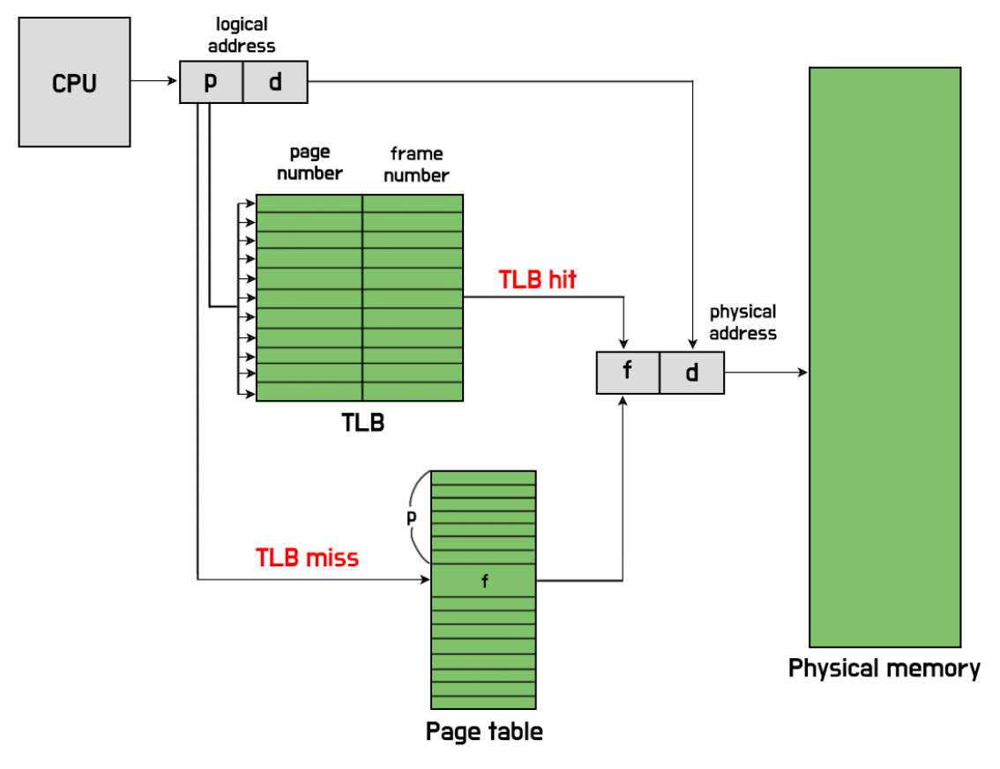
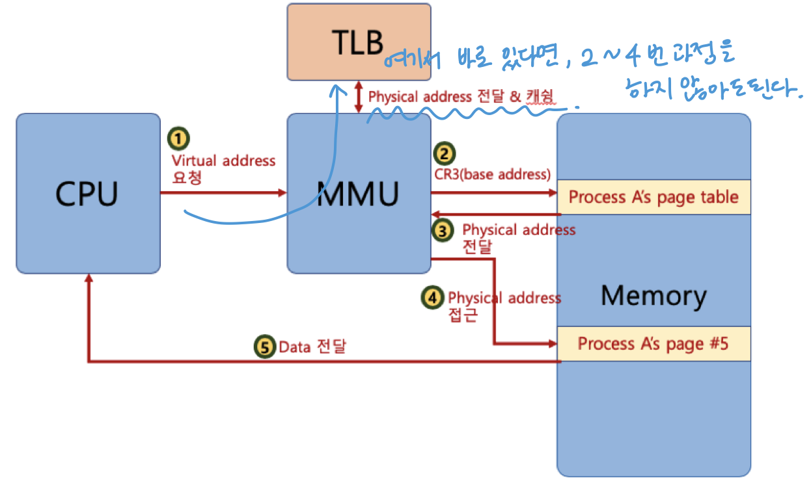

# ⚪가상 메모리란

프로세스를 실행하기 위해서는 메모리를 할당 받아야 한다

메모리는 한정적이다

가상 메모리는 물리 메모리보다 큰 프로세스나 여러 개의 프로세스들을 동시에 실행시킬 수 있도록, 마치 메모리가 무한한 것처럼 인식되게 하는 방법임

즉, **가상 메모리(Virtual Memory)는 운영체제에서 실제 물리 메모리(RAM)보다 큰 주소 공간을 프로세스에 제공하기 위해 사용되는 기술**

> CPU가 프로세스를 처리할 때, 특정 시점에 프로세스의 특정 메모리를 접근(액세스)하는 주소값은 아주 작을 것이다.   
> 그 주소값이 아주 작다는 점을 착안하여 고안된 방법이다.   
> 가상 메모리는 프로세스와 관련된 주소값을 저장하는 메모리 공간을 분리하여 관리함으로써, 내 컴퓨터의 메모리가 실제 메모리보다 많아 보이게하는 기술이다.

 

 

 

# ⚪가상 주소

프로세스는 가상 주소를 사용하고, 데이터를 read/write 할때 실제 물리 주소로 변환을 함

즉, 가상 메모리 시스템을 사용하기 위해서는 **가상 주소(virtual address)와 물리 주소(physical address)가 필요**

- **virtual address(가상 주소): 프로세스가 참조하는 주소**
- **physical address(물리 주소): 실제 메모리 주소**

 

{: width="50%"}

특정 가상 주소가 어느 물리 주소에 매핑되었는지 알기 위해서 필요한 것이 **MMU(Memory Management Unit)**

- **MMU(Memory Management Unit) :** CPU에 코드 실행시, **가상 주소 메모리 접근이 필요할 때, 해당 주소를 물리 주소 값으로 변환**해주는 하드웨어 장치

 

 

 

# ⚪페이징 시스템

{: width="70%"}

- **paging :**  가상메모리와 물리메모리를 동일한 크기의 블록으로 나눔. 이때 **가상메모리의 블록을 page**라고 부르고, **물리 메모리의 블록을 frame**(또는 page frame)이라고 부름. 페이지(프레임)의 크기는 2의 승수(일반적으로 4kb~16kb)
- **page table :** **VPN**(Virtual Page Number)를 **PFN**(Pysical Frame Number)로 **매핑**  

이렇게 paging으로 메모리를 관리하면 internal fragmentation은 발생할 수 있지만, external fragmentation을 막을 수 있다.

##  🔹페이지 테이블

**각각의 프로세스는 자신만의 page table**을 갖고 있으며, 각 프로세스의 page table이 저장되어 있는 주소는 **OS가 각 PCB(Process Control Block)에 저장**(CR3 register를 이용해서 PTBR을 사용한다고 함)한다. 

 운영체제는 프로세스가 메인 메모리에 올라올 때(dispatch), pcb에 저장되어 있는 페이지 테이블의 시작 주소를 **PTBR(Page Table Base Register)로 불러온다**.

page table은 OS로부터 관리되고, MMU가 접근해서 읽는 구조임.

{: width="70%"}

이때, 각 page table의 원소 하나하나를 **page table entry(PTE)**라고 함

- **V :** valid, 해당 가상 페이지의 유효 여부를 저장, 가상 주소가 접근될 때마다 valid bit 테스트
- **R :** reference, 해당 가상 페이지가 최근에 접근 되었는지 여부, 가상 주소가 접근될 때, 해당 reference bit가 set됨
- **M :** modify, 해당 가상 페이지에 쓰기가 발생했는지 여부
- **Prot :** protection, 해당 가상페이지의 접근 권한, 읽기/쓰기/실행 권한 등
- **PFN :** 해당 가상 페이지에 연결된 물리 프레임 번호

## 🔹페이지 테이블 structure

### 🔸Linear page table

{: width="70%"}

그냥 모든 Virtual Address의 page를 순서대로 다 담아놓은 page table이다. 

즉, vpn 0번부터 vpn N번까지 쭈욱 늘려놓은 것인데, 이는 현대 컴퓨터 환경에서는 사용되지 않는다.

왜냐하면 어쨌든 page table을 메모리에 올려놓아야 하는데, 이 방식은 page table이 메모리를 너무 많이 차지하기 때문이다.

 

**32비트, 페이지 크기: 4KB, 프로세스 100개**

- 32비트 주소 공간: 232 = 4GB
- 페이지 크기: 4KB = 212 바이트
- 페이지 수: 232/212 = 220 = 1,048,576 (약 100만 개)
- 각 페이지 테이블 엔트리 크기: 4바이트
- 한 프로세스 당 페이지 테이블 크기: 1,048,576 × 4 바이트 = 4MB
- 100개의 프로세스가 존재할 때 전체 페이지 테이블 크기: 4MB × 100 = 400MB

이 조건으로 가정하면 무려 페이지 테이블만 400MB를 잡아먹는다.

 

여기서 만약에 페이지의 크기만 16KB로 늘린다면 

**32비트, 페이지 크기: 16KB, 프로세스 100개**

- 32비트 주소 공간: 232 = 4GB
- 페이지 크기: 16KB = 214 바이트
- 페이지 수: 232/214 = 218 = 1,048,576 (약 26만 개)
- 각 페이지 테이블 엔트리 크기: 4바이트
- 한 프로세스 당 페이지 테이블 크기: 262,144 × 4 바이트 = 1MB
- 100개의 프로세스가 존재할 때 전체 페이지 테이블 크기: 1MB × 100 = 100MB

페이지 테이블이 차지하는 크기가 100MB로 줄어들지만, 페이지 자체 크기가 크기 때문에 internal fragmentation문제가 증가한다는 문제가 생긴다.

### 🔸Hierarchy page table

{: width="70%"}

Linear page table의 문제를 해결하기 위해서 '안쓰는 page table은 할당하지 않고 있다가 필요할때만 할당하면 되지 않을까?' 라는 생각이 든다. 

그리고 Hierarchy page table이 그 방법이다.

위의 그림과 같이 **Outer page table**과 **page table**을 나누어, 사용하는 Outer page table만 하위의 page table을 할당해주는 방식이다.

위와 같은 경우, **사용하지 않는 page의 경우, page table을 만들지 않아도 되고**, outer page table로 손쉽게 관리할 수 있다는 장점이 있다.

{: width="70%"}

**PTBR(Page Table Base Register)**에서 outer page table의 시작 주소를 갖고오고,   
VA의 P1값을 사용해서 해당하는 page table의 시작 주소를 얻고,   
거기서도 마찬가지로 P2를 이용해서 실제 메모리 페이지프레임 시작 주소를 얻고,   
거기서도 d를 사용해서 실제 물리 메모리 주소를 얻게 되는 것이다.

### 🔸Hashed page table

해시 함수를 활용하여 VA를 PA로 mapping 하는 방법이다.

### 🔸Inverted page table

VA를 보고 PA에 mapping하는 것이 아니라, 반대로 PA를 보고 VA를 찾는 방식이다.

프로세스마다 page table을 만들지 않아도 된다는 장점이 있지만, 여러가지 문제점이 많아 실험적으로만 사용된다.

 

 

 

# ⚪MMU와 TLB

{: width="70%"}

{: width="70%"}

**MMU**(Memory Management Unit)는 CPU에 코드 실행시, **가상 주소 메모리 접근이 필요할 때, 해당 주소를 물리 주소값으로 변환**해주는 하드웨어 장치임

그러나 항상 MMU가 메모리를 접근해야하면 비효율적이기 때문에, **캐싱을 위해서 TLB(Translation Look-aside Buffer)**를 사용함

**TLB**는 하드웨어에 구현된 표이다.

 TLB는 **vpn**과, **vpn에 mapping되는 pfn**를 가지고 있는데, 만약 어떤 vpn이 TLB에 있으면, page table을 뒤져보지 않고도 바로 pfn을 알 수 있다.

 

이 때, TLB에 있는 경우를 TLB hit, 없는 경우를 TLB miss라고 한다.

 

하지만, 프로세스가 바뀔 경우, TLB를 모두 flush 해줘야 한다는 문제점이 있다. (TLB에 pid를 추가시켜 flush해주지 않아도 되는 TLB도 많이 사용된다.)