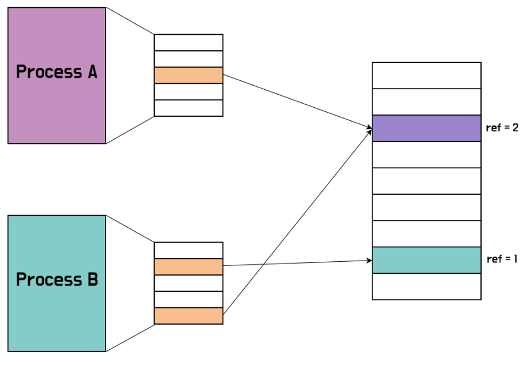
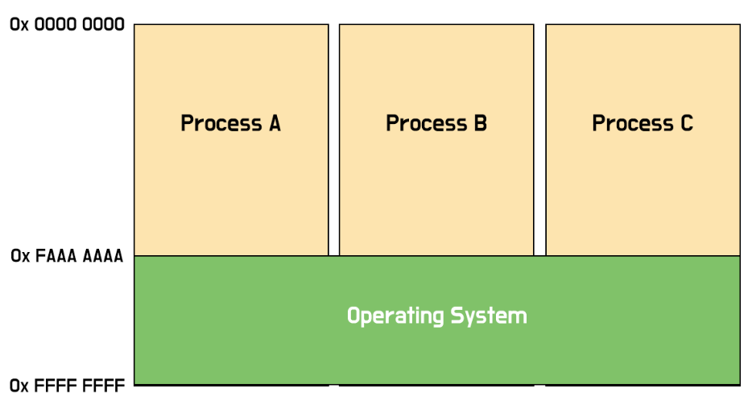
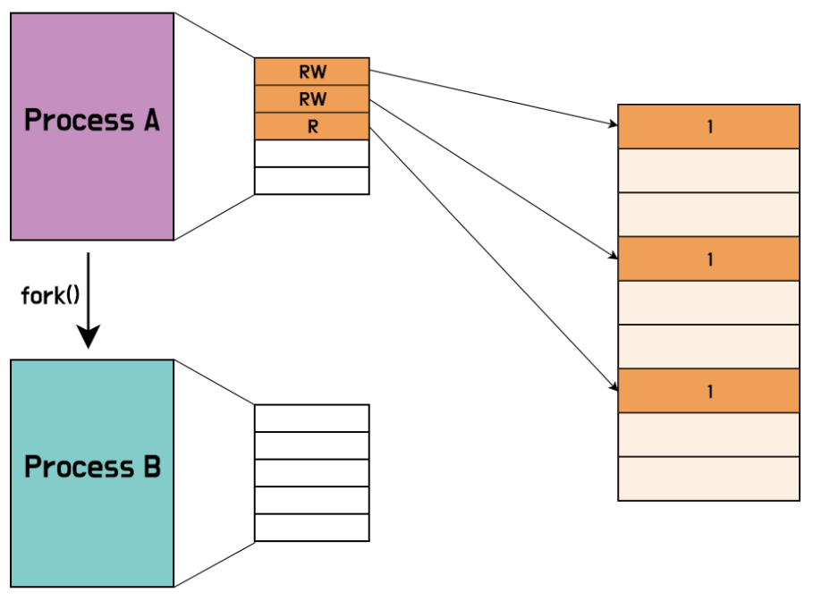
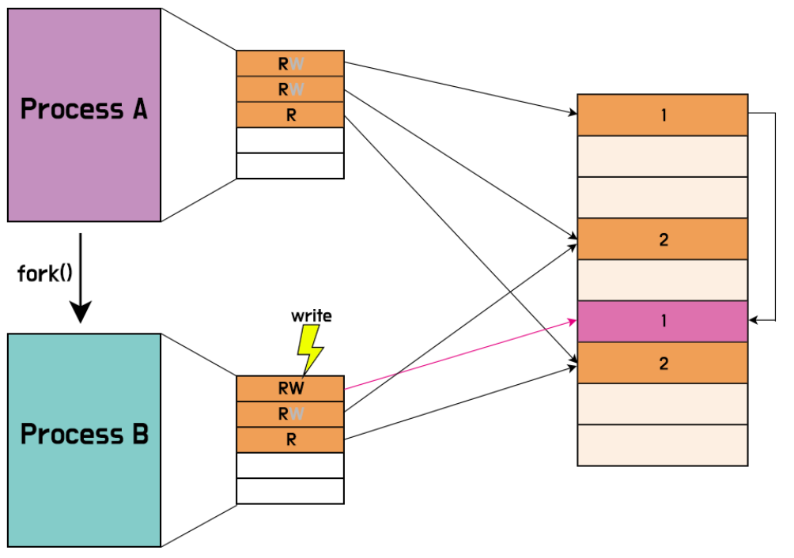

# ⚪Swapping

/img.png){: width="50%"}

swapping이란, 원래 컴퓨터에 돌고 있는 프로세스 중 쓰지 않는 프로세스는 메인 메모리에서 Backing store(SSD, HDD)에 넣는것/빼오는 것이다. 하지만 위의 경우처럼 프로세스 전체를 swap하는 방식은 지금은 쓰지 않는다.

 

요즘 swapping이라고 하면 프로세스 전체를 바꾸는 것이 아니라 **page를 swapping하는 경우**를 말한다. 그리고 **이를 Demand Paging**이라고 한다.

 

 

 

# ⚪Demand Paging

앞서 말했듯이 Demand Paging은 page 단위로 swaping을 하는 것이다.

 

demand paging은 다음 과정을 통해 실행된다.

 

1. OS가 swap out할 victim page를 고른다.
2. disk에 swap out 한다.
3. 방금 뺀 page 대한 PTE를 업데이트한다.
4. 빈 page(물리 메모리)에 새로운 프로세스의 page를 할당한다.

> /img-1720984829784-39.png){: width="50%"}   
>     PTE(page table entry)

만약 특정 page가 쫓겨나게되면, OS는 쫓겨난 page에 대한 PTE를 수정한다.

먼저 Valid bit를 0으로 설정하고,   
PFN부분에 스왑 파일 내의 위치 (예: 스왑 파일의 블록 번호. hdd나 ssd의 블록번호임)를 기록한다.   
이후에 MMU가 page table을 읽다가 invalid 한 PTE를 만나면, OS에게 문제를 해결해달라고 **page fault**라는 exception을 날린다.

> [**페이지 폴트 처리 과정**]
>
> 1.**페이지 폴트 발생:**
>
> - 프로세스가 접근하려는 페이지가 현재 물리 메모리에 없는 경우, 페이지 폴트가 발생함.
>
> 2.**페이지 폴트 핸들러 호출:**
>
> - 운영체제의 페이지 폴트 핸들러가 호출됨. 페이지 폴트 핸들러는 페이지 폴트를 처리하고 필요한 페이지를 메모리에 로드하는 역할을 함.
>
> 3.**메모리에 빈 공간 확보:**
>
> - 페이지를 로드할 물리 메모리 공간을 확보함. 만약 물리 메모리가 꽉 찬 상태라면, 다른 페이지를 스왑 아웃하여 빈 공간을 만듦.
>
> 4.**스왑 파일에서 페이지 로드:**
>
> - 페이지 폴트 핸들러는 페이지 테이블 엔트리(PTE)를 확인하여 스왑 파일에 저장된 페이지의 위치를 찾음. 이 위치는 PTE의 PFN(페이지 프레임 번호) 필드에 기록되어 있음.
> - 스왑 파일에서 해당 페이지를 읽어 물리 메모리의 빈 공간에 로드함.
> - (스왑파일 : 운영체제가 물리 메모리가 부족할 때, 사용하지 않는 페이지들을 일시적으로 저장하기 위해 사용하는 디스크상의 파일)
>
> 5.**페이지 테이블 엔트리 업데이트:**
>
> - PTE의 유효 비트(Valid bit)를 1로 설정하여 페이지가 이제 메모리에 있음을 나타냄.
> - PFN 필드를 업데이트하여 페이지가 로드된 물리 메모리의 주소를 가리키도록 함.

이와같은 demand paging이 가능한 이유는 **principle of locality** 때문이다.  
temporal locality는 최근에 사용된 놈이 다시 사용될 가능성이 높다는 것이고, spatial locality는 최근에 사용된 놈의 가까운 곳에 있는 놈이 다시 사용될 가능성이 높다는 것이다.

이런 principle of locality 때문에 demand paging이 높은 효율성을 자랑하고, 잘 쓰일 수 있다.

 

 

 

# ⚪Virtual Memory System

앞서 계속해서 설명했던 Logical Memory를 Physical Memory로 mapping해서 메모리를 관리하는 것을 Virtual Memory System이라고 한다.

 

**VM의 장점** 

1) 유저용 메모리(Logical memory)와 컴퓨터용 메모리(Physical memory) 분리가능
2) address space를 많은 프로세스들과 공유 가능해진다. (demand paging)
3) 더 많은 프로세스를 메모리를 효율적으로 관리하며 돌릴 수 있다.
4) 원래는 프로세스가 사용하는 모든 메모리가 다 main memory에 올라와야 하는데, VM쓰면 필요한 부분만 불러오기가 가능해진다.

가상메모리에 관한 자세한 내용은 [링크](https://igh01gi.github.io/os/VirtualMemory/){:target="_blank"}

 

 

 

# ⚪**Shared Memory in VM**

VM 시스템에서 메모리를 share 하는것은 굉장히 간단함.

{: width="50%"}

위의 그림처럼 두 프로세스가 하나의 메모리를 공유할 때, 각각의 LA(Logical Address)가 하나의 PA(Physical Address)를 가리키면 간단하게 공유가 된다.

 

{: width="50%"}

참고로 운영체제가 담겨있는 메모리 영역은 모든 프로세스가 공유하고 있다. 각 프로세스가 운영체제 프로그램이 저장된 page frame을 동시에 참조하고 있다.

 

 

 

# ⚪**Copy-on-Write**

Copy-on-Write는 VM(Virtual Memory) 시스템에서 process fork 할 경우 쓰는 방법이다.

 

fork 할 때, 프로세스의 모든 메모리를 복사하면 오버헤드가 너무 크고, shared 하면 독립적으로 메모리가 동작하지 못한다. 그래서 고안해낸 방법이 CoW이다.

 

CoW는 우선 fork를 하면, 동일한 메모리 페이지를 공유도록 복사하고  
해당 Logical memory의 write permission을 끈다.   
이후에 만약 그 Logical memory에 두 프로세스 중 누군가가 write 하려하면 그제서야 새로운 Physical memory를 할당해주는 방법이다.

 

{: width="50%"}

fork()를 막 할 시점에, Process A의 페이지 테이블을 보면 RW권한인 것도 있고 R권한인 것도 있음.

 

{: width="50%"}

fork를 하면 부모와 자식 프로세스의 페이지 **테이블 엔트리(PTE)는 동일한 물리 메모리 주소**를 가리키게 됨.

모든 이 공유된 페이지는  "**읽기 전용(Read Only)**" 으로 설정됨.

 

{: width="50%"}

부모나 자식 프로세스 중 하나가 공유된 페이지에 쓰기 작업을 시도하면, 페이지 폴트가 발생함

 

{: width="50%"}

운영체제는 이 페이지 폴트를 페이지 폴트 핸들러를 통해서 처리함

핸들러는 이 page fault가 권한이 없는데 접근해서 생긴 fault인지, CoW 과정에서생긴 fault인지 판단하고 상황에 따라 처리를 해줌

쓰기를 시도한 프로세스는 새로운 물리 메모리 페이지를 할당받고, 기존의 공유된 페이지 내용을 새로운 페이지로 복사

페이지 테이블 엔트리를 업데이트하여, 쓰기를 시도한 프로세스는 이제 새로 할당된 페이지를 가리키게 됨   
그리고 이 페이지에 대한 쓰기 권한을 부여함

다른 프로세스는 여전히 원래의 페이지를 참조

 

위와 같은 CoW 는 많이 사용된다.   
대표적으로 malloc으로 메모리 동적 할당을 했을 때, 컴퓨터는 실제로 모든 메모리를 준비해놓는것이 아니라, CoW를 통해 모두 shared 해놓은 뒤, 필요시마다 새로 메모리를 할당해주는 식으로 동작한다.