<a href="https://www.inflearn.com/course/%EC%8A%A4%ED%94%84%EB%A7%81-%EC%9E%85%EB%AC%B8-%EC%8A%A4%ED%94%84%EB%A7%81%EB%B6%80%ED%8A%B8" target="_blank">
  
</a>

```
본 시리즈는 인프런 김영한님의
'스프링 입문 - 코드로 배우는 스프링 부트, 웹 MVC,DB 접근 기술'
을 보고 공부용으로 작성한 것입니다.
```

<br>

<br>

<br>

# <span style="color: #D6ABFA;">⚪프로젝트 생성</span>

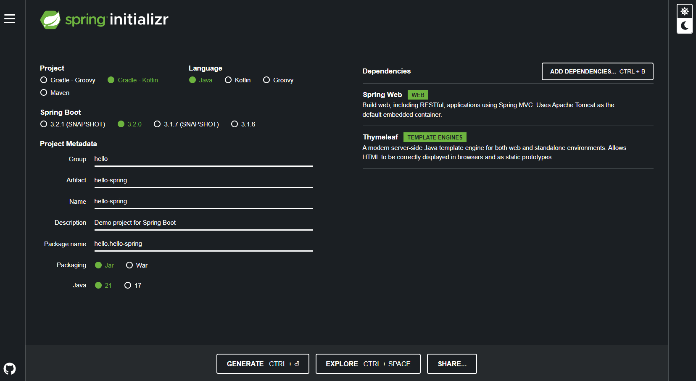

[https://start.spring.io](https://start.spring.io){:target="_blank"}

스프링 부트 스타터 사이트로 이동하여서 스프링 프로젝트를 생성함

## 🔹기본 설정값

- **Project** : Gradle-Kotlin
- **Language** : Java
- **Spring Boot** : 현재 나와있는 정식버전중 가장 최신
- **Packaging** : Jar
- **Java** : 21

## 🔹Dependencies 세팅

- **Spring Web**
- **Thymeleaf** : html을 만들어주는 템플릿 엔진들중 하나


<br>

<br>

<br>

# <span style="color: #D6ABFA;">⚪프로젝트 구조</span>

## 🔹main과 test 폴더 분리

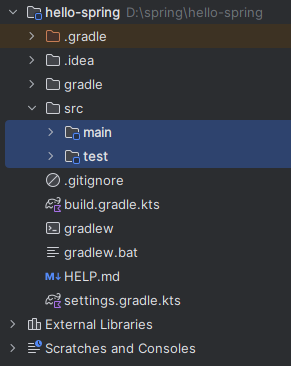

기본적으로 main과 test폴더가 나눠져 있음

## 🔹resources 폴더


실제 자바 코드파일을 제외한 프로퍼티스, xml등등의 설정파일등이 들어가는 곳임

자바 파일을 제외한 것들은 여기로 간다고 생각

## 🔹build.gradle

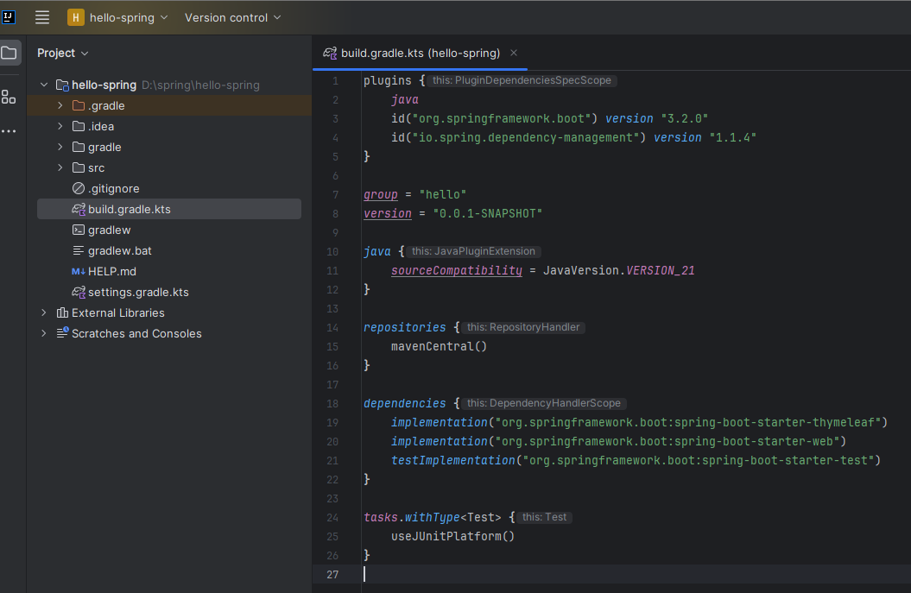

gradle을 통해서 버전 설정 및 라이브러리를 땡겨온 것들의 정보를 알 수 있음

dependencies에 써있는 라이브러리들을 다운받는 곳이 repositories에 써있는 mavenCentral()이라는 곳임

필요하다면 특정 사이트 url을 넣을수도 있음

## 🔹메인 메소드

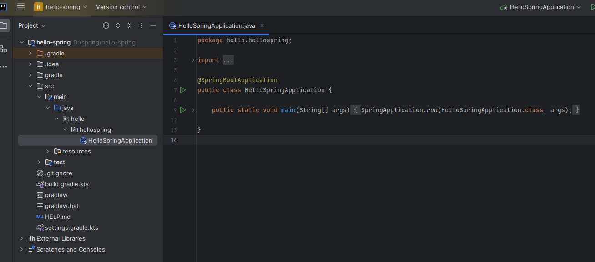

기본적으로 생성되어 있는 메인메소드가 존재함

실행시키면 톰캣이라는 내장하고 있는 웹서버를 띄우면서 **localhost:8080**을 통해서 페이지 접속이 가능하게 됨

## 🔹미세 설정 팁

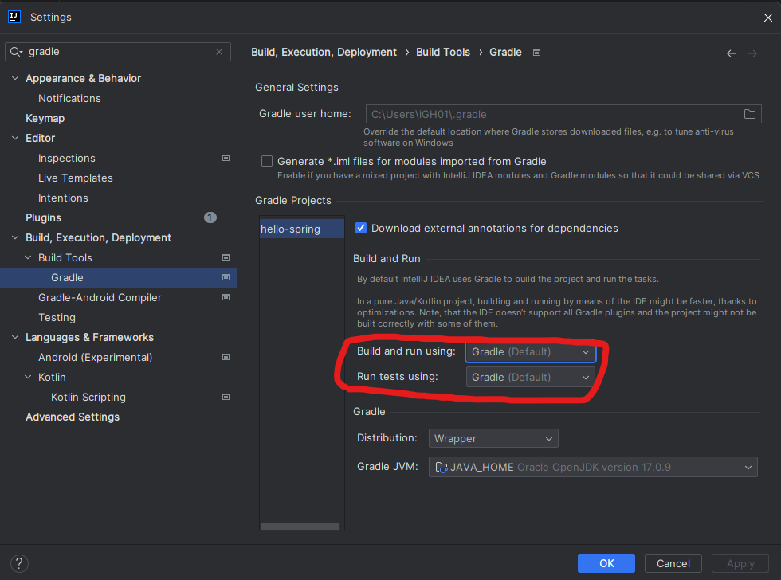

IntelliJ에서 위 설정값이 기본으로 Gradle로 돼있는데, 둘다 Java로 바꿔주면 그레이들을 통하지 않고 실행하게 되어서 속도를 향상시킬 수있음

<br>

<br>

<br>

# <span style="color: #D6ABFA;">⚪라이브러리</span>

## 🔹스프링 부트 라이브러리

- **spring-boot-starter-web**
  - **spring-boot-starter-tomcat** : 톰캣(웹서버)
  - **spring-webmvc** : 스프링 웹 MVC
- **spring-boot-starter-thymeleaf** : 타임리프 템플릿 엔진(View)
- **spring-boot-starter(공통)** : 스프링 부트 + 스프링 코어 + 로깅
  - **spring-boot**
    - **spring-core**
  - **spring-boot-starter-logging**
    - **lgback, slf4j**

## 🔹테스트 라이브러리

- **spring-boot-starter-test**
  - **junit** : 테스트 프레임워크
  - **mockito** : 목 라이브러리
  - **assertj** : 테스트 코드를 좀 더 편하게 작성하게 도와주는 라이브러리
  - **spring-test** : 스프링 통합 테스트 지원

> **템플릿 엔진**
>
> 지정된 템플릿 양식과 데이터가 합쳐져 HTML 문서를 출력하는 소프트웨어

<br>

<br>

<br>

# <span style="color: #D6ABFA;">⚪View 환경설정</span>

## 🔹Welcome Page 만들기

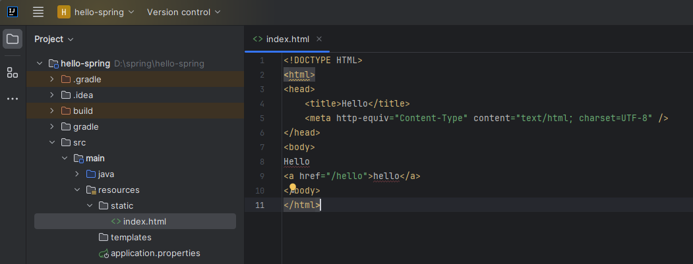

```java
<!DOCTYPE HTML>
<html>
<head>
    <title>Hello</title>
    <meta http-equiv="Content-Type" content="text/html; charset=UTF-8" />
</head>
<body>
Hello
<a href="/hello">hello</a>
</body>
</html>
```

- 스프링 부트가 제공하는 Welcome Page (첫 페이지) 기능
- resources/static/index.html 을 올려두면 해당 내용을 띄워줌

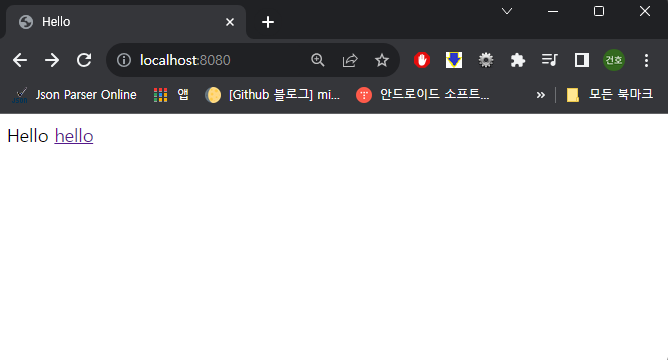

## 🔹Controller 만들기

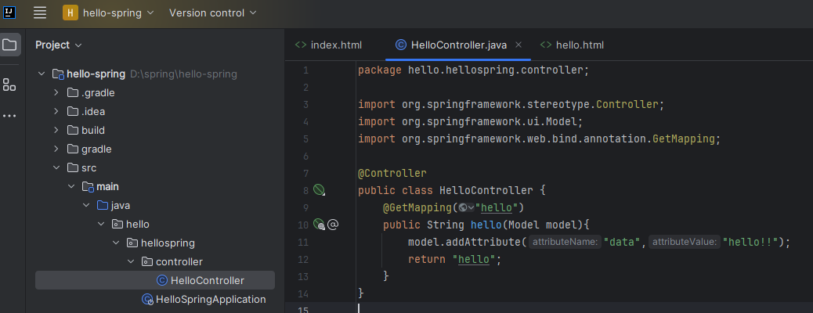

```java
package hello.hellospring.controller;

import org.springframework.stereotype.Controller;
import org.springframework.ui.Model;
import org.springframework.web.bind.annotation.GetMapping;

@Controller
public class HelloController {
    @GetMapping("hello")
    public String hello(Model model){
        model.addAttribute("data","hello!!");
        return "hello";
    }
}
```

먼저 controller 패키지를 만든다음에 그곳에 HelloController.java를 생성함

이것은 **Controller로 작동**할 예정 (mvc패턴에서의 그 controller)

```java
@GetMapping("hello")
```

 Spring Framework에서 사용되는 어노테이션 중 하나로, 해당 메서드가 HTTP GET 요청에 응답하는 역할

웰컴페이지에 /hello를 링크로 연결해두었기 때문에, 사용자가 웹페이지에서 해당 링크를 누르면 위 메소드가 작동하게 됨

## 🔹thymeleaf 템플릿 엔진을 활용한 view

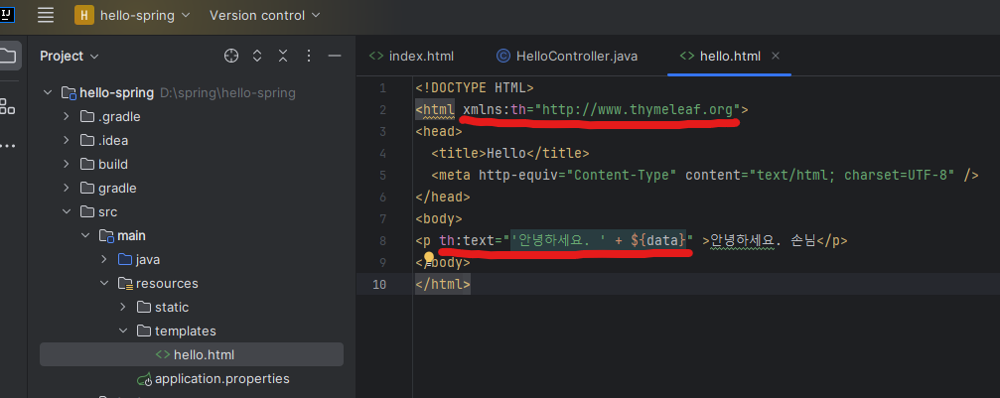

```java
<!DOCTYPE HTML>
<html xmlns:th="http://www.thymeleaf.org">
<head>
  <title>Hello</title>
  <meta http-equiv="Content-Type" content="text/html; charset=UTF-8" />
</head>
<body>
<p th:text="'안녕하세요. ' + ${data}" >안녕하세요. 손님</p>
</body>
</html>
```

resources/templates 폴더에 hello.html 을 생성함.

**View**로 작동할 예정이며, 컨트롤러에서 넘겨준 데이터를 ${data}부분을 통해 넘겨받아 표시해줌

thymeleaf템플릿 엔진의 기능을 사용해서 가능

```java
<html xmlns:th="http://www.thymeleaf.org">
```

을 통해서 thymeleaf템플린 엔진 문법을 사용할수 있게 한후

```java
<p th:text="'안녕하세요. ' + ${data}" >안녕하세요. 손님</p>
```

이 부분을 통해서 컨트롤러가 data라는 키로 넘겨준 밸류를 넣어서 출력하게 됨

<br>

결과창

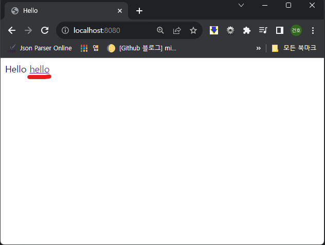

웰컴페이지에 링크를 걸어뒀던 hello를 클릭하면

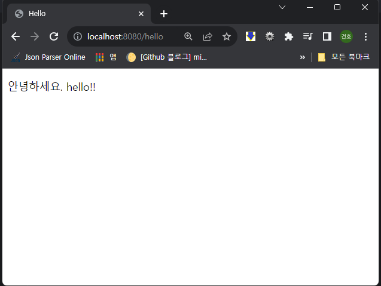

아래처럼 컨트롤러가 넘겨준 hello!!가 출력됨

<br>

## 🔹현재 구성한 환경 정리

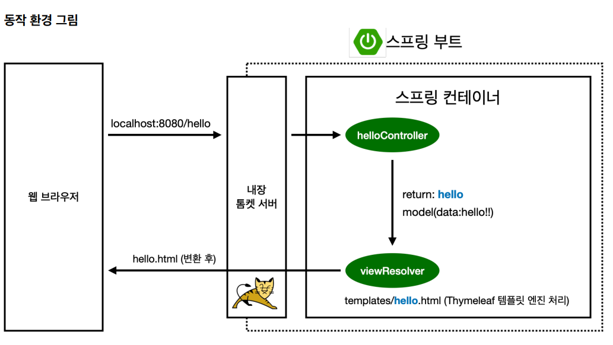

> Controller에서 리턴 값으로 문자를 반환하면 viewResolver가 화면을 찾아서 처리함
>
> - 스프링 부트 템플릿엔진 기본 viewName 매핑
> - resources/templates/ + {ViewName} + .html

Controller에서 return "hello"를 하였기 때문에 resources/templates/hello.html을 찾아서 처리하게 됨

> 참고: spring-boot-devtools 라이브러리를 추가하면, html 파일을 컴파일만 해주면 서버 재시작 없이 View 파일 변경이 가능하다. 

<br>

<br>

<br>

# <span style="color: #D6ABFA;">⚪빌드 & 실행</span>

윈도우 기준

- cmd에서 스프링 프로젝트 디렉토리로 이동
-   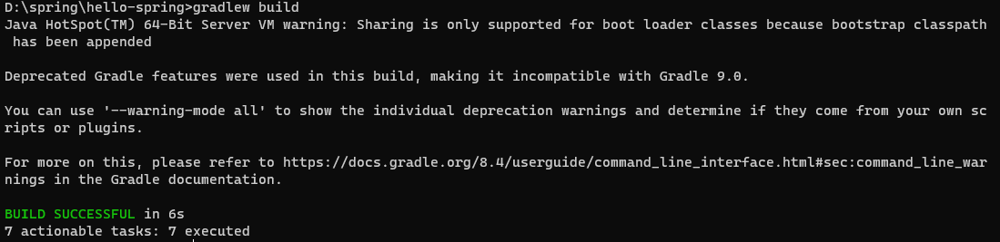  
  **gradelw build**를 통해서 빌드함
- 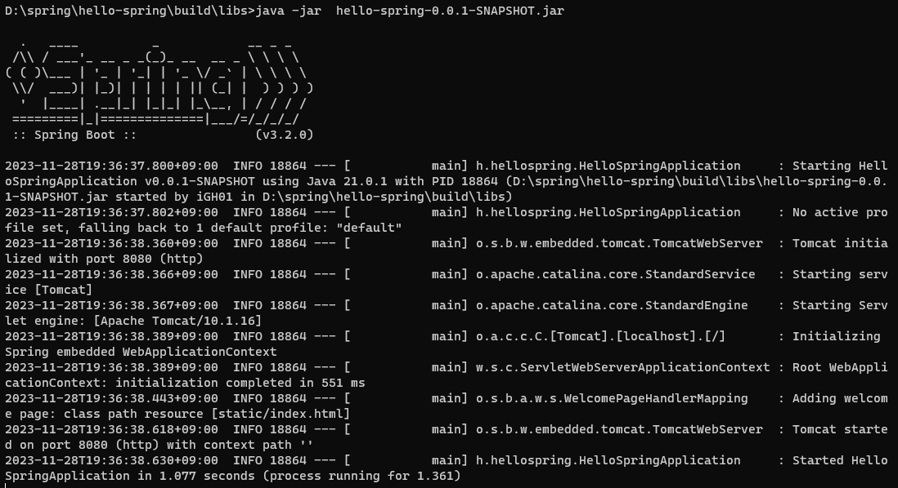  
  build\libs 폴더속 생성된 jar파일을 **java -jar** 명령어 뒤에 써주어서 실행시키면 끝  
  이 jar파일을 서버에 넣어놓고 실행시키면 되는 방식임  
  (이때 plain파일이 아닌 일반 jar파일을 실행시켜줘야 함)
- http://localhost:8080/ 를 통해서 접속이 가능해짐
