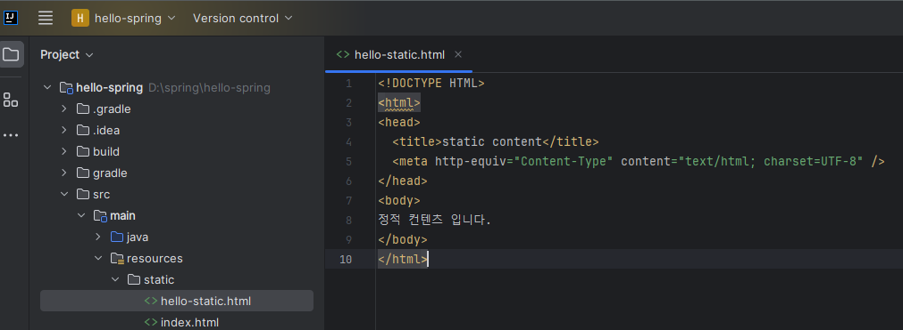
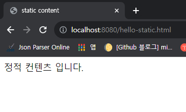
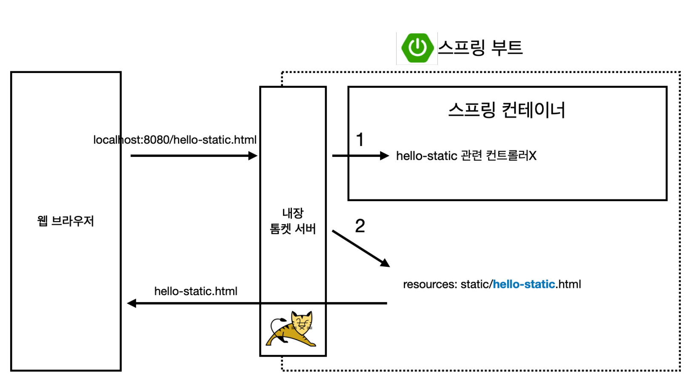
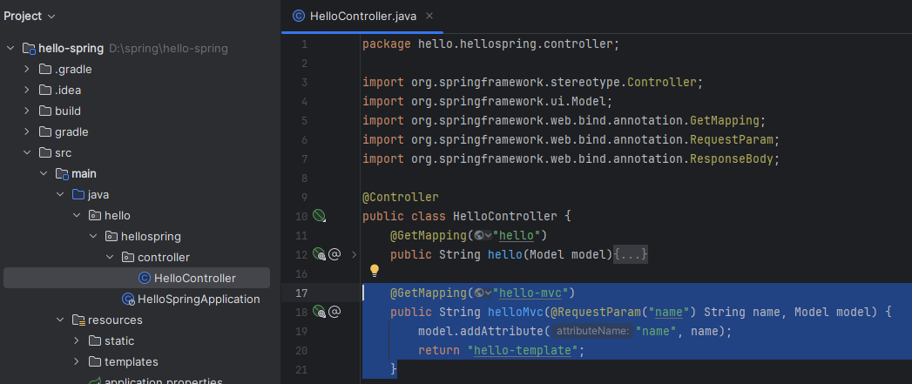
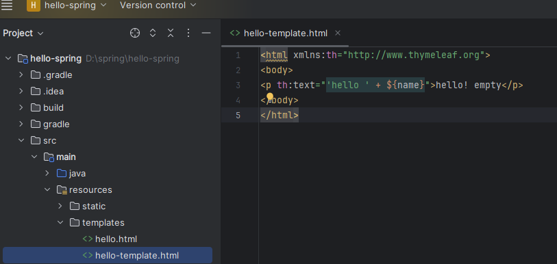
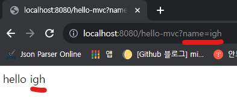
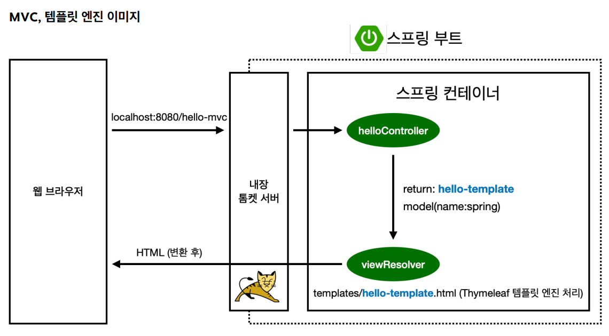
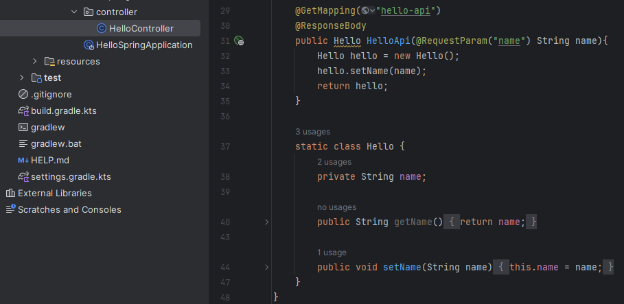
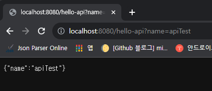
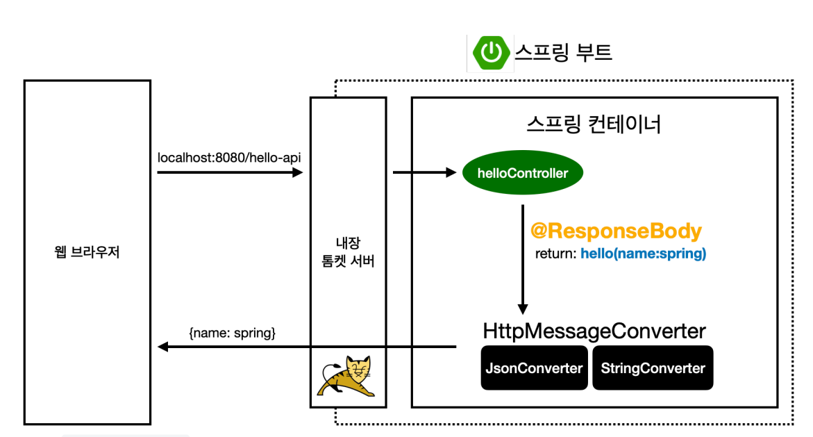

<a href="https://www.inflearn.com/course/%EC%8A%A4%ED%94%84%EB%A7%81-%EC%9E%85%EB%AC%B8-%EC%8A%A4%ED%94%84%EB%A7%81%EB%B6%80%ED%8A%B8" target="_blank">
  
</a>

```
본 시리즈는 인프런 김영한님의
'스프링 입문 - 코드로 배우는 스프링 부트, 웹 MVC,DB 접근 기술'
을 보고 공부용으로 작성한 것입니다.
```

<br>

<br>

<br>

# <span style="color: #D6ABFA;">⚪정적 컨텐츠</span>





마치 깃허브 블로그처럼 미리 작성해둔 화면을 그대로 보여주는 것

현재 컨트롤러에 hello-static관련 매핑을 해두지 않았기 때문에 hello-static.html은 정적 컨텐츠로서 작동함

따라서 http://localhost:8080/hello-static.html 를 입력하면 사전에 작성해둔 html이 특별한 처리없이 그대로 표시됨

<br>



내장 톰켓 서버에서 스프링어 hello-static.html이 왔다고 넘기면, 

먼저 스프링에서 컨트롤러쪽에서 관련 컨트롤러가 있는지 찾아봄. 그러나 매핑된 컨트롤러가 없기 때문에

resources안에 있는 static폴더에서 찾아봄

<br>

<br>

# <span style="color: #D6ABFA;">⚪MVC와 템플릿 엔진</span>

- **M** : Model
- **V** : View
- **C** : Controller



```java
 @GetMapping("hello-mvc")
    public String helloMvc(@RequestParam("name") String name, Model model) {
        model.addAttribute("name", name);
        return "hello-template";
    }
```

hello-mvc에 컨트롤러를 매핑하였음

**@RequestParam**을 통해서 리퀘스트값으로 name을 받음

그리고 model에 받은 값을 name 키값에 넣어서 view쪽으로 전달해줌

return "hello-template"를 했기때문에 resources/templates/hello-template.html을 생성해줘야 함

<br>



```java
<html xmlns:th="http://www.thymeleaf.org">
<body>
<p th:text="'hello ' + ${name}">hello! empty</p>
</body>
</html>
```

타임리프 템플릿 엔진을 활용해서 컨트롤러부터 전달받은 name이라는 키값에 들어있는 value를 꺼내서 보여줌



> ${ }구문을 통해서 key값에 들어있는 value를 꺼낼수 있음

<br>



<br>

<br>

<br>

# <span style="color: #D6ABFA;">⚪API</span>



- **@ResponseBody**를 사용하면 viewResolver를 사용하지 않음
- @ResponseBody를 사용한채 문자를 반환하면 문자 내용 그대로를 반환하고, **객체를 반환하면 객체가 JSON**으로 변환됨



객체를 반환하였기 때문에 위처럼 json형식으로 반환된 것을 확인 가능

<br>



- **@ResponseBody**를 사용
  - **viewResolver** 대신에 **HttpMessageConverter** 가 동작
  - 기본 문자처리: **StringHttpMessageConverter**
  - 기본 객체처리: **MappingJackson2HttpMessageConverter**
  - byte 처리 등등 기타 여러 HttpMessageConverter가 기본으로 등록되어 있음

>참고: 클라이언트의 HTTP Accept 해더와 서버의 컨트롤러 반환 타입 정보 둘을 조합해서 HttpMessageConverter 가 선택된다.
