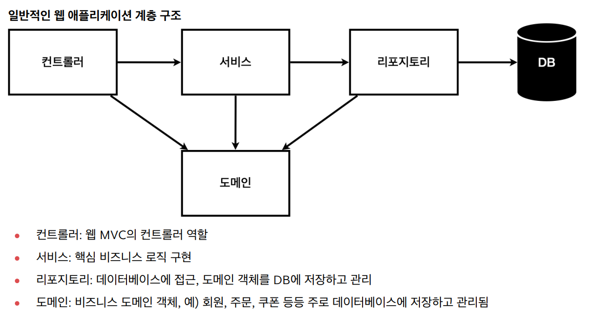
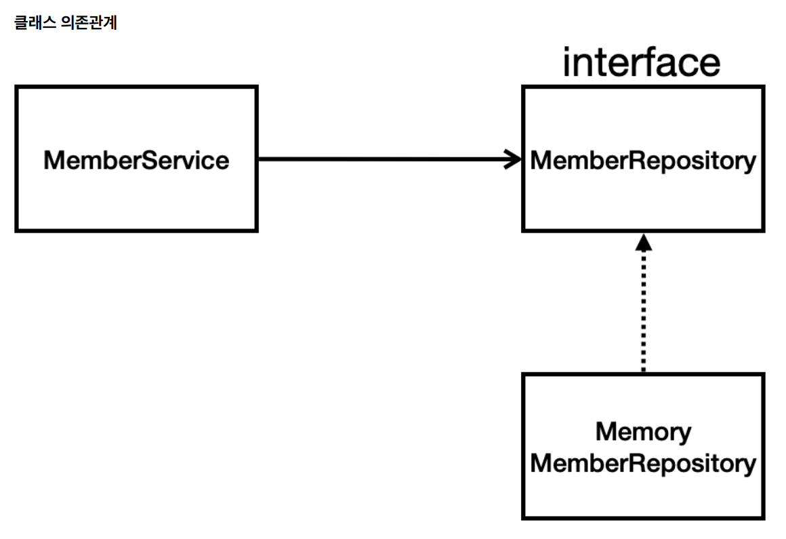
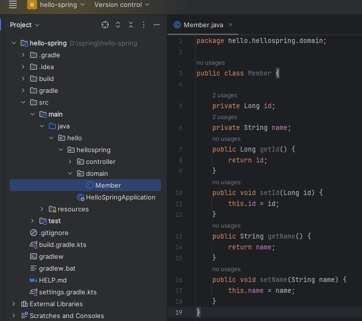
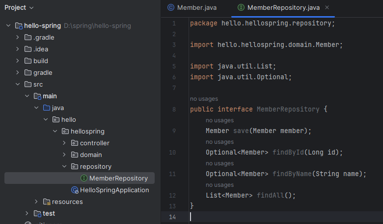
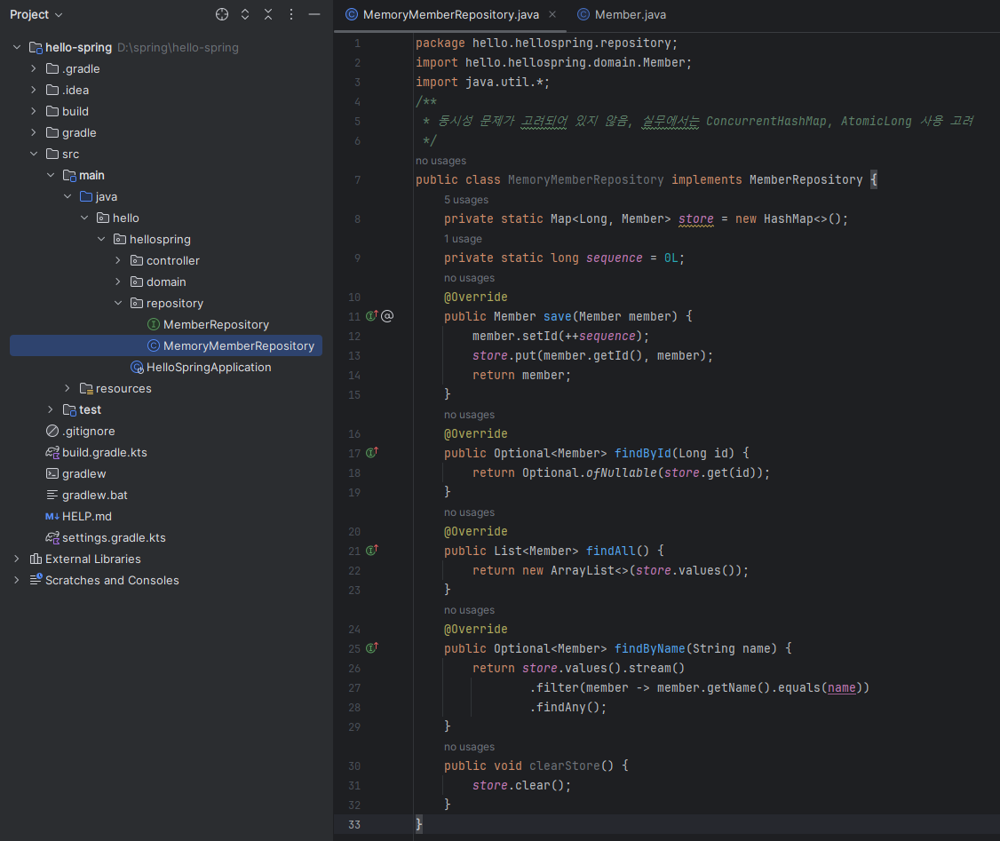
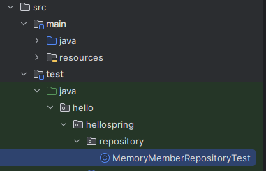
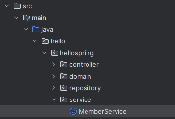
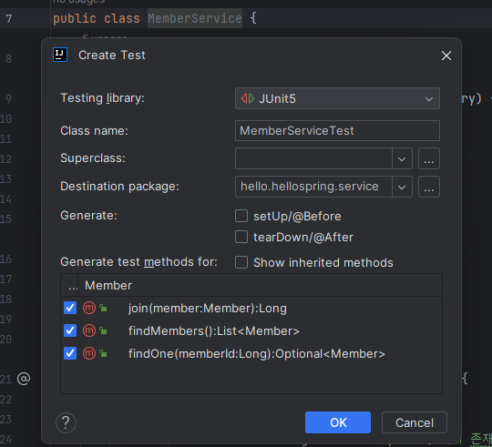
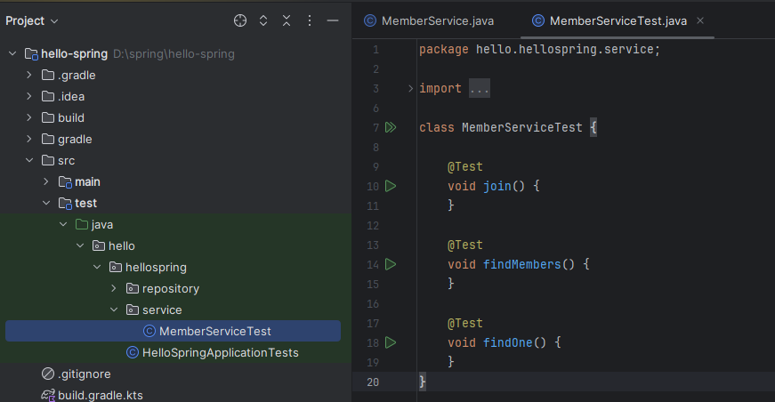

<a href="https://www.inflearn.com/course/%EC%8A%A4%ED%94%84%EB%A7%81-%EC%9E%85%EB%AC%B8-%EC%8A%A4%ED%94%84%EB%A7%81%EB%B6%80%ED%8A%B8" target="_blank">
  
</a>

```
본 시리즈는 인프런 김영한님의
'스프링 입문 - 코드로 배우는 스프링 부트, 웹 MVC,DB 접근 기술'
을 보고 공부용으로 작성한 것입니다.
```

<br>

<br>

<br>

# <span style="color: #D6ABFA;">⚪비지니스 요구사항 정리</span>

- **데이터** : 회원ID, 이름
- **기능** : 회원 등록, 조회
- 아직 데이터 저장소가 선정되지 않음(가상의 시나리오)

## 🔹일반적인 웹 애플리케이션 계층 구조



## 🔹클래스 의존 관계



- 아직 데이터 저장소가 선정되지 않아서, 우선 인터페이스로 구현 클래스를 변경할 수 있도록 설계
- 데이터 저장소는 RDB, NoSQL 등등 다양한 저장소를 고민중인 상황으로 가정
- 개발을 진행하기 위해서 초기 개발 단계에서는 구현체로 가벼운 메모리 기반의 데이터 저장소 사용

<br>

<br>

<br>

# <span style="color: #D6ABFA;">⚪회원 도메인과 리포지토리 생성</span>

## 🔹회원 도메인



```java
package hello.hellospring.domain;

public class Member {

    private Long id;
    private String name;
    
    public Long getId() {
        return id;
    }
    public void setId(Long id) {
        this.id = id;
    }
    public String getName() {
        return name;
    }
    public void setName(String name) {
        this.name = name;
    }
}
```

domain 패키지를 생성해준 다음 그곳에 Member.java로 회원 도메인을 생성

id와 name만을 갖고 있는 단순한 도메인

## 🔹리포지토리 인터페이스



```java
package hello.hellospring.repository;

import hello.hellospring.domain.Member;

import java.util.List;
import java.util.Optional;

public interface MemberRepository {
    Member save(Member member);
    Optional<Member> findById(Long id);
    Optional<Member> findByName(String name);
    List<Member> findAll();
}
```

repository 패키지를 생성해준 다음 그곳에 MemberRepository인터페이스를 생성

Optional는 Java8부터 사용하는 문법인데, null을 반환할 가능성이 있는 것들은 Optional을 통해서 반환하는것이 추세라고 함

## 🔹리포지토리 구현체



```java
package hello.hellospring.repository;
import hello.hellospring.domain.Member;
import java.util.*;
/**
 * 동시성 문제가 고려되어 있지 않음, 실무에서는 ConcurrentHashMap, AtomicLong 사용 고려
 */
public class MemoryMemberRepository implements MemberRepository {
    
    private static Map<Long, Member> store = new HashMap<>();
    private static long sequence = 0L;
    
    @Override
    public Member save(Member member) {
        member.setId(++sequence);
        store.put(member.getId(), member);
        return member;
    }
    
    @Override
    public Optional<Member> findById(Long id) {
        return Optional.ofNullable(store.get(id));
    }
    
    @Override
    public List<Member> findAll() {
        return new ArrayList<>(store.values());
    }
    
    @Override
    public Optional<Member> findByName(String name) {
        return store.values().stream()
                .filter(member -> member.getName().equals(name))
                .findAny();
    }
    
    public void clearStore() {
        store.clear();
    }
}
```

아직 저장소가 정해지지 않았다는 가정하에 개발중인 것이기 때문에, 간단한 테스트를 위해서 메모리에 저장하는 형식으로 가기로 결정

그 결과 만든 클래스임

## 🔹회원 리포지토리 테스트 케이스



```java
package hello.hellospring.repository;

import hello.hellospring.domain.Member;
import org.junit.jupiter.api.AfterEach;
import org.junit.jupiter.api.Test;
import java.util.List;
import java.util.Optional;
import static org.assertj.core.api.Assertions.*;

class MemoryMemberRepositoryTest {
    MemoryMemberRepository repository = new MemoryMemberRepository();
    @AfterEach
    public void afterEach() {
        repository.clearStore();
    }

    @Test
    public void save() {
        //given
        Member member = new Member();
        member.setName("spring");

        //when
        repository.save(member);

        //then
        Member result = repository.findById(member.getId()).get();
        assertThat(result).isEqualTo(member);
    }

    @Test
    public void findByName() {
        //given
        Member member1 = new Member();
        member1.setName("spring1");
        repository.save(member1);
        Member member2 = new Member();
        member2.setName("spring2");
        repository.save(member2);

        //when
        Member result = repository.findByName("spring1").get();

        //then
        assertThat(result).isEqualTo(member1);
    }

    @Test
    public void findAll() {
        //given
        Member member1 = new Member();
        member1.setName("spring1");
        repository.save(member1);
        Member member2 = new Member();
        member2.setName("spring2");
        repository.save(member2);

        //when
        List<Member> result = repository.findAll();

        //then
        assertThat(result.size()).isEqualTo(2);
    }
}
```

test.java.hello.hellospring.repository 경로에 MemoryMemberRepositoryTest.java를 생성해서 테스트를 함

### 🔸given, when, then 주석

테스트 케이스는 보통 

- **given** : 주어진 상황
- **when** : 이걸 실행했을때
- **then** : 결과가 이게 나와야 함

으로 대부분 구분되기 때문에, 주석으로 적어서 나눠놓으면 작성할때도, 타인이 볼때도 편함

### 🔸JUnit 과 AssertJ

둘다 테스트할때 사용하는데, 

AssertJ가 문법도 쉽고 자동완성도 좋으며 등등.... 

AssertJ를 사용하자

```java
import static org.assertj.core.api.Assertions.*;
```

를 추가하면 Assertions. 를 쓰지않고 기본으로 AssertJ를 사용할 수 있게 됨

### 🔸@AfterEach 어노테이션

```java
    @AfterEach
    public void afterEach() {
        repository.clearStore();
    }
```

- **@AfterEach** : 한번에 여러 테스트를 실행하면 메모리 DB에 직전 테스트의 결과가 남을 수 있다. 이렇게 되면 다음 이전 테스트 때문에 다음 테스트가 실패할 가능성이 있다. @AfterEach 를 사용하면 각 테스트가 종료될 때 마다 이 기능을 실행한다. 여기서는 메모리 DB에 저장된 데이터를 삭제한다
- 테스트는 각각 독립적으로 실행되어야 한다. 테스트 순서에 의존관계가 있는 것은 좋은 테스트가 아니다.

<br>

<br>

<br>

# <span style="color: #D6ABFA;">⚪회원 서비스</span>

회원 서비스는 회원 리포지토리랑 도메인을 활용해서 실제 비지니스 로직을 작성하는 부분임

## 🔹회원 서비스 개발



```java
package hello.hellospring.service;

import hello.hellospring.domain.Member;
import hello.hellospring.repository.MemberRepository;
import java.util.List;
import java.util.Optional;

public class MemberService {
    private final MemberRepository memberRepository;
    
    public MemberService(MemberRepository memberRepository) {
        this.memberRepository = memberRepository;
    }

    
    /**
     * 회원가입
     */
    public Long join(Member member) {
        validateDuplicateMember(member); //중복 회원 검증
        memberRepository.save(member);
        return member.getId();
    }
    
    private void validateDuplicateMember(Member member) {
        memberRepository.findByName(member.getName())
                .ifPresent(m -> {
                    throw new IllegalStateException("이미 존재하는 회원입니다.");
                });
    }

    
    /**
     * 전체 회원 조회
     */
    public List<Member> findMembers() {
        return memberRepository.findAll();
    }
    public Optional<Member> findOne(Long memberId) {
        return memberRepository.findById(memberId);
    }
}
```

이 코드중에서

```java
    private final MemberRepository memberRepository;
    
    public MemberService(MemberRepository memberRepository) {
        this.memberRepository = memberRepository;
    }
```

MemberService클래스 입장에서보면, 외부에서 memberRepository를 만들어서 넣어줌

이런것을 **DI** (Dependency Injection)이라고 함

## 🔹회원 서비스 테스트

### 🔸쉽게 테스트 클래스 만드는 방법

테스트 하고자 하는 클래스 이름에 마우스를 누르고

윈도우 기준 **Ctrl + Shift + t** 를 누르면 됨



그러면 아래와 같이 자동으로 테스트를 위한 준비가 됨



## 🔸전체 코드

```java
package hello.hellospring.service;

import hello.hellospring.domain.Member;
import hello.hellospring.repository.MemoryMemberRepository;
import org.junit.jupiter.api.AfterEach;
import org.junit.jupiter.api.BeforeEach;
import org.junit.jupiter.api.Test;
import static org.assertj.core.api.Assertions.*;
import static org.junit.jupiter.api.Assertions.*;

class MemberServiceTest {
    MemberService memberService;
    MemoryMemberRepository memberRepository;
    
    @BeforeEach
    public void beforeEach() {
        memberRepository = new MemoryMemberRepository();
        memberService = new MemberService(memberRepository);
    }
    
    @AfterEach
    public void afterEach() {
        memberRepository.clearStore();
    }

    @Test
    public void 회원가입() throws Exception {
        //Given
        Member member = new Member();
        member.setName("hello");

        //When
        Long saveId = memberService.join(member);

        //Then
        Member findMember = memberRepository.findById(saveId).get();

        assertEquals(member.getName(), findMember.getName());
    }

    @Test
    public void 중복_회원_예외() throws Exception {
        //Given
        Member member1 = new Member();
        member1.setName("spring");
        Member member2 = new Member();
        member2.setName("spring");

        //When
        memberService.join(member1);
        IllegalStateException e = assertThrows(IllegalStateException.class,
                () -> memberService.join(member2));//예외가 발생해야 한다.

        //That
        assertThat(e.getMessage()).isEqualTo("이미 존재하는 회원입니다.");
    }
}
```

여기서

```java
assertEquals(member.getName(), findMember.getName());  ==> JUnit을 활용한 것  (expected, actual)
    
assertThat(e.getMessage()).isEqualTo("이미 존재하는 회원입니다.");  ==> AssertJ를 활용한 것   (actual, expected 순서)
```

같은 활용이지만 AssertJ가 읽기 편한것을 알 수 있음 

### 🔸@BeforeEach, @AfterEach

```java
    @BeforeEach
    public void beforeEach() {
        memberRepository = new MemoryMemberRepository();
        memberService = new MemberService(memberRepository);
    }
    
    @AfterEach
    public void afterEach() {
        memberRepository.clearStore();
    }
```

테스트 실행할때마다 새로 생성하고, 테스트가 끝날때마다 초기화 해줌
