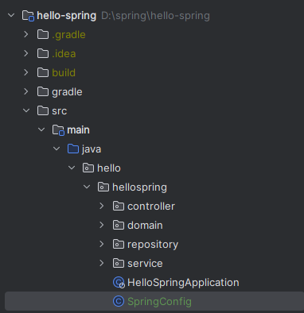
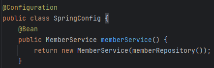
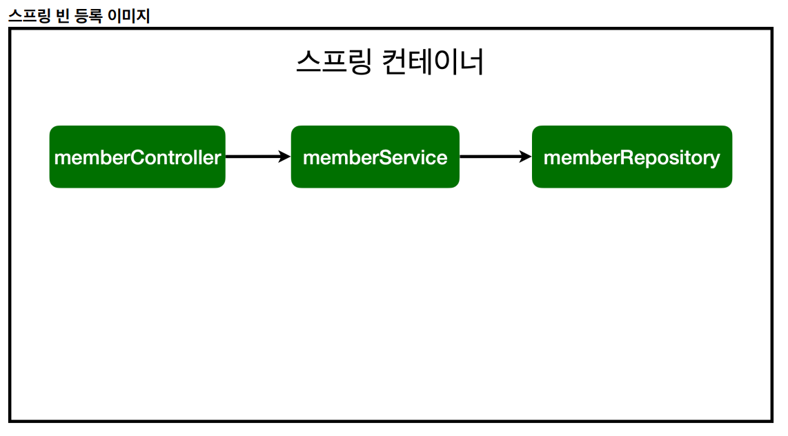
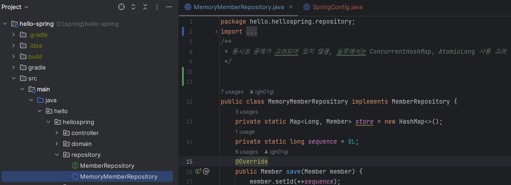
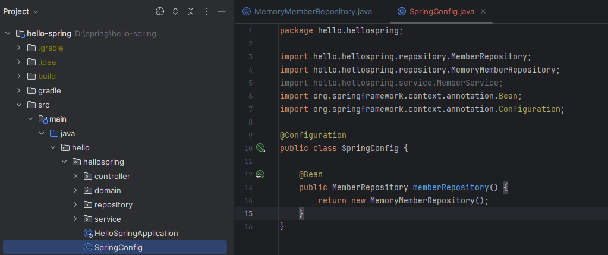

<a href="https://www.inflearn.com/course/%EC%8A%A4%ED%94%84%EB%A7%81-%EC%9E%85%EB%AC%B8-%EC%8A%A4%ED%94%84%EB%A7%81%EB%B6%80%ED%8A%B8" target="_blank">
  
</a>

```
본 시리즈는 인프런 김영한님의
'스프링 입문 - 코드로 배우는 스프링 부트, 웹 MVC,DB 접근 기술'
을 보고 공부용으로 작성한 것입니다.
```

<br>

<br>

<br>

> 이번 포스팅의 목적은 앞서서 만들었던
>
>  **memberController**, **memberService**, **memberRepository** 를 **스프링빈**으로 등록한 다음, 
>
> **DI(Dependency Injection)**을 통해서 의존성을 주입하는것을 목적으로 한다

<br>

# <span style="color: #D6ABFA;">⚪스프링 빈</span>

- 스프링 빈(Bean)은 스프링 컨테이너에 의해 관리되는 재사용 가능한 소프트웨어 컴포넌트
- 스프링은 스프링 컨터이너에 스프링 빈을 등록할 때 기본으로 싱글톤으로 등록함 (유일하게 하나만 등록해서 공유하는 방식)
- 싱글톤이 아니게 설정할 수 있지만, 대부분 싱글톤으로 사용

## 🔹스프링 빈 등록법

- 1.**XML**, 2.**컴포넌트 스캔(자바 어노테이션)**, 3.**자바 코드(설정)**로 등록하는 3가지 방식이 있음

- 보통 XM방식은 사용하지 않고

- 정형화된 컨트롤러, 서비스, 리포지토리 같은 코드는 **컴포넌트 스캔(자바 어노테이션)**을 사용

- 정형화 되지 않거나, 상황에 따라 구현 클래스를 변경해야 하면 **설정(자바 코드)**을 통해 스프링 빈으로 등록

코드를 통한 사용방법 예시는 뒤에서 설명

<br>

<br>

<br>

# <span style="color: #D6ABFA;">⚪스프링 빈에서의 DI (Dependency Injection)</span>

스프링 빈에서 의존관계를 주입해주는 **DI** 를 하는 방법에는 3가지 방법이 있음.

(DI라는 개념이 스프링에서만 사용되는것이 아니고, 빈에서만 사용되는 것도 아님)

1. 생성자 주입
2. setter 주입
3. 필드 주입

의존 관계가 실행중에 동적으로 변하는 경우는 거의 없으므로 거의 대부분 **생성자 주입** 방식을 사용함

코드를 통한 사용방법 예시는 뒤에서 설명

<br>

<br>

<br>

# <span style="color: #D6ABFA;">⚪스프링 빈 등록 코드</span>

## 🔹컴포넌트 스캔(자바 어노테이션)

```java
@Controller
public class MemberController {
    ...
}

@Service
public class MemberService {
    ...
}

@Repository
public class MemoryMemberRepository implements MemberRepository {
    ...
}
```

- **@Component** 어노테이션이 있다면 스프링 빈으로 자동 등록됨
- **@Component**를 포함하는 다음 어노테이션도 스프링 빈으로 자동 등록됨
  - **@Controller**
  - **@Service**
  - **@Repository**

(참고로 @SpringBootApplication이 있는 패키지를 포함한 하위 패키지들을 spring이 탐색하여 스프링 빈으로 등록하기 때문에  

해당 패키지 범위를 벗어나면  기본적으로 탐색을 하지 않기때문에 따로 설정을 해주지 않는이상 위 방식이 안됨)

## 🔹자바코드(설정)로 직접 스프링 빈 등록



SpringConfig 파일을 만든다음에 (임의의 이름임)

```java
package hello.hellospring;

import hello.hellospring.repository.MemberRepository;
import hello.hellospring.repository.MemoryMemberRepository;
import hello.hellospring.service.MemberService;
import org.springframework.context.annotation.Bean;
import org.springframework.context.annotation.Configuration;

@Configuration
public class SpringConfig {
    @Bean
    public MemberService memberService() {
        return new MemberService(memberRepository());
    }
    
    @Bean
    public MemberRepository memberRepository() {
        return new MemoryMemberRepository();
    }
}
```

클래스 위에 @Configuration 어노테이션을 쓰고, 각 스프링빈 생성자에 

MemberService와 MemberRepository를 설정한 예시

(컨트롤러는 @Controller를 붙여야하기 때문에 설정을 통해서 등록해줄 필요가 없음)

이 설정을 사용할 경우, 회원 서비스와 회원 리포지토리의 @Service, @Repository, @Autowired 애노테이션을 제거하고 진행해야 함

<br>

<br>

<br>

# <span style="color: #D6ABFA;">⚪DI 등록 코드</span>

## 🔹생성자 주입

```java
@Controller
public class MemberController {
    private final MemberService memberService;

    @Autowired
    public MemberController(MemberService memberService) {
        this.memberService = memberService;
    }
}
```


**private final**을 사용해서 선언을 하고

**@AutoWired**를 생성자에 써주면 됨

이 방법을 추천

만약 생성자가 '1'개라면 @AutoWired를 생략할 수 있음

<br>



그러나 만약 이러한 자바코드(설정)방식으로 스프링 빈을 등록했을 경우에는, 해당 클래스(이 사진을 예시로는 MemberService)에 있는 @Component 어노테이션과 생성자 주입용 @Autowired를 지워줘야 함. 

중복되는 기능이기 때문

## 🔹setter 주입

```java
@Controller
public class MemberController {
    private MemberService memberService;

    @Autowired
    public setMemberService(MemberService memberService) {
        this.memberService = memberService;
    }
}
```

생성자가 아니기 때문에, MemberController가 생성된 후에 Setter를 통해서 주입이 됨

## 🔹필드 주입

```java
@Controller
public class MemberController {
    @AutoWired private MemberService memberService;
}
```

<br>

<br>

<br>

# <span style="color: #D6ABFA;">⚪예제 최종 코드</span>

최종적으로 빈 등록 + DI 가 필요한 클래스들은

- MemberController
- MemberService
- MemoryMemberRepository (구현체)

이다

이중 MemberController와 MemberService는 컴포넌트 스캔과 생성자 주입을 활용하여 설정을 해주고

MemoryMemberRepository의 경우에만 자바코드(설정)을 통해서 스프링 빈을 등록하고 그 곳에서 DI를 해 줄 것이다.

왜냐하면 아직 저장소가 정해지지 않았기 때문에 MemberRepository를 인터페이스로 만들고 그 구현체로 MemoryMemberRepository 를 사용하고 있는 것이기 때문에 추후에 충분히 다른 클래스로 변경될 여지가 있음

그렇기 때문에 자바코드(설정)을 통하여서 MemberRepository 스프링 빈으로 등록하게 된다면 추후에 해당 설정 자바 코드만을 수정하면 끝나게 됨

해당 설정 클래스의 이름은 여기서 SpringConfig로 설정하였음



최종적으로는 위와 같이 스프링 빈 등록 및 의존관계를 설정하는 것이 목표

<br>

## 🔹MemberController.java

```java
package hello.hellospring.controller;

import hello.hellospring.service.MemberService;
import org.springframework.beans.factory.annotation.Autowired;
import org.springframework.stereotype.Controller;

@Controller
public class MemberController {
    private final MemberService memberService;

    @Autowired
    public MemberController(MemberService memberService) {
        this.memberService = memberService;
    }
}
```

## 🔹MemberService

```java
package hello.hellospring.service;

import hello.hellospring.domain.Member;
import hello.hellospring.repository.MemberRepository;
import org.springframework.beans.factory.annotation.Autowired;
import org.springframework.stereotype.Service;

import java.util.List;
import java.util.Optional;

@Service
public class MemberService {
    private final MemberRepository memberRepository;

    @Autowired
    public MemberService(MemberRepository memberRepository) {
        this.memberRepository = memberRepository;
    }

    /**
     * 회원가입
     */
    public Long join(Member member) {
        validateDuplicateMember(member); //중복 회원 검증
        memberRepository.save(member);
        return member.getId();
    }
    private void validateDuplicateMember(Member member) {
        memberRepository.findByName(member.getName())
                .ifPresent(m -> {
                    throw new IllegalStateException("이미 존재하는 회원입니다.");
                });
    }

    /**
     * 전체 회원 조회
     */
    public List<Member> findMembers() {
        return memberRepository.findAll();
    }
    public Optional<Member> findOne(Long memberId) {
        return memberRepository.findById(memberId);
    }
}
```

## 🔹MemoryMemberRepository



보면 @Repository 를 사용하지 않은것을 알 수 있음. 

즉 자바코드(설정)을 통해서 스프링 빈에 등록할 예정

(정형화 되지 않거나, 상황에 따라 구현 클래스를 변경해는 경우에 속하기 때문)

해당 자바코드(설정)의 이름은 SpringConfig 클래스로 구현함

## 🔹SpringConfig



MemberRepository 인터페이스의 구현인 MemoryMemberRepository는 추후에 교체될수 있기 때문에, 

위처럼 자바코드(설정)을 통한 방식으로 스프링빈에 등록함
