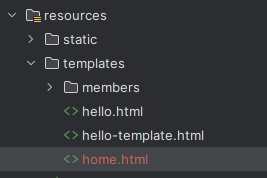

<a href="https://www.inflearn.com/course/%EC%8A%A4%ED%94%84%EB%A7%81-%EC%9E%85%EB%AC%B8-%EC%8A%A4%ED%94%84%EB%A7%81%EB%B6%80%ED%8A%B8" target="_blank">
  
</a>

```
본 시리즈는 인프런 김영한님의
'스프링 입문 - 코드로 배우는 스프링 부트, 웹 MVC,DB 접근 기술'
을 보고 공부용으로 작성한 것입니다.
```

<br>

<br>

<br>


# <span style="color: #D6ABFA;">⚪홈 화면 추가</span>

## 🔹홈 컨트롤러 추가

```java
package hello.hellospring.controller;

import org.springframework.stereotype.Controller;
import org.springframework.web.bind.annotation.GetMapping;

@Controller
public class HomeController {
    
 @GetMapping("/")
 public String home() {
 return "home";
 }
}
```

> 컨트롤러가 정적파일보다 우선순위가 높기 때문에, http://localhost:8080/ 로 접속했을때 index.html이 아닌 templates/hom.html을 띄워주게 됨

## 🔹홈 html 문서 추가



```html
<!DOCTYPE HTML>
<html xmlns:th="http://www.thymeleaf.org">
<body>

<div class="container">
    <div>
        <h1>Hello Spring</h1>
        <p>회원 기능</p>
        <p>
            <a href="/members/new">회원 가입</a>
            <a href="/members">회원 목록</a>
        </p>
    </div>
</div> <!-- /container -->

</body>
</html>
```

<br>

<br>

<br>

# <span style="color: #D6ABFA;">⚪회원 등록</span>

## 🔹회원 등록 폼 컨트롤러 추가

```java
@Controller
public class MemberController {
    private final MemberService memberService;

    @Autowired
    public MemberController(MemberService memberService) {
        this.memberService = memberService;
    }
   
    ...

    @GetMapping("/members/new")
    public String createForm(){
        return "members/createMemberForm";
    }
    
    ...
}
```

## 🔹회원 등록 폼 HTML

( resources/templates/members/createMemberForm )

```html
<!DOCTYPE HTML>
<html xmlns:th="http://www.thymeleaf.org">
<body>
<div class="container">
    <form action="/members/new" method="post">
        <div class="form-group">
            <label for="name">이름</label>
            <input type="text" id="name" name="name" placeholder="이름을 입력하세요">
        </div>
        <button type="submit">등록</button>
    </form>
</div> <!-- /container -->
</body>
</html>
```

## 🔹회원 등록 컨트롤러

웹 등록 화면에서 데이터를 전달 받을 폼 객체

```java
package hello.hellospring.controller;

public class MemberForm {
    private String name;
    public String getName() {
        return name;
    }

    public void setName(String name) {
        this.name = name;
    }
}
```

<br>

회원 컨트롤러에서 회원을 실제 등록하는 기능

```java
@Controller
public class MemberController {
    
    ...

    @PostMapping("/members/new")
    public String create(MemberForm form){
        Member member=new Member();
        member.setName(form.getName());

        memberService.join(member);

        return "redirect:/";
    }
    
    ...
}
```

<br>

<br>

<br>

# <span style="color: #D6ABFA;">⚪회원 조회</span>

## 🔹회원 컨트롤러에서 조회 

```java
@Controller
public class MemberController {
    
    ...

    @GetMapping("/members")
    public String list(Model model){
        List<Member> members = memberService.findMembers();
        model.addAttribute("members",members);
        return "members/memberList";
    }
    
    ...
}
```

## 🔹회원 리스트 HTML

```html
<!DOCTYPE HTML>
<html xmlns:th="http://www.thymeleaf.org">
<body>
<div class="container">
  <div>
    <table>
      <thead>
      <tr>
        <th>#</th>
        <th>이름</th>
      </tr>
      </thead>
      <tbody>
      <tr th:each="member : ${members}">
        <td th:text="${member.id}"></td>
        <td th:text="${member.name}"></td>
      </tr>
      </tbody>
    </table>
  </div>
</div> <!-- /container -->
</body>
</html>
```

마치 for each문을 사용하듯이 타임리프 템플릿엔진에서 처리해줌
