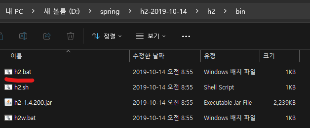
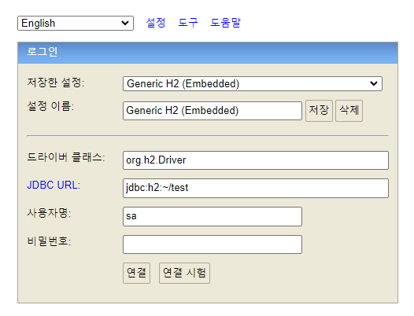
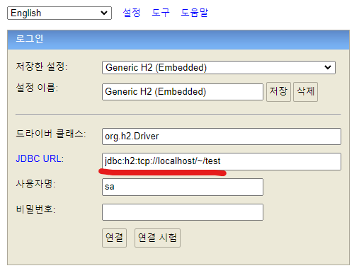
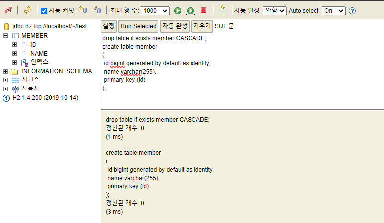
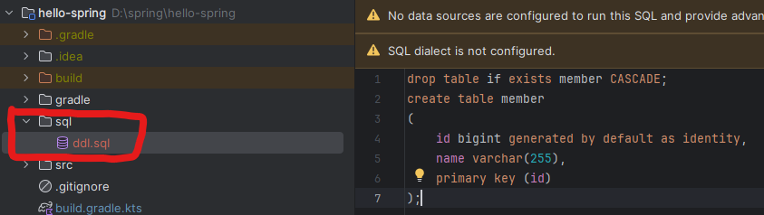
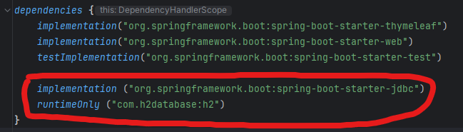
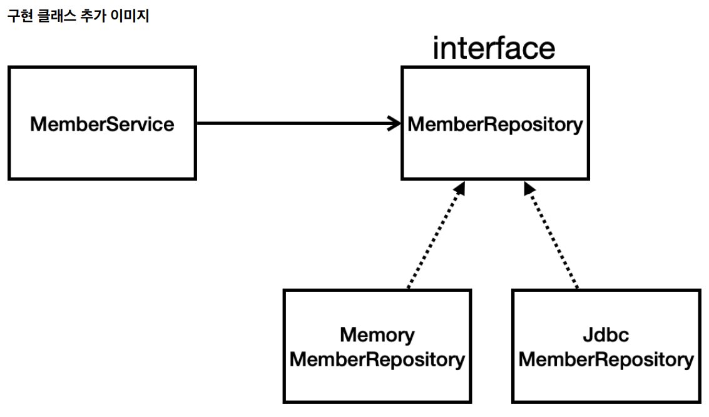
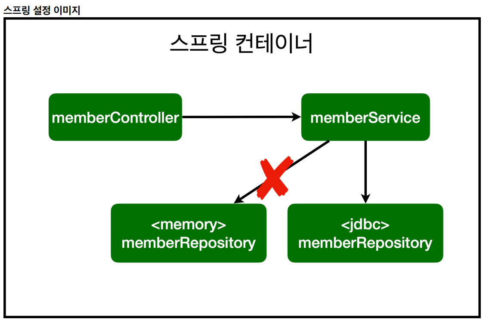

<a href="https://www.inflearn.com/course/%EC%8A%A4%ED%94%84%EB%A7%81-%EC%9E%85%EB%AC%B8-%EC%8A%A4%ED%94%84%EB%A7%81%EB%B6%80%ED%8A%B8" target="_blank">
  
</a>

```
본 시리즈는 인프런 김영한님의
'스프링 입문 - 코드로 배우는 스프링 부트, 웹 MVC,DB 접근 기술'
을 보고 공부용으로 작성한 것입니다.
```

<br>

<br>

<br>


# <span style="color: #D6ABFA;">⚪H2 데이터베이스 설치</span>

## 🔹다운로드

개발이나 테스트 용도로 가볍고 편리한 DB인 H2 데이터 베이스를 설치할 것임

[Archive Downloads (h2database.com)](https://www.h2database.com/html/download-archive.html){:target="_blank"}

위 링크에서 1.4.200 버전을 다운



bin폴더 속 h2.bat을 실행 (윈도우 기준)

<br>



연결 버튼을 누르면 


C:\Users\사용자명 폴더에 test.mv.db가 생성된다. 

이렇게 최초 test.mv.db파일을 생성한 이후부터는 JDBC URL을 파일경로 직접 접근하는 것이 아니라 소켓을 통해서 접속하도록 해줘야 함

만약 접속하는데 문제가 있다면 이 파일을 지운다음 다시 h2.bat을 실행

<br>



위와같이 JDBC URL을 **jdbc:h2:tcp://localhost/~/test** 으로 적어줘서 소켓을 통해서 접속하게 설정해줌

(이렇게 해야 여러군데에서 접속할 수 있다고 함)

## 🔹테이블 생성

```sql
drop table if exists member CASCADE;
create table member
(
 id bigint generated by default as identity,
 name varchar(255),
 primary key (id)
);
```

generated by default as identity를 써줬을때 id를 입력하지않고 insert를 하면 

db가 자동으로 이전 id에서 1증가시켜서 넣어줌



<br>



이런식으로 sql폴더를 하나 만들어서 ddl문을 적어주면 깃으로 관리가 되기 때문에 해놓으면 좋음

<br>

<br>

<br>

# <span style="color: #D6ABFA;">⚪순수 Jdbc</span>

순수 jdbc를 사용한 개발을 요즘은 하지 않음

그러나 알아두면 좋기 때문에 진행

## 🔹환경 설정

### 🔸build.gradle  설정

build.gradle파일에 jdbc와 h2 데이터베이스 관련 라이브러리를 추가하는 과정



```java
	implementation ("org.springframework.boot:spring-boot-starter-jdbc")
        //자바는 DB랑 붙으려면 jdbc드라이버가 필요함
        
	runtimeOnly ("com.h2database:h2")
        //db랑 붙을때 데이터베이스가 제공하는 클라이언트가 필요함. 이 경우엔 h2 데이터베이스 클라이언트를 사용
```

### 🔸application.properties 설정

```properties
spring.datasource.url=jdbc:h2:tcp://localhost/~/test
spring.datasource.driver-class-name=org.h2.Driver
spring.datasource.username=sa
```

> **주의!** 
>
> 스프링부트 2.4부터는 spring.datasource.username=sa 를 꼭 추가해주어야 한다. 
>
> 그렇지 않으면 Wrong user name or password 오류가 발생한다. 

## 🔹Jdbc 회원 리포지토리

```java
package hello.hellospring.repository;

import hello.hellospring.domain.Member;
import org.springframework.jdbc.datasource.DataSourceUtils;

import javax.sql.DataSource;
import java.sql.*;
import java.util.ArrayList;
import java.util.List;
import java.util.Optional;

public class JdbcMemberRepository implements MemberRepository {

    private final DataSource dataSource;

    public JdbcMemberRepository(DataSource dataSource) {
        this.dataSource = dataSource;
    }

    @Override
    public Member save(Member member) {
        String sql = "insert into member(name) values(?)";

        Connection conn = null;
        PreparedStatement pstmt = null;
        ResultSet rs = null;

        try {
            conn = getConnection();
            pstmt = conn.prepareStatement(sql, Statement.RETURN_GENERATED_KEYS);
            
            pstmt.setString(1, member.getName());
            
            pstmt.executeUpdate(); //insert문이기 때문에 excuteUpdate()
            rs = pstmt.getGeneratedKeys();
            
            if (rs.next()) {
                member.setId(rs.getLong(1));
            } else {
                throw new SQLException("id 조회 실패");
            }
            return member;
        } catch (Exception e) {
            throw new IllegalStateException(e);
        } finally {
            close(conn, pstmt, rs); //자원들 release 해줘야함. db커넥션 같은건 특히 반환안하고 쌓이면 큰일 남
        }
    }

    @Override
    public Optional<Member> findById(Long id) {

        String sql = "select * from member where id = ?";

        Connection conn = null;
        PreparedStatement pstmt = null;
        ResultSet rs = null;

        try {
            conn = getConnection();
            pstmt = conn.prepareStatement(sql);
            pstmt.setLong(1, id);

            rs = pstmt.executeQuery(); //조회는 excuteQuery()임

            if(rs.next()) {
                Member member = new Member();
                member.setId(rs.getLong("id"));
                member.setName(rs.getString("name"));
                return Optional.of(member);
            } else {
                return Optional.empty();
            }

        } catch (Exception e) {
            throw new IllegalStateException(e);
        } finally {
            close(conn, pstmt, rs);
        }

    }

    @Override
    public List<Member> findAll() {
        String sql = "select * from member";

        Connection conn = null;
        PreparedStatement pstmt = null;
        ResultSet rs = null;

        try {
            conn = getConnection();
            pstmt = conn.prepareStatement(sql);

            rs = pstmt.executeQuery();

            List<Member> members = new ArrayList<>();
            while(rs.next()) {
                Member member = new Member();
                member.setId(rs.getLong("id"));
                member.setName(rs.getString("name"));
                members.add(member);
            }

            return members;
        } catch (Exception e) {
            throw new IllegalStateException(e);
        } finally {
            close(conn, pstmt, rs);
        }
    }

    @Override
    public Optional<Member> findByName(String name) {
        String sql = "select * from member where name = ?";

        Connection conn = null;
        PreparedStatement pstmt = null;
        ResultSet rs = null;

        try {
            conn = getConnection();
            pstmt = conn.prepareStatement(sql);
            pstmt.setString(1, name);

            rs = pstmt.executeQuery();

            if(rs.next()) {
                Member member = new Member();
                member.setId(rs.getLong("id"));
                member.setName(rs.getString("name"));
                return Optional.of(member);
            }

            return Optional.empty();
        } catch (Exception e) {
            throw new IllegalStateException(e);
        } finally {
            close(conn, pstmt, rs);
        }
    }

    private Connection getConnection() {
        return DataSourceUtils.getConnection(dataSource); 
        //스프링 프레임워크를 쓸때는 connect을 꼭 DataSourceUtils를 활용해서 가져와야 함
    }

    private void close(Connection conn, PreparedStatement pstmt, ResultSet rs) {
        try {
            if (rs != null) {
                rs.close();
            }
        } catch (SQLException e) {
            e.printStackTrace();
        }
        try {
            if (pstmt != null) {
                pstmt.close();
            }
        } catch (SQLException e) {
            e.printStackTrace();
        }
        try {
            if (conn != null) {
                close(conn);
            }
        } catch (SQLException e) {
            e.printStackTrace();
        }
    }

    private void close(Connection conn) throws SQLException {
        DataSourceUtils.releaseConnection(conn, dataSource);
    }
}
```

## 🔹스프링 설정 변경

```java
package hello.hellospring;

import hello.hellospring.repository.JdbcMemberRepository;
import hello.hellospring.repository.MemberRepository;
import hello.hellospring.repository.MemoryMemberRepository;
import hello.hellospring.service.MemberService;
import org.springframework.context.annotation.Bean;
import org.springframework.context.annotation.Configuration;

import javax.sql.DataSource;

@Configuration
public class SpringConfig {
    private final DataSource dataSource;

    public SpringConfig(DataSource dataSource) {
        this.dataSource = dataSource;
    }

    @Bean
    public MemberService memberService() {
        return new MemberService(memberRepository());
    }

    @Bean
    public MemberRepository memberRepository() {
        // return new MemoryMemberRepository(); 이제 이거 안씀
        return new JdbcMemberRepository(dataSource);
    }
}
```

> DataSource는 데이터베이스 커넥션을 획득할 때 사용하는 객체다. 
>
> 스프링 부트는 데이터베이스 커넥션 정보를 바탕으로 DataSource를 생성하고 스프링 빈으로 만들어둔다. 
>
> 그래서 DI를 받을 수 있다.

# <span style="color: #D6ABFA;">⚪현재 컨테이너 상태</span>

## 🔹구현 클래스 추가한 상황



JdbcMemberRepository를 이번에 추가하였음

## 🔹스프링 컨테이너 상황




스프링 설정에서 위처럼 변경하였음

- 개방-폐쇄 원칙(OCP, Open-Closed Principle)
  - 확장에는 열려있고, 수정, 변경에는 닫혀있다
- 스프링의 DI(Dependencies Injection)을 사용하면 기존 코드를 전혀 손대지 않고, 설정만으로 구현 클래스를 변경할 수 있다
- 데이터를 DB에 저장하므로 스프링 서버를 다시 실행해도 데이터가 안전하게 저장되어 있음
