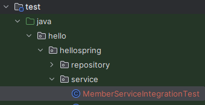
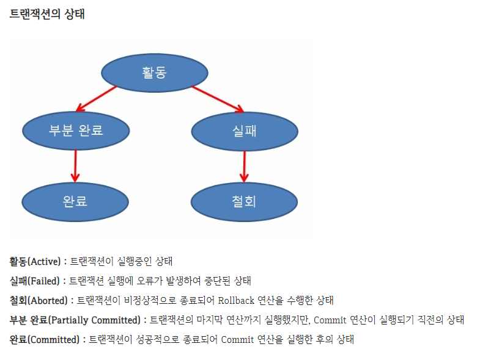

<a href="https://www.inflearn.com/course/%EC%8A%A4%ED%94%84%EB%A7%81-%EC%9E%85%EB%AC%B8-%EC%8A%A4%ED%94%84%EB%A7%81%EB%B6%80%ED%8A%B8" target="_blank">
  
</a>

```
본 시리즈는 인프런 김영한님의
'스프링 입문 - 코드로 배우는 스프링 부트, 웹 MVC,DB 접근 기술'
을 보고 공부용으로 작성한 것입니다.
```

<br>

<br>

<br>


# <span style="color: #D6ABFA;">⚪회원 서비스 스프링 통합 테스트</span>

일반적으로는 통합 테스트(Integration Test)보다 단위 테스트(Unit Test)가 더 좋은 테스트일 확률이 높음

따라서 가능하다면 단위 단위로 쪼개서 테스트를 잘 할 수 있게 하는것이 좋음

## 🔹테스트용 클래스 생성



스프링 컨테이너와 DB까지 연결합 통합 테스트를 진행

```java
package hello.hellospring.service;

import hello.hellospring.domain.Member;
import hello.hellospring.repository.MemberRepository;
import org.junit.jupiter.api.Test;
import org.springframework.beans.factory.annotation.Autowired;
import org.springframework.boot.test.context.SpringBootTest;
import org.springframework.transaction.annotation.Transactional;

import static org.assertj.core.api.Assertions.assertThat;
import static org.junit.jupiter.api.Assertions.assertEquals;
import static org.junit.jupiter.api.Assertions.assertThrows;

@SpringBootTest
@Transactional
class MemberServiceIntegrationTest {

    @Autowired MemberService memberService;
    @Autowired MemberRepository memberRepository;

    @Test
    public void 회원가입() throws Exception {

        //Given
        Member member = new Member();
        member.setName("hello");

        //When
        Long saveId = memberService.join(member);

        //Then
        Member findMember = memberRepository.findById(saveId).get();
        assertEquals(member.getName(), findMember.getName());
    }

    @Test
    public void 중복_회원_예외() throws Exception {

        //Given
        Member member1 = new Member();
        member1.setName("spring");
        Member member2 = new Member();
        member2.setName("spring");

        //When
        memberService.join(member1);
        IllegalStateException e = assertThrows(IllegalStateException.class,
                () -> memberService.join(member2));//예외가 발생해야 한다.
        assertThat(e.getMessage()).isEqualTo("이미 존재하는 회원입니다.");
    }
}
```

- **@SpringBootTest** : 스프링 컨테이너와 테스트를 함께 실행한다 (통합 테스트)
- **@Transactional** : 테스트 케이스에 이 애노테이션이 있으면, 테스트 시작 전에 트랜잭션을 시작하고, 테스트 완료 후에 항상 롤백한다. 이렇게 하면 DB에 데이터가 남지 않으므로 다음 테스트에 영향을 주지 않는다


