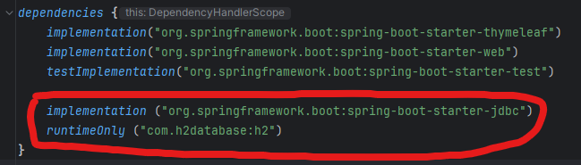

<a href="https://www.inflearn.com/course/%EC%8A%A4%ED%94%84%EB%A7%81-%EC%9E%85%EB%AC%B8-%EC%8A%A4%ED%94%84%EB%A7%81%EB%B6%80%ED%8A%B8" target="_blank">
  
</a>

```
본 시리즈는 인프런 김영한님의
'스프링 입문 - 코드로 배우는 스프링 부트, 웹 MVC,DB 접근 기술'
을 보고 공부용으로 작성한 것입니다.
```

<br>

<br>

<br>


# <span style="color: #D6ABFA;">⚪JdbcTemplate</span>

순수 Jdbc와는다르게 JdbcTemplate는 실무에서도 많이 사용함

## 🔹환경 설정

- 순수 Jdbc와 동일한 환경 설정을 하면 됨
- 스프링 JdbcTemplate과 MyBatis 같은 라이브러리는 JDBC API에서 본 반복 코드를 대부분 제거해줌. 하지만 SQL은 직접 작성해야 함

### 🔸build.gradle  설정

build.gradle파일에 jdbc와 h2 데이터베이스 관련 라이브러리를 추가하는 과정



```java
	implementation ("org.springframework.boot:spring-boot-starter-jdbc")
        //자바는 DB랑 붙으려면 jdbc드라이버가 필요함
        
	runtimeOnly ("com.h2database:h2")
        //db랑 붙을때 데이터베이스가 제공하는 클라이언트가 필요함. 이 경우엔 h2 데이터베이스 클라이언트를 사용
```

### 🔸application.properties 설정

```properties
spring.datasource.url=jdbc:h2:tcp://localhost/~/test
spring.datasource.driver-class-name=org.h2.Driver
spring.datasource.username=sa
```

> **주의!** 
>
> 스프링부트 2.4부터는 spring.datasource.username=sa 를 꼭 추가해주어야 한다. 
>
> 그렇지 않으면 Wrong user name or password 오류가 발생한다. 

## 🔹JdbcTemplate 회원 리포지토리

```java
package hello.hellospring.repository;

import hello.hellospring.domain.Member;
import org.springframework.jdbc.core.JdbcTemplate;
import org.springframework.jdbc.core.RowMapper;
import org.springframework.jdbc.core.namedparam.MapSqlParameterSource;
import org.springframework.jdbc.core.simple.SimpleJdbcInsert;

import javax.sql.DataSource;
import java.sql.ResultSet;
import java.sql.SQLException;
import java.util.HashMap;
import java.util.List;
import java.util.Map;
import java.util.Optional;

public class JdbcTemplateMemberRepository implements MemberRepository {

    private final JdbcTemplate jdbcTemplate;

    public JdbcTemplateMemberRepository(DataSource dataSource) {
        jdbcTemplate = new JdbcTemplate(dataSource);
    }

    @Override
    public Member save(Member member) {
        SimpleJdbcInsert jdbcInsert = new SimpleJdbcInsert(jdbcTemplate);
        jdbcInsert.withTableName("member").usingGeneratedKeyColumns("id");

        Map<String, Object> parameters = new HashMap<>();
        parameters.put("name", member.getName());

        Number key = jdbcInsert.executeAndReturnKey(new
                MapSqlParameterSource(parameters));
        member.setId(key.longValue());
        return member;
    }

    @Override
    public Optional<Member> findById(Long id) {
        List<Member> result = jdbcTemplate.query("select * from member where id = ? ", memberRowMapper(), id);
        return result.stream().findAny();
    }

    @Override
    public List<Member> findAll() {
        return jdbcTemplate.query("select * from member", memberRowMapper());
    }

    @Override
    public Optional<Member> findByName(String name) {
        List<Member> result = jdbcTemplate.query("select * from member where name = ? ", memberRowMapper(), name);
        return result.stream().findAny();
    }

    private RowMapper<Member> memberRowMapper() {
        return (rs, rowNum) -> {
            Member member = new Member();
            member.setId(rs.getLong("id"));
            member.setName(rs.getString("name"));
            return member;
        };
    }
}
```

## 🔹스프링 설정 변경

```java
package hello.hellospring;

import hello.hellospring.repository.JdbcMemberRepository;
import hello.hellospring.repository.JdbcTemplateMemberRepository;
import hello.hellospring.repository.MemberRepository;
import hello.hellospring.repository.MemoryMemberRepository;
import hello.hellospring.service.MemberService;
import org.springframework.context.annotation.Bean;
import org.springframework.context.annotation.Configuration;

import javax.sql.DataSource;

@Configuration
public class SpringConfig {
    private final DataSource dataSource;

    public SpringConfig(DataSource dataSource) {
        this.dataSource = dataSource;
    }

    @Bean
    public MemberService memberService() {
        return new MemberService(memberRepository());
    }

    @Bean
    public MemberRepository memberRepository() {
        // return new MemoryMemberRepository();
        //return new JdbcMemberRepository(dataSource);
        return new JdbcTemplateMemberRepository(dataSource);
    }
}
```

