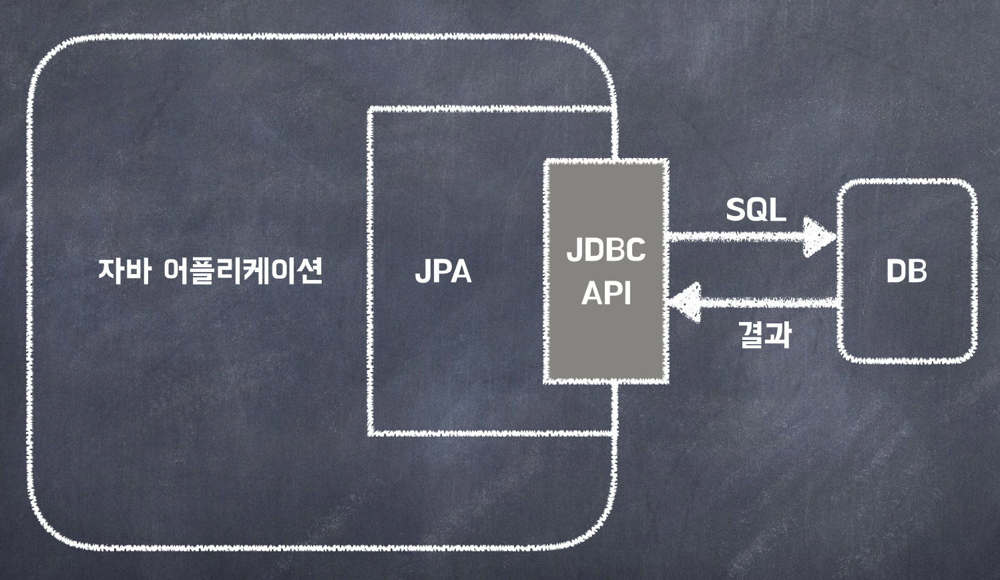

<a href="https://www.inflearn.com/course/%EC%8A%A4%ED%94%84%EB%A7%81-%EC%9E%85%EB%AC%B8-%EC%8A%A4%ED%94%84%EB%A7%81%EB%B6%80%ED%8A%B8" target="_blank">
  
</a>

```
본 시리즈는 인프런 김영한님의
'스프링 입문 - 코드로 배우는 스프링 부트, 웹 MVC,DB 접근 기술'
을 보고 공부용으로 작성한 것입니다.
```

<br>

<br>

<br>


# <span style="color: #D6ABFA;">⚪JPA란</span>



> JPA (Java Persisitence API)는 **`자바 진영의 ORM 기술 표준`**.
>
> 어플리케이션과 JDBC 사이에서 동작

> ORM (Object Relational Mapping)은 객체와 테이블을 매핑해서 **`패러다임의 불일치를 개발자 대신 해결`**해준다.

- JPA는 기존의 반복 코드는 물론이고, 기본적인 SQL도 JPA가 직접 만들어서 실행해준다
- JPA를 사용하면, SQL과 데이터 중심의 설계에서 객체 중심의 설계로 패러다임을 전환을 할 수 있다
- JPA를 사용하면 개발 생산성을 크게 높일 수 있다

<br>

<br>

<br>

# <span style="color: #D6ABFA;">⚪환경 설정</span>

## 🔹build.gradle  설정

build.gradle 파일에 JPA, h2 데이터베이스 관련 라이브러리 추가

```java
dependencies {
	implementation("org.springframework.boot:spring-boot-starter-thymeleaf")
	implementation("org.springframework.boot:spring-boot-starter-web")
	testImplementation("org.springframework.boot:spring-boot-starter-test")

	//implementation ("org.springframework.boot:spring-boot-starter-jdbc")
	implementation ("org.springframework.boot:spring-boot-starter-data-jpa") //이걸 추가
	runtimeOnly ("com.h2database:h2")
}
```

- spring-boot-starter-data-jpa 는 내부에 jdbc 관련 라이브러리를 포함한다. 따라서 jdbc는 제거해도 된다

## 🔹application.properties 설정

```properties
spring.datasource.url=jdbc:h2:tcp://localhost/~/test
spring.datasource.driver-class-name=org.h2.Driver
spring.datasource.username=sa


//아래 두개가 추가된 부분
spring.jpa.show-sql=true
spring.jpa.hibernate.ddl-auto=none
```

> **주의**!
>
> 스프링부트 2.4부터는 spring.datasource.username=sa 를 꼭 추가해주어야 한다. 그렇지 않으면 오류가 발생한다

- **show-sql** : JPA가 생성하는 SQL을 출력한다
- **ddl-auto** : JPA는 테이블을 자동으로 생성하는 기능을 제공하는데 none 를 사용하면 해당 기능을 끈다
  - create 를 사용하면 엔티티 정보를 바탕으로 테이블도 직접 생성해준다

<br>

<br>

<br>

# <span style="color: #D6ABFA;">⚪JPA 엔티티 매핑</span>

```java
package hello.hellospring.domain;

import jakarta.persistence.Entity;
import jakarta.persistence.GeneratedValue;
import jakarta.persistence.GenerationType;
import jakarta.persistence.Id;

@Entity
public class Member {

    @Id @GeneratedValue(strategy = GenerationType.IDENTITY)
    private Long id;
    private String name;

    public Long getId() {
        return id;
    }
    public void setId(Long id) {
        this.id = id;
    }
    public String getName() {
        return name;
    }
    public void setName(String name) {
        this.name = name;
    }
}
```

- **@Entity** : 어노테이션을 써줌으로서 jpa가 관리하는 entity가 됨
- **@Id** : primary key를 의미함
- **@GeneratedValue(strategy = GenerationType.IDENTITY)** : 현재 DB설정에서 id를 자동으로 생성해주게 해놨기때문에 써줬음. DB가 알아서 생성해주는걸 IDENTITY라고 함

<br>

name의 경우, 현재 DB에서도 column의 이름이 name이기 때문에 별다른 어노테이션을 써주지 않았는데, 

만약에 DB에서 해당 column 이름이 username이었다면

```java
@Column(name="username")
private String name;
```

이렇게 **@Column(name= )** 어노테이션을 사용해서 설정해주면 됨

<br>

<br>

<br>

# <span style="color: #D6ABFA;">⚪JPA 회원 리포지토리</span>

```java
package hello.hellospring.repository;

import hello.hellospring.domain.Member;
import jakarta.persistence.EntityManager;


import java.util.List;
import java.util.Optional;

public class JpaMemberRepository implements MemberRepository {
    private final EntityManager em;

    public JpaMemberRepository(EntityManager em) {
        this.em = em;
    }

    public Member save(Member member) {
        em.persist(member); //psersist는 객체를 저장하는 코드, member에 저장되는 id도 자동으로 입력해줌
        return member;
    }

    public Optional<Member> findById(Long id) {
        Member member = em.find(Member.class, id); //find는 객체를 저장하는 코드
        return Optional.ofNullable(member);
    }

    //pk로 찾는것이 아니기 때문에 jpql이라는 객체지향 쿼리 언어를 써야함
    //Entity를 대상으로 쿼리를 날리는 것
    public List<Member> findAll() {
        return em.createQuery("select m from Member m", Member.class)
                .getResultList();
    }

    public Optional<Member> findByName(String name) {
        List<Member> result = em.createQuery("select m from Member m where m.name = :name ", Member.class)
                .setParameter("name", name)
                .getResultList();
        
        return result.stream().findAny();
    }
}
```

- build.gradle에서 data-jpa 라이브러리를 받았기 때문에, 스프링이 자동으로 EntityManager라는걸 생성을 해줌 (자동으로 EntityManager 스프링빈을 생성함)

- jpa 회원 리포지토리에서 생성자로 DI를 받는 형식으로 만들어둔 뒤에, 이번 경우에는 스프링 설정에서 생성자 호출을 통해서 DI를 해줄 예정

<br>

<br>

<br>

# <span style="color: #D6ABFA;">⚪서비스 계층에 트랜잭션 추가</span>

```java
...
    
import org.springframework.transaction.annotation.Transactional;

...
    
@Transactional
public class MemberService {
```

- **@Transactional** : 데이터를 저장하고 변경할때 항상 트랜잭션이 있어야 함
- 스프링은 해당 클래스의 메서드를 실행할 때 트랜잭션을 시작하고, 메서드가 정상 종료되면 트랜잭션을 커밋한다.  만약 런타임 예외가 발생하면 롤백한다
- JPA를 통한 모든 데이터 변경은 트랜잭션 안에서 실행해야 한다

> Spring에서 @Transactional을 사용할 때, 더 많은 옵션과 더 많은 버전을 지원하는
>
>  import org.springframework.transaction.annotation.Transactional를 사용하는 것이 
>
> import jakarta.transaction.Transactional 보다 개발에 유리해 보임

<br>

<br>

<br>

# <span style="color: #D6ABFA;">⚪스프링 설정 변경</span>

```java
package hello.hellospring;

import hello.hellospring.repository.*;
import hello.hellospring.service.MemberService;
import jakarta.persistence.EntityManager;
import org.springframework.context.annotation.Bean;
import org.springframework.context.annotation.Configuration;

import javax.sql.DataSource;

@Configuration
public class SpringConfig {
    private final DataSource dataSource;
    private final EntityManager em;


    public SpringConfig(DataSource dataSource, EntityManager em) {
        this.dataSource = dataSource;
        this.em=em;
    }

    @Bean
    public MemberService memberService() {
        return new MemberService(memberRepository());
    }

    @Bean
    public MemberRepository memberRepository() {
        // return new MemoryMemberRepository();
        //return new JdbcMemberRepository(dataSource);
        //return new JdbcTemplateMemberRepository(dataSource);
        return new JpaMemberRepository(em); //멤머리포지토리 스프링빈을 방금 만든 jpa멤버리포지토리로 사용하게 설정
    }
}
```


