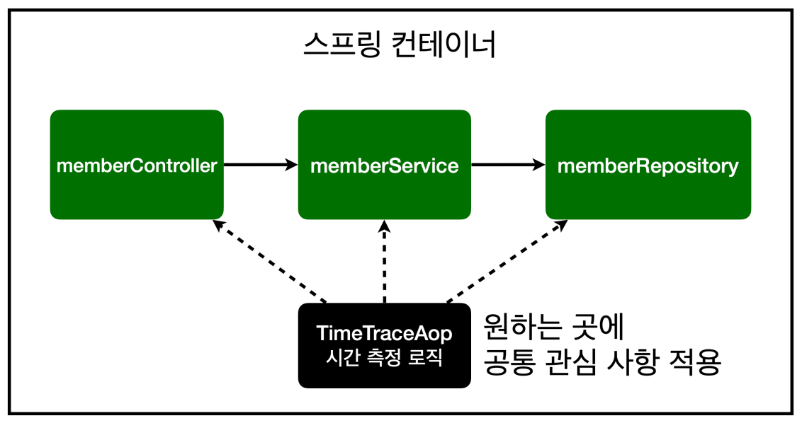
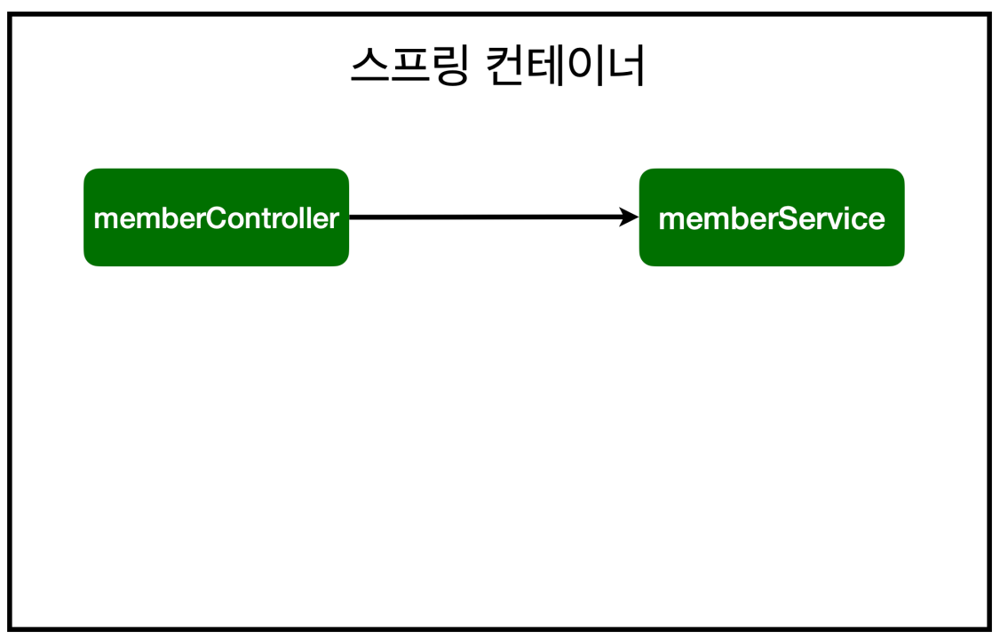
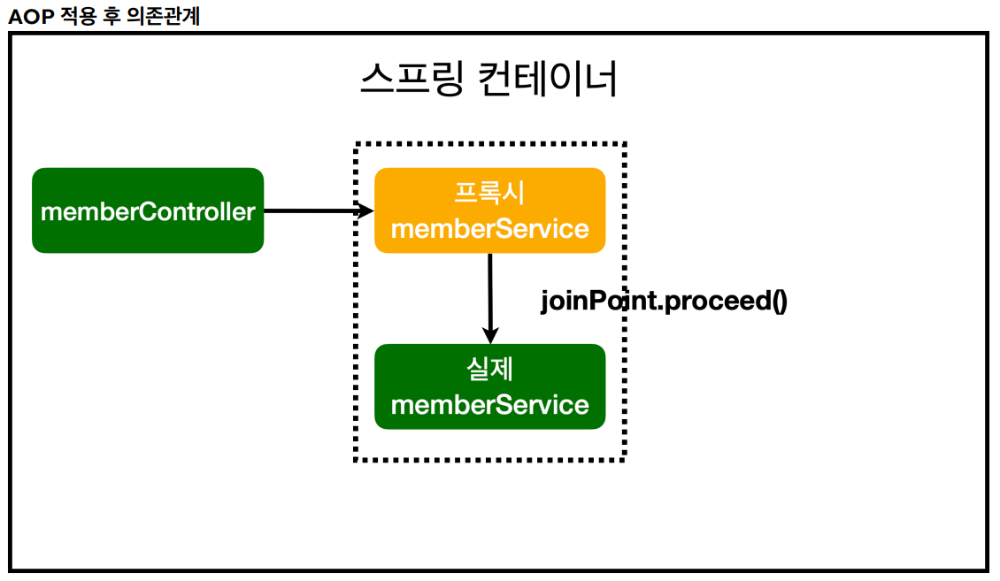
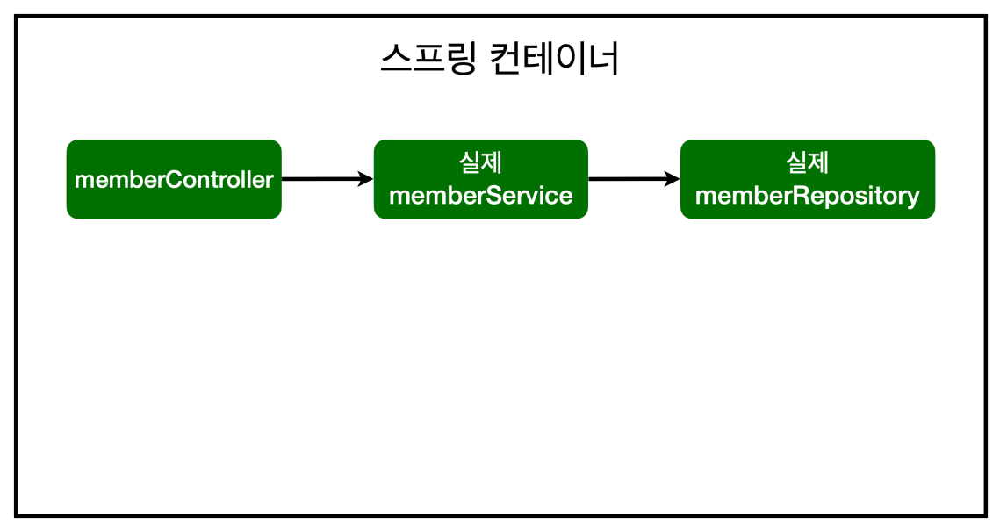
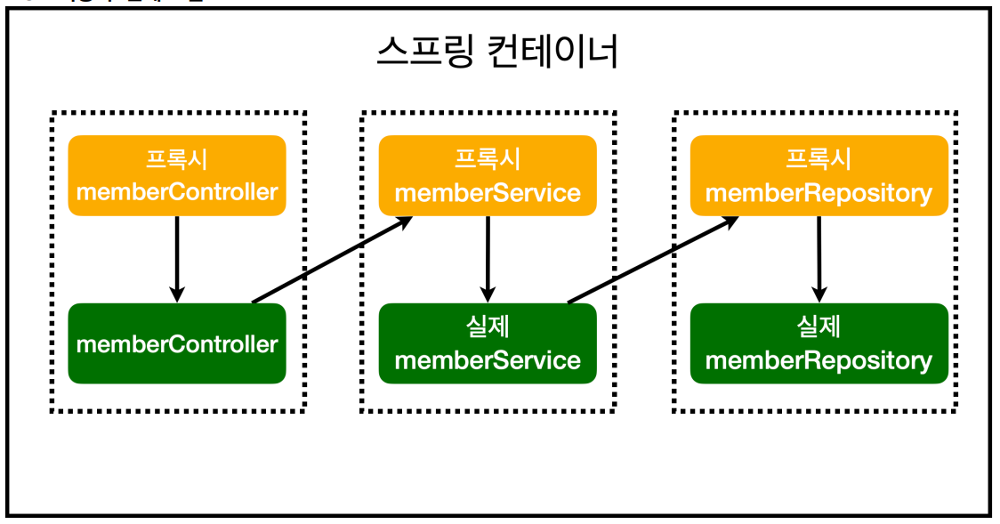

<a href="https://www.inflearn.com/course/%EC%8A%A4%ED%94%84%EB%A7%81-%EC%9E%85%EB%AC%B8-%EC%8A%A4%ED%94%84%EB%A7%81%EB%B6%80%ED%8A%B8" target="_blank">
  
</a>

```
본 시리즈는 인프런 김영한님의
'스프링 입문 - 코드로 배우는 스프링 부트, 웹 MVC,DB 접근 기술'
을 보고 공부용으로 작성한 것입니다.
```

<br>

<br>

<br>


# <span style="color: #D6ABFA;">⚪AOP 란</span>

.png)

- Aspect Oriented Programming의 약자
- **공통 관심 사항(cross-cutting concern)**과 **핵심 관심 사항(core cocern)**을 나누어서 보고, 그들을 기준으로 모듈화 하는 것
- 핵심 관심 사항은 핵심 비즈니스 로직을 의미
- 공통 관심 사항은 예를 들면 회원 가입 시간, 회원 조회 시간 등을 측정...하는 등의 시간 측정을 하는 부분

<br>

<br>

<br>

# <span style="color: #D6ABFA;">⚪AOP 사용 예시</span>



시간 측정 로직을 원하는 곳에 사용할 수 있게 하기 위해서 AOP를 사용할 것임

## 🔹시간 측정 AOP 등록

```java
package hello.hellospring.aop;

import org.aspectj.lang.ProceedingJoinPoint;
import org.aspectj.lang.annotation.Around;
import org.aspectj.lang.annotation.Aspect;
import org.springframework.stereotype.Component;

@Component //이 방식말고 자바 설정 코드로 직접 스프링빈에 등록하는게 더 선호되긴함(컨트롤러 같은 정형화된 것이 아니기 때문)
@Aspect //이거 써줘야 aspect로 작동
public class TimeTraceAop {
    
    @Around("execution(* hello.hellospring..*(..))") //적용할 범위를 설정함. 이 경우엔 hellospring패키지 하위 전부에 적용
    public Object execute(ProceedingJoinPoint joinPoint) throws Throwable {
        
        long start = System.currentTimeMillis();
        
        System.out.println("START: " + joinPoint.toString());
        
        try {
            return joinPoint.proceed(); //다음 메소드로 진행됨
        } finally {
            long finish = System.currentTimeMillis();
            long timeMs = finish - start;
            
            System.out.println("END: " + joinPoint.toString()) + " " + timeMs + "ms");
        }
    }
}
```

<br>

<br>

<br>

# <span style="color: #D6ABFA;">⚪AOP 동작 방식 설명</span>

## 🔹AOP 적용 전 의존관계(a)



## 🔹AOP 적용 후 의존관계(a)



AOP를 memberService에 적용할것이라고 지정을 하면

proxy memberService (가짜 멤버 서비스)를 생성한 뒤,

컨테이너에 스프링 빈을 등록할때 진짜 memberService 스프링 빈 대신, proxy memberService 스프링 빈을 앞에 세워 놓음

그리고 proxy 스프링 빈에서 joinPoint.proceed()를 하면 그때 진짜로 호출을 해주게 됨

## 🔹AOP 적용 전 전체 의존관계(b)



## 🔹AOP 적용 후 전체 의존관계(b)



