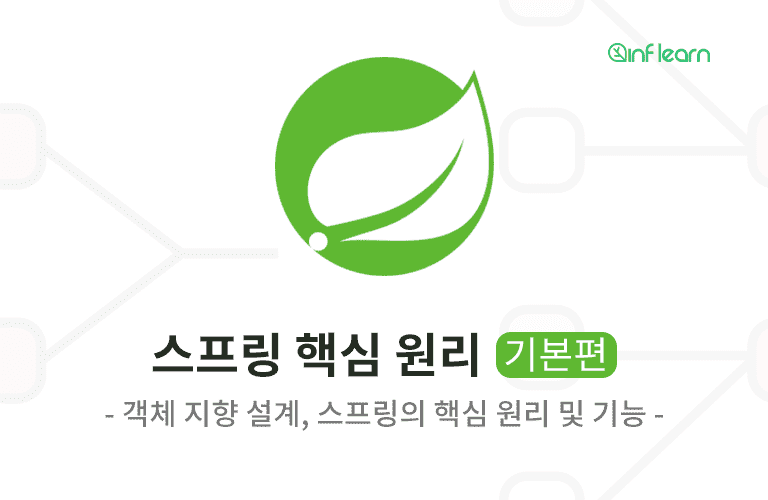
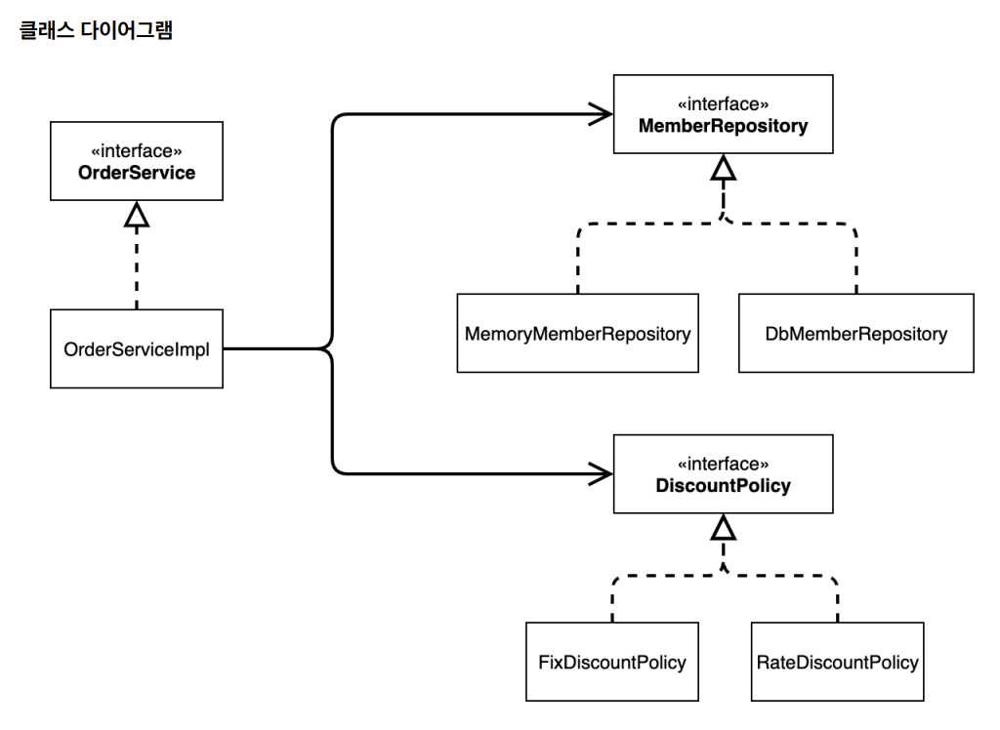
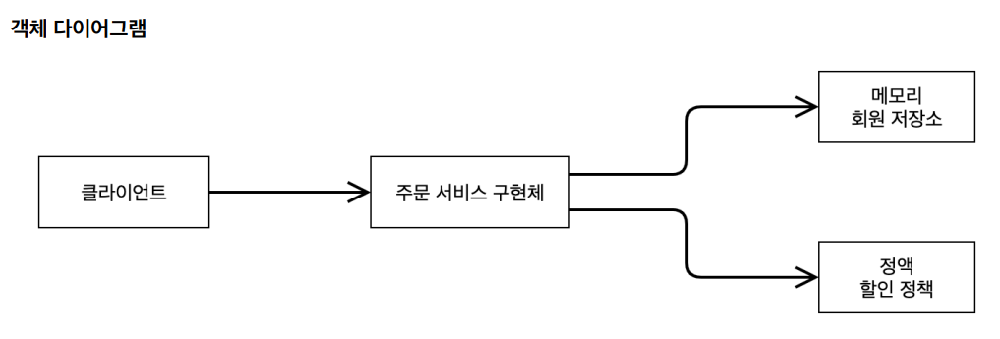

<a href="https://www.inflearn.com/course/%EC%8A%A4%ED%94%84%EB%A7%81-%ED%95%B5%EC%8B%AC-%EC%9B%90%EB%A6%AC-%EA%B8%B0%EB%B3%B8%ED%8E%B8" target="_blank">
  
</a>

```
본 시리즈는 인프런 김영한님의
'스프링 핵심 원리 - 기본편'
을 보고 공부용으로 작성한 것입니다.
```

<br>

<br>

<br>

# <span style="color: #D6ABFA;">⚪IoC</span>

**제어의 역전 IoC(Inversion of Control)**

```java
@Configuration
public class AppConfig {

@Bean
    public MemberService memberService() {
            return new MemberServiceImpl(memberRepository());
    }

@Bean
    public MemberRepository memberRepository() {
        return new MemoryMemberRepository();
    }

@Bean
    public OrderService orderService() {
        return new OrderServiceImpl(memberRepository(), discountPolicy());
    }

@Bean
    public DiscountPolicy discountPolicy() {
        return new RateDiscountPolicy();
    }
}
```

```java
public class OrderServiceImpl implements OrderService {

    private final MemberRepository memberRepository;
    private final DiscountPolicy discountPolicy;
    
    public OrderServiceImpl(MemberRepository memberRepository, DiscountPolicy discountPolicy) {
        this.memberRepository = memberRepository;
        this.discountPolicy = discountPolicy;
    }

    @Override
    public Order createOrder(Long memberId, String itemName, int itemPrice) {
        Member member = memberRepository.findById(memberId);
        int discountPrice = discountPolicy.discount(member, itemPrice);

        return new Order(memberId, itemName, itemPrice, discountPrice);
    }
}
```

- AppConfig클래스로 인해서 OrderServiceImpl은 필요한 인터페이스들을 호출하지만 어떤 구현 객체들이 실행될지 모른다
- 프로그램에 대한 제어 흐름에 대한 권한은 모두 AppConfig가 가지고 있다
- 심지어 OrderServiceImpl 도 AppConfig가 생성한다
- AppConfig는 OrderServiceImpl 이 아닌 OrderService 인터페이스의 다른 구현 객체를 생성하고 실행할 수 도 있다. 그런 사실도 모른체 OrderServiceImpl 은 묵묵히 자신의 로직 을 실행할 뿐이다\
- 이렇듯 프로그램의 제어 흐름을 직접 제어하는 것이 아니라 외부에서 관리하는 것을 **제어의 역전(IoC)**이라 한다

<br>

<br>

<br>

# <span style="color: #D6ABFA;">⚪프레임워크 vs 라이브러리</span>

- 프레임워크가 내가 작성한 코드를 제어하고, 대신 실행하면 그것은 프레임워크가 맞다. (JUnit)
- 반면에 내가 작성한 코드가 직접 제어의 흐름을 담당한다면 그것은 프레임워크가 아니라 라이브러리다.

<br>

<br>

<br>

# <span style="color: #D6ABFA;">⚪DI</span>

## 🔹의존관계 주입 DI(Dependency Injection)

```java
public class OrderServiceImpl implements OrderService {

    private final MemberRepository memberRepository;
    private final DiscountPolicy discountPolicy;
    
    public OrderServiceImpl(MemberRepository memberRepository, DiscountPolicy discountPolicy) {
        this.memberRepository = memberRepository;
        this.discountPolicy = discountPolicy;
    }

    @Override
    public Order createOrder(Long memberId, String itemName, int itemPrice) {
        Member member = memberRepository.findById(memberId);
        int discountPrice = discountPolicy.discount(member, itemPrice);

        return new Order(memberId, itemName, itemPrice, discountPrice);
    }
}
```

```java
public interface DiscountPolicy {
    /**
     * @return 할인 대상 금액
     */
    int discount(Member member, int price);
}
```

```java
@Configuration
public class AppConfig {

    ...
        
@Bean  //이런식으로 스프링에서는 DI를 함
    public OrderService orderService() {
        return new OrderServiceImpl(memberRepository(), discountPolicy());
    }
    
    ...

}
```

- OrderServiceImpl 은 DiscountPolicy 인터페이스에 의존한다. 실제 어떤 구현 객체가 사용될지는 모른다.
- 의존관계는 **정적인 클래스 의존 관계와, 실행 시점에 결정되는 동적인 객체(인스턴스) 의존 관계** 둘을 분리해서 생 각해야 한다

## 🔹정적인 클래스 의존관계



클래스가 사용하는 import 코드만 보고 의존관계를 쉽게 판단할 수 있다. 

정적인 의존관계는 애플리케이션을 실행하지 않아도 분석할 수 있다. 

클래스 다이어그램을 보자 OrderServiceImpl 은 MemberRepository , DiscountPolicy 에 의존한다는 것을 알 수 있다. 

그런데 이러한 클래스 의존관계 만으로는 실제 어떤 객체가 OrderServiceImpl 에 주입 될지 알 수 없다.

## 🔹동적인 객체 인스턴스 의존 관계



애플리케이션 실행 시점에 실제 생성된 객체 인스턴스의 참조가 연결된 의존 관계다.

- 애플리케이션 실행 시점(런타임)에 외부에서 실제 구현 객체를 생성하고 클라이언트에 전달해서 클라이언트와 서버의 실제 의존관계가 연결 되는 것을 의존관계 주입이라 한다.
- 객체 인스턴스를 생성하고, 그 참조값을 전달해서 연결된다
- 의존관계 주입을 사용하면 클라이언트 코드를 변경하지 않고, 클라이언트가 호출하는 대상의 타입 인스턴스를 변 경할 수 있다
- 의존관계 주입을 사용하면 정적인 클래스 의존관계를 변경하지 않고, 동적인 객체 인스턴스 의존관계를 쉽게 변경 할 수 있다

<br>

<br>

<br>

# <span style="color: #D6ABFA;">⚪IoC 컨테이너, DI 컨테이너</span>

- AppConfig 처럼 객체를 생성하고 관리하면서 의존관계를 연결해 주는 것을 **IoC 컨테이너** 또는 **DI 컨테이너**라 한다
- 의존관계 주입에 초점을 맞추어 최근에는 주로 DI 컨테이너라 한다
- 또는 어샘블러, 오브젝트 팩토리 등으로 불리기도 한다

<br>

<br>

<br>

# <span style="color: #D6ABFA;">⚪스프링 컨테이너</span>

```java
public class MemberApp {
    public static void main(String[] args) {

        ApplicationContext applicationContext=new AnnotationConfigApplicationContext(AppConfig.class); //스프링 컨테이너 얻는 방법
        MemberService memberService=applicationContext.getBean("memberService",MemberService.class); //스프링 빈의 이름과 반환 클래스를 인자로
        
        Member member = new Member(1L, "memberA", Grade.VIP);
        memberService.join(member);

        Member findMember = memberService.findMember(1L);
        System.out.println("new member = " + member.getName());
        System.out.println("find Member = " + findMember.getName());
    }
}
```

```java
@Configuration
public class AppConfig {

@Bean
    public MemberService memberService() {
            return new MemberServiceImpl(memberRepository());
    }

@Bean
    public MemberRepository memberRepository() {
        return new MemoryMemberRepository();
    }

@Bean
    public OrderService orderService() {
        return new OrderServiceImpl(memberRepository(), discountPolicy());
    }

@Bean
    public DiscountPolicy discountPolicy() {
        return new RateDiscountPolicy();
    }
}
```

- ``ApplicationContext``를 스프링 컨테이너라 한다
- 스프링 컨테이너는 ``@Configuration`` 이 붙은 것을 설정(구성) 정보로 사용한다. 여기서 ``@Bean`` 이라 적힌 메서드를 모두 호출해서 반환된 객체를 스프링 컨테이너에 등록한다. 이렇게 스프링 컨테이너에 등록된 객체를 스프링 빈이라 한다.
- 스프링 컨테이너는 ``@Configuration``이 붙어있는 클래스를 자동으로 빈으로 등록해두고, 해당 클래스를 파싱해서 ``@Bean``이 있는 메소드를 찾아서 빈을 생성해준다
- 스프링 빈은 ``@Bean`` 이 붙은 메서드의 명을 스프링 빈의 이름으로 사용한다. ( memberService ,  orderService )
- ``@Bean(name="abcd")`` 를 통해서 스프링 빈의 이름을 직접 설정도 가능
- 스프링 빈은 ``applicationContext.getBean()`` 메서드를 사용 해서 찾을 수 있다

<br>

<br>

<br>

# <span style="color: #D6ABFA;">⚪스프링 부트 3.1 이상 - 로그 출력 안되는 문제 해결</span>

다음 위치에 파일을 만들어서 넣으면 된다

**src/main/resources/logback.xml**

```xml
<configuration>
    
 	<appender name="STDOUT" class="ch.qos.logback.core.ConsoleAppender">
 		<encoder>
 			<pattern>%d{HH:mm:ss.SSS} [%thread] %-5level %logger{36} -%kvp- %msg%n</pattern>
 		</encoder>
 	</appender>
    
 	<root level="DEBUG">
 		<appender-ref ref="STDOUT" />
 	</root>
    
</configuration>
```

스프링 부트 3.1 부터 기본 로그 레벨을 INFO 로 빠르게 설정하기 때문에 로그를 확인할 수 없는데, 

이렇게하면 기본 로그 레벨을 DEBUG 로 설정해서 강의 내용과 같이 로그를 확인할 수 있다

참고로 이 내용은 MemberApp 과 OrderApp 처럼 ApplicationContext 를 직접 생성해서 사용할 때만 적용된 다

강의 뒤에서 나오는 CoreApplication 처럼 스프링 부트를 실행할 때는 이 파일을 제거하거나 또는 ``<root level="DEBUG">`` 부분을  ``<root level="INFO">``로 변경하면 강의 내용과 같은 로그를 확인할 수 있다
