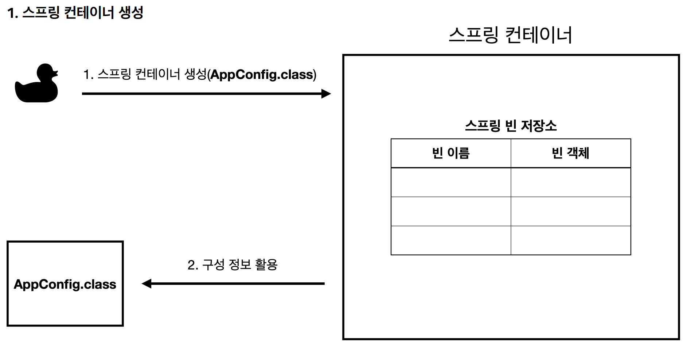
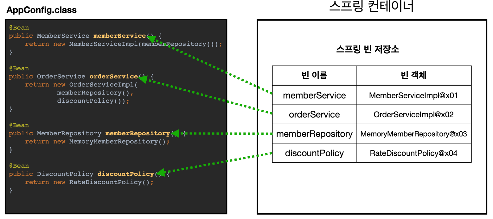
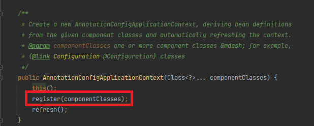
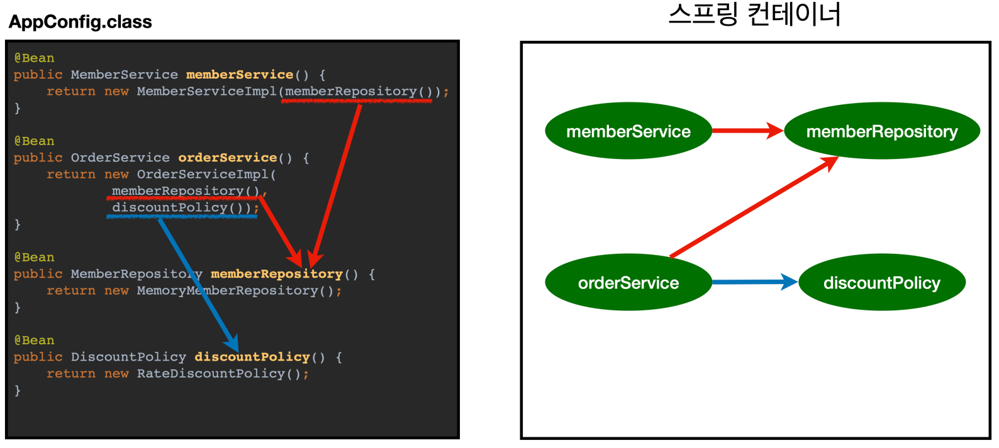
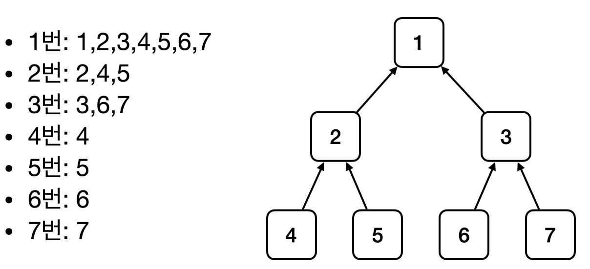
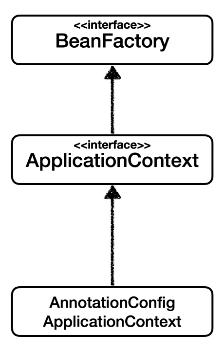
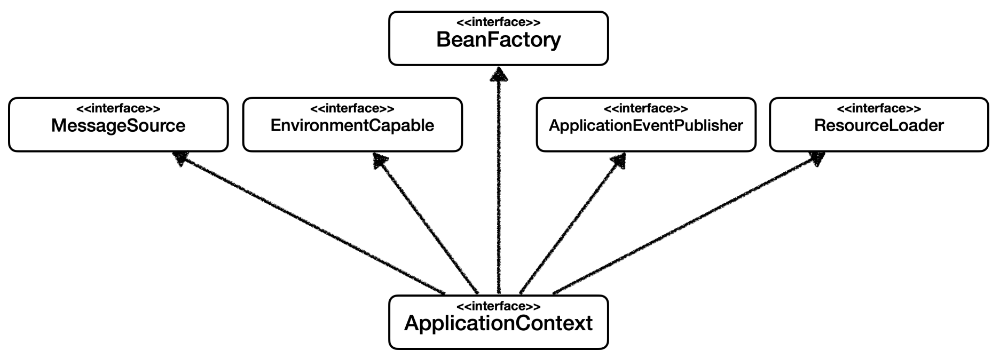
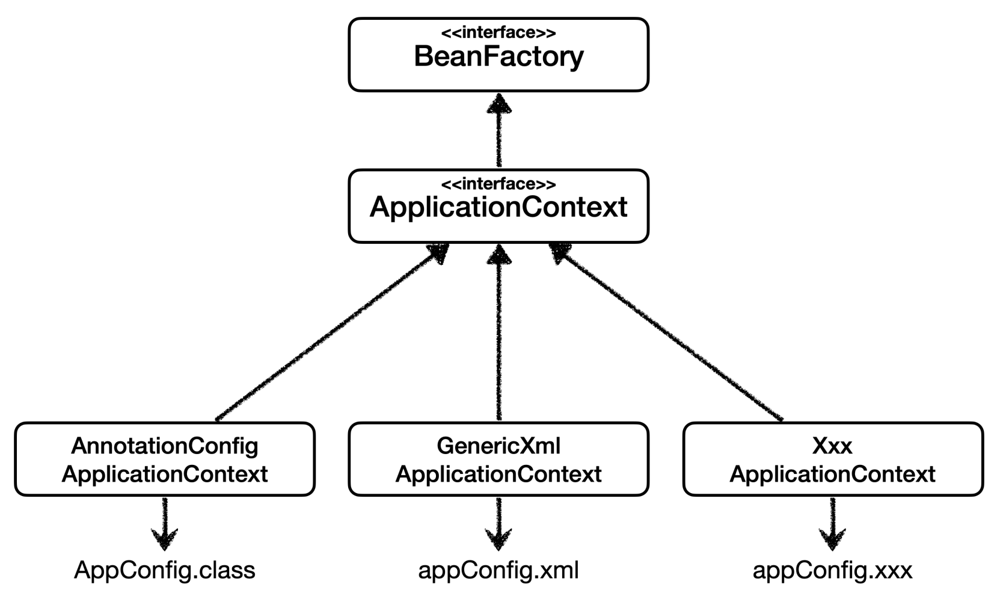
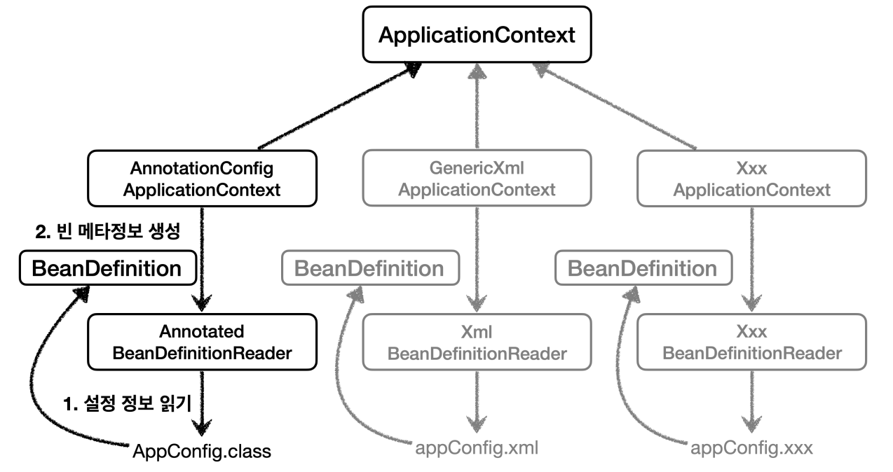

<a href="https://www.inflearn.com/course/%EC%8A%A4%ED%94%84%EB%A7%81-%ED%95%B5%EC%8B%AC-%EC%9B%90%EB%A6%AC-%EA%B8%B0%EB%B3%B8%ED%8E%B8" target="_blank">
  
</a>

```
본 시리즈는 인프런 김영한님의
'스프링 핵심 원리 - 기본편'
을 보고 공부용으로 작성한 것입니다.
```

<br>

<br>

<br>

# <span style="color: #D6ABFA;">⚪스프링 컨테이너 생성</span>

```java
//스프링컨테이너를 생성하고 스프링 빈 등록까지
ApplicationContext applicationContext = new AnnotationConfigApplicationContext(AppConfig.class);

//참고로 AppConfig클래스는 아래와 같다고 가정
@Configuration
public class AppConfig {

    @Bean
    public MemberService memberService() {
        return new MemberServiceImpl(memberRepository());
    }

    @Bean
    public MemberRepository memberRepository() {
        return new MemoryMemberRepository();
    }

    @Bean
    public OrderService orderService() {
        return new OrderServiceImpl(memberRepository(), discountPolicy());
    }

    @Bean
    public DiscountPolicy discountPolicy() {
        return new RateDiscountPolicy();
    }
}
```

- ```ApplicationContext``` 를 스프링 컨테이너라 한다
- ```ApplicationContext``` 는 인터페이스이다
- 스프링 컨테이너는 XML을 기반으로 만들 수 있고, 애노테이션 기반의 자바 설정 클래스로 만들 수 있다
- 위 코드의 경우가 애노테이션 기반의 자반 설정 클래스를 사용해서 만든 스프링 컨테이너
- ```AnnotationConfigApplicationContext```는 ```ApplicationContext```인터페이스의 구현체이다

>더 정확히는 스프링 컨테이너를 부를 때 ```BeanFactory``` , ```ApplicationContext``` 로 구분해서 이야기 한다
>
> ```BeanFactory``` 를 직접 사용하는 경우는 거의 없으므로 일반적으로 ```ApplicationContext```를 스프링 컨테이너라 한다

<br>

<br>

<br>

# <span style="color: #D6ABFA;">⚪스프링 컨테이너 생성 과정</span> 

## 🔹1. 스프링 컨테이너 생성



```java
@Configuration //싱글톤 보장
public class AppConfig {

    @Bean
    public MemberService memberService() {
        return new MemberServiceImpl(memberRepository());
    }

    @Bean
    public MemberRepository memberRepository() {
        return new MemoryMemberRepository();
    }

    @Bean
    public OrderService orderService() {
        return new OrderServiceImpl(memberRepository(), discountPolicy());
    }

    @Bean
    public DiscountPolicy discountPolicy() {
        return new RateDiscountPolicy();
    }
}
```

- ```new AnnotationConfigApplicationContext(AppConfig.class)``` 이 경우에는 어노테이션 기반의 컨테이너를 생성하는 것
- 스프링 컨테이너를 생성할 때는 구성 정보를 지정해줌 (내부적으로 인자로 받은 구성정보를 register해줌=스프링 컨테이너에다가 스프링 빈 등록)
- 여기서는 AppConfig.class 를 구성 정보로 지정했다
- ```AnnotationConfigApplicationContext```의 ```register 메소드```를 활용해서 추후에 설정 클래스를 추가 등록도 할 수 있음

## 🔹2. 스프링 빈 등록





- 스프링 컨테이너는 파라미터로 넘어온 설정 클래스 정보를 사용해서 스프링 빈을 등록한다 (register 메소드를 활용한 것)

**빈 이름**

- 빈 이름은 메서드 이름을 사용한다
- 빈 이름을 직접 부여할 수도 있다 ```@Bean(name="memberService2")```

> **주의**
>
> 빈 이름은 항상 다른 이름을 부여해야 한다. 
>
> 같은 이름을 부여하면, 다른 빈이 무시되거나, 기존 빈을 덮어버 리거나 설정에 따라 오류가 발생한다

## 🔹3. 의존관계 설정 완료



- 스프링 컨테이너는 설정 정보를 참고해서 의존관계를 주입(DI)한다
- ```@Configuration``` 애노테이션이 AppConfig클래스에 붙어있기 때문에 스프링빈이 싱글톤을 보장받으면서 의존관계가 주입됨
- ```@Configuration``` 애노테이션이 없었다면 ```memberService 스프링 빈```에서 의존하는 ```MemberRepository인스턴스```와 ```memberRepository 스프링 빈```은 다르게 됨. 즉 싱글톤이 보장되지 않아서 문제가 생김
- ```@Configuration``` 애노테이션과 관련된 설명은 다음 게시글에서 싱글톤 컨테이너와 연관하여 다시 설명

> **참고** 
>
> 스프링은 빈을 생성하고, 의존관계를 주입하는 단계가 나누어져 있다. 
>
> 그런데 이렇게 자바 코드로 스프링 빈을 등록하면 생성자를 호출하면서 의존관계 주입도 한번에 처리된다. 
>
> 여기서는 이해를 돕기 위해 개념적으로 나누어 설명했다. 자세한 내용은 의존관계 자동 주입에서 다시 설명하겠다.

<br>

<br>

<br>

# <span style="color: #D6ABFA;">⚪컨테이너에 등록된 모든 빈 조회</span> 

```java
class ApplicationContextInfoTest {
    AnnotationConfigApplicationContext ac = new AnnotationConfigApplicationContext(AppConfig.class);

    @Test
    @DisplayName("모든 빈 출력하기")
    void findAllBean() {
        String[] beanDefinitionNames = ac.getBeanDefinitionNames();
        for (String beanDefinitionName : beanDefinitionNames) {
            Object bean = ac.getBean(beanDefinitionName); //타입을 지정 안했기때문에 Object로 꺼내짐
            System.out.println("name=" + beanDefinitionName + " object=" + bean);
        }
    }

    @Test
    @DisplayName("애플리케이션 빈 출력하기")
    void findApplicationBean() {
        String[] beanDefinitionNames = ac.getBeanDefinitionNames();
        for (String beanDefinitionName : beanDefinitionNames) {
            //getBeanDefinition은 ApplicationContext에서는 없는 메소드이기 때문에 
            //AnnotationConfigApplicationContext에서 사용 가능
            BeanDefinition beanDefinition = ac.getBeanDefinition(beanDefinitionName);

            //Role ROLE_APPLICATION: 직접 등록한 애플리케이션 빈
            //Role ROLE_INFRASTRUCTURE: 스프링이 내부에서 사용하는 빈
            if (beanDefinition.getRole() == BeanDefinition.ROLE_APPLICATION) {
                Object bean = ac.getBean(beanDefinitionName);
                System.out.println("name=" + beanDefinitionName + " object=" + bean);
            }
        }
    }
}
```

- **모든 빈 출력하기**
  - 실행하면 스프링에 등록된 모든 빈 정보를 출력할 수 있다
  - ```ac.getBeanDefinitionNames()``` : 스프링에 등록된 모든 빈 이름을 조회한다
  - ```ac.getBean()``` : 빈 이름으로 빈 객체(인스턴스)를 조회한다.
- **애플리케이션 빈 출력하기**
  - 스프링이 내부에서 사용하는 빈은 제외하고, 내가 등록한 빈만 출력
  - 스프링이 내부에서 사용하는 빈은 ```getRole()``` 로 구분할 수 있다
    - ```ROLE_APPLICATION``` : 일반적으로 사용자가 정의한 빈 
    - ```ROLE_INFRASTRUCTURE``` : 스프링이 내부에서 사용하는 빈

<br>

<br>

<br>

# <span style="color: #D6ABFA;">⚪스프링 빈 조회 - 기본</span> 

```java
class ApplicationContextBasicFindTest {
    AnnotationConfigApplicationContext ac = new AnnotationConfigApplicationContext(AppConfig.class);

    @Test
    @DisplayName("빈 이름 + 타입으로 조회")
    void findBeanByName() {
        MemberService memberService = ac.getBean("memberService", MemberService.class);
        assertThat(memberService).isInstanceOf(MemberServiceImpl.class);
    }

    @Test
    @DisplayName("이름 없이 타입만으로 조회")
    void findBeanByType() {
        MemberService memberService = ac.getBean(MemberService.class);
        assertThat(memberService).isInstanceOf(MemberServiceImpl.class);
    }

    @Test
    @DisplayName("구체 타입으로 조회") //유연성이 떨어지기 때문에 비추
    void findBeanByName2() {
        MemberServiceImpl memberService = ac.getBean("memberService", MemberServiceImpl.class);
        assertThat(memberService).isInstanceOf(MemberServiceImpl.class);
    }

    @Test
    @DisplayName("빈 이름으로 조회X")
    void findBeanByNameX() {
        //ac.getBean("xxxxx", MemberService.class);
        Assertions.assertThrows(NoSuchBeanDefinitionException.class, () -> ac.getBean("xxxxx", MemberService.class));
    }
}
```

스프링 컨테이너에서 스프링 빈을 찾는 가장 기본적인 조회 방법 

- ```ac.getBean(빈이름, 타입)``` 
- ```ac.getBean(타입)``` 
- 조회 대상 스프링 빈이 없으면 예외 발생 
  - ```NoSuchBeanDefinitionException: No bean named 'xxxxx' available```

<br>

<br>

<br>

# <span style="color: #D6ABFA;">⚪스프링 빈 조회 - 동일한 타입이 둘 이상</span> 

```java
class ApplicationContextSameBeanFindTest {
    AnnotationConfigApplicationContext ac = new AnnotationConfigApplicationContext(SameBeanConfig.class);

    @Test
    @DisplayName("타입으로 조회시 같은 타입이 둘 이상 있으면, 중복 오류가 발생한다")
    void findBeanByTypeDuplicate() {
        //MemberRepository bean = ac.getBean(MemberRepository.class);
        assertThrows(NoUniqueBeanDefinitionException.class, () -> ac.getBean(MemberRepository.class));
    }

    @Test
    @DisplayName("타입으로 조회시 같은 타입이 둘 이상 있으면, 빈 이름을 지정하면 된다")
    void findBeanByName() {
        MemberRepository memberRepository = ac.getBean("memberRepository1", MemberRepository.class);
        assertThat(memberRepository).isInstanceOf(MemberRepository.class);
    }

    @Test
    @DisplayName("특정 타입을 모두 조회하기")
    void findAllBeanByType() {
        Map<String, MemberRepository> beansOfType = ac.getBeansOfType(MemberRepository.class);
        for (String key : beansOfType.keySet()) {
            System.out.println("key = " + key + " value = " + beansOfType.get(key));
        }
        System.out.println("beansOfType = " + beansOfType);
        assertThat(beansOfType.size()).isEqualTo(2);
    }

    @Configuration
    static class SameBeanConfig {
        @Bean
        public MemberRepository memberRepository1() {
            return new MemoryMemberRepository();
        }

        @Bean
        public MemberRepository memberRepository2() {
            return new MemoryMemberRepository();
        }
    }
}
```

- 타입으로 조회시 같은 타입의 스프링 빈이 둘 이상이면 오류가 발생한다. 이때는 빈 이름을 지정하자
- ```ac.getBeansOfType()``` 을 사용하면 해당 타입의 모든 빈을 조회할 수 있다.

<br>

<br>

<br>

# <span style="color: #D6ABFA;">⚪스프링 빈 조회 - 상속 관계</span> 

```java
class ApplicationContextExtendsFindTest {
    AnnotationConfigApplicationContext ac = new AnnotationConfigApplicationContext(TestConfig.class);

    @Test
    @DisplayName("부모 타입으로 조회시, 자식이 둘 이상 있으면, 중복 오류가 발생한다")
    void findBeanByParentTypeDuplicate() {
        //DiscountPolicy bean = ac.getBean(DiscountPolicy.class);
        assertThrows(NoUniqueBeanDefinitionException.class, () -> ac.getBean(DiscountPolicy.class));
    }

    @Test
    @DisplayName("부모 타입으로 조회시, 자식이 둘 이상 있으면, 빈 이름을 지정하면 된다")
    void findBeanByParentTypeBeanName() {
        DiscountPolicy rateDiscountPolicy = ac.getBean("rateDiscountPolicy", DiscountPolicy.class);
        assertThat(rateDiscountPolicy).isInstanceOf(RateDiscountPolicy.class);
    }

    @Test
    @DisplayName("특정 하위 타입으로 조회")
    void findBeanBySubType() {
        RateDiscountPolicy bean = ac.getBean(RateDiscountPolicy.class);
        assertThat(bean).isInstanceOf(RateDiscountPolicy.class);
    }

    @Test
    @DisplayName("부모 타입으로 모두 조회하기")
    void findAllBeanByParentType() {
        Map<String, DiscountPolicy> beansOfType = ac.getBeansOfType(DiscountPolicy.class);
        assertThat(beansOfType.size()).isEqualTo(2);
        for (String key : beansOfType.keySet()) {
            System.out.println("key = " + key + " value=" + beansOfType.get(key));
        }
    }

    @Test
    @DisplayName("부모 타입으로 모두 조회하기 - Object")
    void findAllBeanByObjectType() {
        Map<String, Object> beansOfType = ac.getBeansOfType(Object.class);
        for (String key : beansOfType.keySet()) {
            System.out.println("key = " + key + " value=" + beansOfType.get(key));
        }
    }

    @Configuration
    static class TestConfig {
        @Bean
        public DiscountPolicy rateDiscountPolicy() {
            return new RateDiscountPolicy();
        }

        @Bean
        public DiscountPolicy fixDiscountPolicy() {
            return new FixDiscountPolicy();
        }
    }
}
```



- 부모 타입으로 조회하면, 자식 타입도 함께 조회한다
- 그래서 모든 자바 객체의 최고 부모인 Object 타입으로 조회하면, 모든 스프링 빈을 조회한다

<br>

<br>

<br>

# <span style="color: #D6ABFA;">⚪BeanFactory와 ApplicationContext</span> 




## 🔹BeanFactory

- 스프링 컨테이너의 최상위 인터페이스다
-  스프링 빈을 관리하고 조회하는 역할을 담당한다
-  ```getBean()``` 을 제공한다
-  지금까지 우리가 사용했던 대부분의 기능은 BeanFactory가 제공하는 기능이다

## 🔹ApplicationContext

- BeanFactory 기능을 모두 상속받아서 제공한다
- 빈을 관리하고 검색하는 기능을 BeanFactory가 제공해주는데, 그러면 둘의 차이가 뭘까? 
- 애플리케이션을 개발할 때는 빈을 관리하고 조회하는 기능은 물론이고, 수 많은 부가기능이 필요하다

<br>

**ApplicationContext가 제공하는 부가기능**



- **메시지소스를 활용한 국제화 기능**
  - 예를 들어서 한국에서 들어오면 한국어로, 영어권에서 들어오면 영어로 출력
- **환경변수**
  - 로컬, 개발, 운영등을 구분해서 처리
- **애플리케이션 이벤트**
  - 이벤트를 발행하고 구독하는 모델을 편리하게 지원
- **편리한 리소스 조회**
  - 파일, 클래스패스, 외부 등에서 리소스를 편리하게 조회

## 🔹 정리

- ApplicationContext는 BeanFactory의 기능을 상속받는다
-  ApplicationContext는 빈 관리기능 + 편리한 부가 기능을 제공한다
-  BeanFactory를 직접 사용할 일은 거의 없다. 부가기능이 포함된 ApplicationContext를 사용한다
-  BeanFactory나 ApplicationContext를 스프링 컨테이너라 한다

<br>

<br>

<br>

# <span style="color: #D6ABFA;">⚪다양한 설정 형식 지원 - 자바 코드, XML</span> 



스프링 컨테이너는 다양한 형식의 설정 정보를 받아들일 수 있게 유연하게 설계되어 있다. (자바 코드, XML, Groovy 등등)

## 🔹애노테이션 기반 자바 코드 설정 사용

- ```new AnnotationConfigApplicationContext(AppConfig.class)```
- ```AnnotationConfigApplicationContext``` 클래스를 사용하면서 자바 코드로된 설정 정보를 넘기면 된다.

## 🔹XML 설정 사용

**xml 기반의 스프링 빈 설정 정보** (src/main/resources/appConfig.xml)

```xml
<?xml version="1.0" encoding="UTF-8"?>
<beans xmlns="http://www.springframework.org/schema/beans"
       xmlns:xsi="http://www.w3.org/2001/XMLSchema-instance"
       xsi:schemaLocation="http://www.springframework.org/schema/beans http://www.springframework.org/schema/beans/spring-beans.xsd">

    <bean id="memberService" class="hello.core.member.MemberServiceImpl">
        <constructor-arg name="memberRepository" ref="memberRepository"/>
    </bean>

    <bean id="memberRepository" class="hello.core.member.MemoryMemberRepository"/>

    <bean id="orderService" class="hello.core.order.OrderServiceImpl">
        <constructor-arg name="memberRepository" ref="memberRepository"/>
        <constructor-arg name="discountPolicy" ref="discountPolicy"/>
    </bean>

    <bean id="discountPolicy" class="hello.core.discount.RateDiscountPolicy"/>
</beans>
```

**XmlAppConfig 사용 자바 코드**

```java
public class XmlAppContext {
    @Test
    void xmlAppContext() {
        ApplicationContext ac = new GenericXmlApplicationContext("appConfig.xml");

        MemberService memberService = ac.getBean("memberService", MemberService.class);
        assertThat(memberService).isInstanceOf(MemberService.class);
    }
}
```

- xml 기반의 ```appConfig.xml``` 스프링 설정 정보와 자바 코드로 된 ```AppConfig.java``` 설정 정보를 비교해보면 거의 비슷하다는 것을 알 수 있다
- 최근에는 스프링 부트를 많이 사용하면서 XML기반의 설정은 잘 사용하지 않는다
- XML을 사용하면 컴파일 없이 빈 설정 정보를 변경할 수 있는 장점
- ```GenericXmlApplicationContext``` 를 사용하면서 ```xml 설정``` 파일을 넘기면 됨

<br>

<br>

<br>

# <span style="color: #D6ABFA;">⚪스프링 빈 설정 메타 정보 - BeanDefinition</span> 

## 🔹스프링이 다양한 설정 형식을 지원할 수 있는 이유



- ```BeanDefinition``` 을 빈 설정 메타정보라 한다
  - ```@Bean``` , ```<bean>``` 당 각각 하나씩 메타 정보가 생성된다
  - 스프링 컨테이너는 이 메타정보를 기반으로 스프링 빈을 생성한다
- ```AnnotationConfigApplicationContext``` 는 ```AnnotatedBeanDefinitionReader``` 를 사용해서 ```AppConfig.class``` 를 읽고 ```BeanDefinition```을 생성한다
- ```GenericXmlApplicationContext``` 는 ```XmlBeanDefinitionReader``` 를 사용해서 ```appConfig.xml``` 설정 정보를 읽고 ```BeanDefinition``` 을 생성한다
- 새로운 형식의 설정 정보가 추가되면, XxxBeanDefinitionReader를 만들어서 ```BeanDefinition``` 을 생성하 면 된다

## 🔹BeanDefinition 정보

```java
public class BeanDefinitionTest {
    AnnotationConfigApplicationContext ac = new AnnotationConfigApplicationContext(AppConfig.class);
    // GenericXmlApplicationContext ac = new GenericXmlApplicationContext("appConfig.xml");

    @Test
    @DisplayName("빈 설정 메타정보 확인")
    void findApplicationBean() {
        
        String[] beanDefinitionNames = ac.getBeanDefinitionNames();
        
        for (String beanDefinitionName : beanDefinitionNames) {
            BeanDefinition beanDefinition = ac.getBeanDefinition(beanDefinitionName);
            
            if (beanDefinition.getRole() == BeanDefinition.ROLE_APPLICATION) {
                System.out.println("beanDefinitionName" + beanDefinitionName + " beanDefinition = " + beanDefinition);
            }
        }
    }
}
```

- ```BeanClassName``` : 생성할 빈의 클래스 명(자바 설정 처럼 팩토리 역할의 빈을 사용하면 없음) 
- ```factoryBeanName``` : 팩토리 역할의 빈을 사용할 경우 이름, 예) appConfig 
- ```factoryMethodName ``` : 빈을 생성할 팩토리 메서드 지정, 예) memberService 
- ```Scope``` : 싱글톤(기본값) 
- ```lazyInit``` : 스프링 컨테이너를 생성할 때 빈을 생성하는 것이 아니라, 실제 빈을 사용할 때 까지 최대한 생성을 지연 처리 하는지 여부
- ```InitMethodName``` : 빈을 생성하고, 의존관계를 적용한 뒤에 호출되는 초기화 메서드 명 
- ```DestroyMethodName``` : 빈의 생명주기가 끝나서 제거하기 직전에 호출되는 메서드 명 
- ```Constructor arguments```, ```Properties``` : 의존관계 주입에서 사용한다. (자바 설정 처럼 팩토리 역할의 빈을 사용 하면 없음)

> 스프링 컨테이너에 빈을 등록하는 방법은 크게 두가지인데
>
> 1. 직접 스프링빈을 등록하는 방법 (xml)
> 2. 팩토리 메소드 사용(자바 코드를 통해서 등록)

## 🔹정리

- BeanDefinition을 직접 생성해서 스프링 컨테이너에 등록할 수 도 있다. 하지만 실무에서 BeanDefinition을 직접 정의하거나 사용할 일은 거의 없다
- BeanDefinition에 대해서는 너무 깊이있게 이해하기 보다는, 스프링이 다양한 형태의 설정 정보를 BeanDefinition으로 추상화해서 사용하는 것 정도만 이해하면 된다
