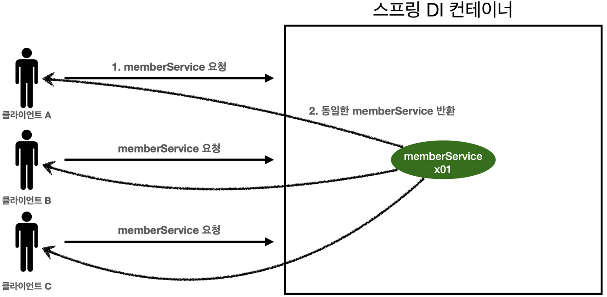
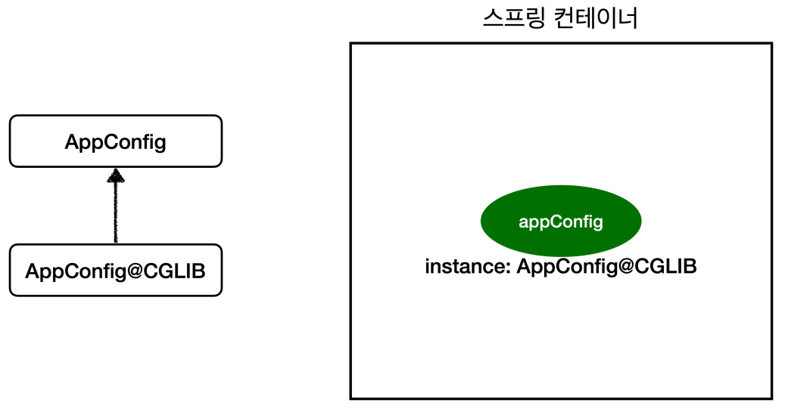

<a href="https://www.inflearn.com/course/%EC%8A%A4%ED%94%84%EB%A7%81-%ED%95%B5%EC%8B%AC-%EC%9B%90%EB%A6%AC-%EA%B8%B0%EB%B3%B8%ED%8E%B8" target="_blank">
  
</a>

```
본 시리즈는 인프런 김영한님의
'스프링 핵심 원리 - 기본편'
을 보고 공부용으로 작성한 것입니다.
```

<br>

<br>

<br>

# <span style="color: #D6ABFA;">⚪싱글톤 패턴</span>

## 🔹싱글톤 패턴이란?

- 클래스의 인스턴스가 딱 1개만 생성되는 것을 보장하는 디자인 패턴이다
- 그래서 객체 인스턴스를 2개 이상 생성하지 못하도록 막아야 한다
- 단순 코드로 구현할 때는 private 생성자를 사용해서 외부에서 임의로 new 키워드를 사용하지 못하도록 막아야 한다

```java
public class SingletonService {

    //1. static 영역에 객체를 딱 1개만 생성해둔다.
    private static final SingletonService instance = new SingletonService();

    //2. public으로 열어서 객체 인스턴스가 필요하면 이 static 메서드를 통해서만 조회하도록 허용한다.
    public static SingletonService getInstance() {
        return instance;
    }

    //3. 생성자를 private으로 선언해서 외부에서 new 키워드를 사용한 객체 생성을 못하게 막는다.
    private SingletonService() {
    }

    public void logic() {
        System.out.println("싱글톤 객체 로직 호출");
    }
}
```

1. static 영역에 객체 instance를 미리 하나 생성해서 올려둔다.
2. 이 객체 인스턴스가 필요하면 오직 getInstance() 메서드를 통해서만 조회할 수 있다. 이 메서드를 호 출하면 항상 같은 인스턴스를 반환한다.
3. 딱 1개의 객체 인스턴스만 존재해야 하므로, 생성자를 private으로 막아서 혹시라도 외부에서 new 키워드 로 객체 인스턴스가 생성되는 것을 막는다.

> **참고**
>
> 싱글톤 패턴을 구현하는 방법은 여러가지가 있다. 여기서는 객체를 미리 생성해두는 가장 단순하고 안전한 방법을 선택했다

## 🔹싱글톤 패턴 문제점

- 싱글톤 패턴을 구현하는 코드 자체가 많이 들어간다
- 의존관계상 클라이언트가 구체 클래스에 의존한다
- DIP를 위반한다
- 클라이언트가 구체 클래스에 의존해서 OCP 원칙을 위반할 가능성이 높다
- 테스트하기 어렵다. 내부 속성을 변경하거나 초기화 하기 어렵다
- private 생성자로 자식 클래스를 만들기 어렵다 
- 결론적으로 유연성이 떨어진다
- 안티패턴으로 불리기도 한다

<br>

<br>

<br>

# <span style="color: #D6ABFA;">⚪싱글톤 컨테이너</span>



- 스프링 컨테이너는 싱글톤 패턴의 문제점을 해결하면서, 객체 인스턴스를 싱글톤(1개만 생성)으로 관리한다
- 스프링 컨테이너는 싱글톤 컨테이너 역할을 한다. 이렇게 싱글톤 객체를 생성하고 관리하는 기능을 **싱글톤 레지스트리**라 한다
- 스프링 컨테이너의 이런 기능 덕분에 싱글턴 패턴의 모든 단점을 해결하면서 객체를 싱글톤으로 유지할 수 있다. 
  - 싱글톤 패턴을 위한 지저분한 코드가 들어가지 않아도 된다. 
  - DIP, OCP, 테스트, private 생성자로 부터 자유롭게 싱글톤을 사용할 수 있다

> **참고**
>
> 스프링의 기본 빈 등록 방식은 싱글톤이지만, 싱글톤 방식만 지원하는 것은 아니다. 요청할 때 마다 새로운 객체를 생성해서 반환하는 기능도 제공한다

<br>

<br>

<br>

# <span style="color: #D6ABFA;">⚪싱글톤 방식의 주의점</span>

- 싱글톤 패턴이든, 스프링 같은 싱글톤 컨테이너를 사용하든, 객체 인스턴스를 하나만 생성해서 공유하는 싱글톤 방식은 여러 클라이언트가 하나의 같은 객체 인스턴스를 공유하기 때문에 싱글톤 객체는 상태를 유지(stateful)하게 설계하면 안된다
- 무상태(stateless)로 설계해야 한다
  - 특정 클라이언트에 의존적인 필드가 있으면 안된다
  - 특정 클라이언트가 값을 변경할 수 있는 필드가 있으면 안된다!
  - 가급적 읽기만 가능해야 한다.
  - 필드 대신에 자바에서 공유되지 않는, 지역변수, 파라미터, ThreadLocal 등을 사용해야 한다
- 스프링 빈의 필드에 공유 값을 설정하면 정말 큰 장애가 발생할 수 있다!!

<br>

<br>

<br>

# <span style="color: #D6ABFA;">⚪@Configuration과 싱글톤</span>

```java
@Configuration
public class AppConfig {

    @Bean
    public MemberService memberService() {
        System.out.println("call AppConfig.memberService");
        return new MemberServiceImpl(memberRepository());
    }

    @Bean
    public MemberRepository memberRepository() {
        System.out.println("call AppConfig.orderService");
        return new MemoryMemberRepository();
    }

    @Bean
    public OrderService orderService() {
        System.out.println("call AppConfig.memberRepository");
        return new OrderServiceImpl(memberRepository(), discountPolicy());
    }

    @Bean
    public DiscountPolicy discountPolicy() {
        return new RateDiscountPolicy();
    }
}
```

이 상황에서 memberRepository()가 몇 번 호출될까?

1. 스프링 컨테이너가 스프링 빈에 등록하기 위해 @Bean이 붙어있는 memberRepository() 호출 
2. memberService() 로직에서 memberRepository() 호출 
3. orderService() 로직에서 memberRepository() 호출

이렇게 총 3번이라고 예상할수도 있음

그러나 실제로는 1번만 호출이 됨!

## 🔹@Configuration과 바이트코드 조작

스프링 컨테이너는 싱글톤 레지스트리다.

따라서 스프링 빈이 싱글톤이 되도록 보장해주어야 한다. 

그런데 스프링이 자바 코드까지 어떻게 하기는 어렵다. 저 자바 코드를 보면 분명 3번 호출되어야 하는 것이 맞다. 

그래서 스프링은 클래스의 바이트코드를 조작하는 라이브러리를 사용한다. 

모든 비밀은 ```@Configuration``` 을 적용한 AppConfig 에 있다

<br>

```java
@Test
void configurationDeep() {
 ApplicationContext ac = new
AnnotationConfigApplicationContext(AppConfig.class);
    
 //AppConfig도 스프링 빈으로 등록된다.
 AppConfig bean = ac.getBean(AppConfig.class);
 
 System.out.println("bean = " + bean.getClass());
 //출력: bean = class hello.core.AppConfig$$EnhancerBySpringCGLIB$$bd479d70
}
```

- 사실 ```AnnotationConfigApplicationContext``` 에 파라미터로 넘긴 값은 스프링 빈으로 등록된다
- 그래서 ```AppConfig``` 도 스프링 빈이 된다. ```AppConfig``` 스프링 빈을 조회해서 클래스 정보를 출력해보자
  - ``bean = class hello.core.AppConfig$$EnhancerBySpringCGLIB$$bd479d70``
  - 순수한 클래스라면 다음과 같이 출력되어야 한다. ``class hello.core.AppConfig``
  - 내가 만든 클래스가 아니라 스프링이 CGLIB라는 바이트코드 조작 라이브러리를 사용해서 AppConfig 클래스를 상속받은 임의의 다른 클래스를 만들고, 그 다른 클래스를 스프링 빈으로 등록한 것



CGLIB라는 바이트코드 조작 라이브러리를 사용하여 AppConfig를 상속한 클래스가 싱글톤이 보장되도록 해준다

아마도 다음과 같이 바이트 코드를 조작하여 작성되어 있을 것 (간소화 버전. 실제는 매우 복잡)

```java
//AppConfig@CGLIB 예상 코드
@Bean
public MemberRepository memberRepository() {
 
     if (memoryMemberRepository가 이미 스프링 컨테이너에 등록되어 있으면?) {
        return 스프링 컨테이너에서 찾아서 반환;
     } else { 
         //스프링 컨테이너에 없으면 기존 로직을 호출해서 MemoryMemberRepository를 생성하고 스프링 컨테이너에 등록
        return 반환
     }
}
```

- @Bean이 붙은 메서드마다 이미 스프링 빈이 존재하면 존재하는 빈을 반환하고, 스프링 빈이 없으면 생성해서 스프링 빈으로 등록하고 반환하는 코드가 동적으로 만들어진다
- 덕분에 싱글톤이 보장되는 것이다

> **참고** 
>
> AppConfig@CGLIB는 AppConfig의 자식 타입이므로, AppConfig 타입으로 조회 할 수 있다

## 🔹@Configuration 없이 @Bean만 적용한다면?

```@Configuration``` 을 붙이면 바이트코드를 조작하는 CGLIB 기술을 사용해서 싱글톤을 보장하지만, 만약 ```@Bean```만 적용하면 어떻게 될까?

```java
//@Configuration 제거
public class AppConfig {

    @Bean
    public MemberService memberService() {
        System.out.println("call AppConfig.memberService");
        return new MemberServiceImpl(memberRepository());
    }

    @Bean
    public MemberRepository memberRepository() {
        System.out.println("call AppConfig.orderService");
        return new MemoryMemberRepository();
    }

    @Bean
    public OrderService orderService() {
        System.out.println("call AppConfig.memberRepository");
        return new OrderServiceImpl(memberRepository(), discountPolicy());
    }

    @Bean
    public DiscountPolicy discountPolicy() {
        return new RateDiscountPolicy();
    }
}
```

```java
@Test
void configurationDeep() {
 ApplicationContext ac = new
AnnotationConfigApplicationContext(AppConfig.class);
    
 //AppConfig도 스프링 빈으로 등록된다.
 AppConfig bean = ac.getBean(AppConfig.class);
 
 System.out.println("bean = " + bean.getClass());
 //출력: bean = class hello.core.AppConfig
}
```

AppConfig가 CGLIB 기술 없이 순수한 AppConfig로 스프링 빈에 등록된 것을 확인할 수 있음

그리고

```java
call AppConfig.memberService
call AppConfig.memberRepository
call AppConfig.orderService
call AppConfig.memberRepository
call AppConfig.memberRepository
```

기존과는 다르게, MemberRepository가 1번이 아닌 총 3번이 호출된 것을 알 수 있음

<br>

인스턴스가 같은지 테스트해봤을때도

memberService스프링 빈에서 의존하는 memberRepository와 orderService 스프링 빈에서 의존하는 그것과, memberRepository스프링 빈 세개가 모두 다 다른 인스턴스인것을 알 수 있음

## 🔹정리

- ```@Bean```만 사용해도 스프링 빈으로 등록되지만, 싱글톤을 보장하지 않는다
  - memberRepository() 처럼 의존관계 주입이 필요해서 메서드를 직접 호출할 때 싱글톤을 보장하지 않는다
- 크게 고민할 것이 없다. 스프링 설정 정보는 항상 ```@Configuration``` 을 사용하자
