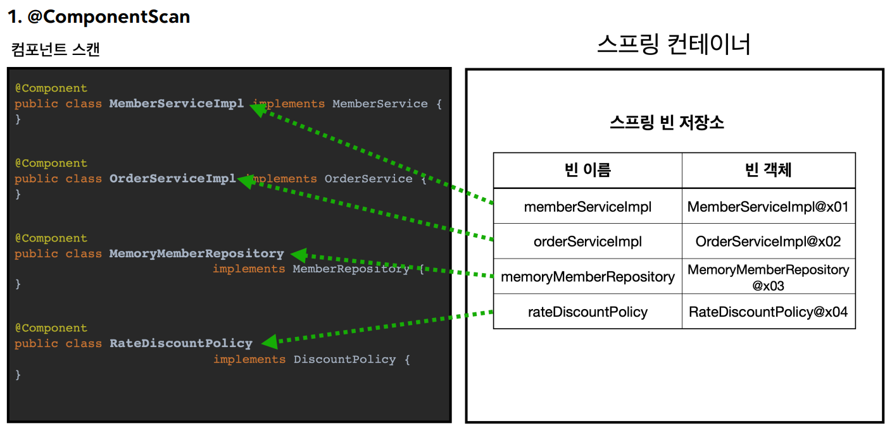
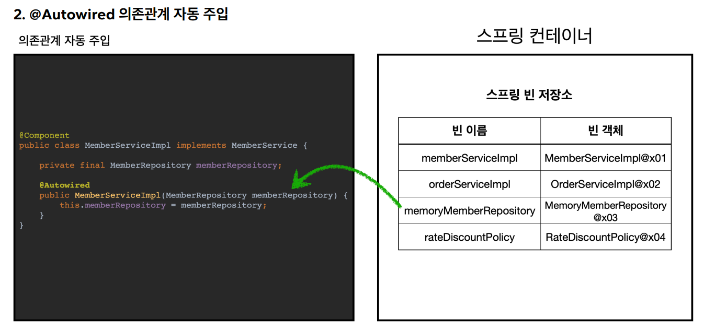
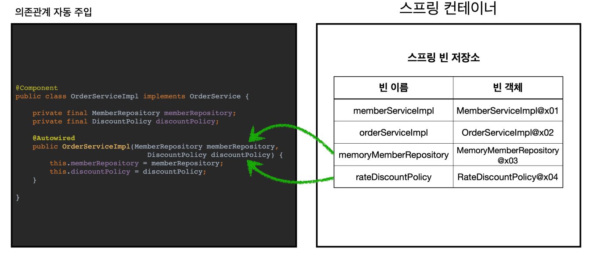

<a href="https://www.inflearn.com/course/%EC%8A%A4%ED%94%84%EB%A7%81-%ED%95%B5%EC%8B%AC-%EC%9B%90%EB%A6%AC-%EA%B8%B0%EB%B3%B8%ED%8E%B8" target="_blank">
  
</a>

```
본 시리즈는 인프런 김영한님의
'스프링 핵심 원리 - 기본편'
을 보고 공부용으로 작성한 것입니다.
```

<br>

<br>

<br>

# <span style="color: #D6ABFA;">⚪간단 사용법</span>

설정 정보에 자바 코드의 @Bean이나 XML의 \<bean\>등을 통해서 스프링빈을 직접 등록하는 것이 아닌 방식을 설명함

## 🔹@ComponentScan

```java
@Configuration
@ComponentScan(excludeFilters = @Filter(type = FilterType.ANNOTATION, classes = Configuration.class))
public class AutoAppConfig {

}
```

- 컴포넌트 스캔을 사용하려면 먼저 ```@ComponentScan``` 을 설정 정보에 붙여주면 된다
- 기존의 AppConfig와는 다르게 @Bean으로 등록한 클래스가 하나도 없다

> **참고** 
>
> 컴포넌트 스캔을 사용하면 @Configuration 이 붙은 설정 정보도 자동으로 등록되기 때문에,  AppConfig, TestConfig 등 앞서 만들어두었던 설정 정보도 함께 등록되고, 실행되어 버린다. 
>
> 그래서 excludeFilters 를 이용해서 설정정보는 컴포넌트 스캔 대상에서 제외했다. 
>
> 보통 설정 정보를 컴포넌트 스캔 대상에서 제외하지는 않지만, 기존 예제 코드를 최대한 남기고 유지하기 위해서 이 방법을 선택했다

## 🔹@Component

컴포넌트 스캔은 이름 그대로 ```@Component``` 애노테이션이 붙은 클래스를 스캔해서 스프링 빈으로 등록한다.  

> **참고**
>
> ```@Configuration``` 이 컴포넌트 스캔의 대상이 된 이유도 ```@Configuration``` 소스코드를 열어보면 ```@Component``` 애노테이션이 붙어있기 때문이다

```java
//MemoryMemberRepository에 @Component 추가
@Component
public class MemoryMemberRepository implements MemberRepository {}
```

## 🔹@AutoWired

```java
@Component
public class OrderServiceImpl implements OrderService {

    private final MemberRepository memberRepository;
    private final DiscountPolicy discountPolicy;

    @Autowired
    public OrderServiceImpl(MemberRepository memberRepository, DiscountPolicy discountPolicy) {
        this.memberRepository = memberRepository;
        this.discountPolicy = discountPolicy;
    }
}
```

- ```@Autowired``` 는 의존관계를 자동으로 주입해준다

## 🔹종합 사용법

```java
public class AutoAppConfigTest {

    @Test
    void basicScan(){
        ApplicationContext ac = new AnnotationConfigApplicationContext(AutoAppConfig.class);

        MemberService memberService = ac.getBean(MemberService.class);
        assertThat(memberService).isInstanceOf(MemberService.class);
    }
}
```

- ```AnnotationConfigApplicationContext``` 를 사용하는 것은 기존과 동일하다
- 설정 정보로 AutoAppConfig 클래스(@ComponentScan이 붙어있는 설정 정보)를 넘겨준다

<br>

<br>

<br>

# <span style="color: #D6ABFA;">⚪동작 과정</span>

## 🔹@ComponentScan



- ```@ComponentScan``` 은 ```@Component``` 가 붙은 모든 클래스를 스프링 빈으로 등록
- 이때 스프링 빈의 기본 이름은 클래스명을 사용하되 맨 앞글자만 소문자를 사용한다
  - **빈 이름 기본 전략** : MemberServiceImpl 클래스 memberServiceImpl
  - **빈 이름 직접 지정** : 만약 스프링 빈의 이름을 직접 지정하고 싶으면 ```@Component("memberService2")``` 이런식으로 이름을 부여하면 된다

## 🔹@Autowired



- 생성자에 ```@Autowired``` 를 지정하면, 스프링 컨테이너가 자동으로 해당 스프링 빈을 찾아서 주입
- 이때 기본 조회 전략은 타입이 같은 빈을 찾아서 주입
  - ```getBean(MemberRepository.class)``` 와 동일하다고 이해하면 된다



- 생성자에 파라미터가 많아도 다 찾아서 자동으로 주입

<br>

<br>

<br>

# <span style="color: #D6ABFA;">⚪탐색 위치</span>

```java
@ComponentScan(
 basePackages = "hello.core",
}
```

- ```basePackages``` : 탐색할 패키지의 시작 위치를 지정한다. 이 패키지를 포함해서 하위 패키지를 모두 탐색한다
  - ```basePackages = {"hello.core", "hello.service"}``` 이렇게 여러 시작 위치를 지정할 수도 있다
- ```basePackageClasses``` : 지정한 클래스의 패키지를 탐색 시작 위치로 지정한다
- 만약 지정하지 않으면 ```@ComponentScan``` 이 붙은 설정 정보 클래스의 패키지가 시작 위치
- 권장 방법은 스프링부트의 기본설정과 같은 패키지 위치를 지정하지 않고, 설정 정보 클래스의 위치를 프로젝트 최상단에 두는 것

(스프링 부트를 사용하면 스프링 부트의 대표 시작 정보인 ```@SpringBootApplication``` 를 이 프로젝트 시작 루트 위치에 두는 것이 관례이다. (그리고 이 설정안에 바로 ```@ComponentScan``` 이 들어있다!)

<br>

<br>

<br>

# <span style="color: #D6ABFA;">⚪컴포넌트 스캔 기본 대상</span>

컴포넌트 스캔은 @Component 뿐만 아니라 다음과 내용도 추가로 대상에 포함한다. 

해당 클래스의 소스 코드를 보면 @Component 를 포함하고 있는 것을 알 수 있다

- ```@Component``` : 컴포넌트 스캔에서 사용 
- ```@Controller``` : 스프링 MVC 컨트롤러에서 사용 
- ```@Service``` : 스프링 비즈니스 로직에서 사용 
- ```@Repository``` : 스프링 데이터 접근 계층에서 사용 
- ```@Configuration```: 스프링 설정 정보에서 사용

<div class="notice--warning" markdown="1">
**참고**   

사실 애노테이션에는 상속관계라는 것이 없음  
그래서 이렇게 애노테이션이 특정 애노테이션을 들고 있는 것을 인식할 수 있는 것은 자바 언어가 지원하는 기능은 아니고, 스프링이 지원하는 기능임  
</div>

컴포넌트 스캔의 용도 뿐만 아니라 애노테이션이 있으면 스프링은 부가 기능을 수행함

- ```@Controller``` : 스프링 MVC 컨트롤러로 인식 
- ```@Repository``` : 스프링 데이터 접근 계층으로 인식하고, 데이터 계층의 예외를 스프링 예외로 변환해준다. 
- ```@Configuration``` : 앞서 보았듯이 스프링 설정 정보로 인식하고, 스프링 빈이 싱글톤을 유지하도록 추가 처리 를 한다. 
- ```@Service``` : 사실 @Service 는 특별한 처리를 하지 않는다. 대신 개발자들이 핵심 비즈니스 로직이 여기에 있 겠구나 라고 비즈니스 계층을 인식하는데 도움이 된다.

<div class="notice--warning" markdown="1">

**참고**   

useDefaultFilters 옵션은 기본으로 켜져있는데, 이 옵션을 끄면 기본 스캔 대상들이 제외된다.  
그냥 이런 옵션이 있구나 정도 알고 넘어가자. 
</div>

<br>

<br>

<br>

# <span style="color: #D6ABFA;">⚪필터</span>

- ```includeFilters``` : 컴포넌트 스캔 대상을 추가로 지정함
- ```excludeFilters``` : 컴포넌트 스캔에서 제외할 대상을 지정함

## 🔹예제

```java
/**
컴포넌트 스캔 대상에 추가할 애노테이션
**/
@Target(ElementType.TYPE) //클래스 레벨에 붙는 어노테이션이라는 설정
@Retention(RetentionPolicy.RUNTIME)
@Documented
public @interface MyIncludeComponent {
}

/**
컴포넌트 스캔 대상에서 제외할 애노테이션
**/
@Target(ElementType.TYPE) //클래스 레벨에 붙는 어노테이션이라는 설정
@Retention(RetentionPolicy.RUNTIME)
@Documented
public @interface MyExcludeComponent {
}

/**
컴포넌트 스캔 대상에 추가할 클래스
**/
@MyIncludeComponent
public class BeanA {
}

/**
컴포넌트 스캔 대상에서 제외할 클래스
**/
@MyExcludeComponent
public class BeanB {
}


/**
설정 정보와 전체 테스트 코드
**/
public class ComponentFilterAppConfigTest {

    @Test
    void filterScan() {
        ApplicationContext ac = new AnnotationConfigApplicationContext(ComponentFilterAppconfig.class);
        BeanA beanA = ac.getBean("beanA", BeanA.class);
        assertThat(beanA).isNotNull();

        org.junit.jupiter.api.Assertions.assertThrows(
                NoSuchBeanDefinitionException.class,
                ()->ac.getBean("BeanB",BeanB.class)
        );
    }

    @Configuration
    @ComponentScan(
            includeFilters = @Filter(type = FilterType.ANNOTATION, classes = MyIncludeComponent.class),
            excludeFilters = @Filter(type = FilterType.ANNOTATION, classes = MyExcludeComponent.class)
    )
    static class ComponentFilterAppconfig{
    }
}
```

- ```includeFilters``` 에 ```MyIncludeComponent 애노테이션```을 추가해서 BeanA가 스프링 빈에 등록된다
- ```excludeFilters``` 에 ```MyExcludeComponent 애노테이션```을 추가해서 BeanB는 스프링 빈에 등록되지 않는다

## 🔹FilterType 옵션

FilterType은 5가지 옵션이 있다

- ```ANNOTATION``` : 기본값, 애노테이션을 인식해서 동작한다
  - ex) org.example.SomeAnnotation
- ```ASSIGNABLE_TYPE``` : 지정한 타입과 자식 타입을 인식해서 동작한다
  - ex) org.example.SomeClass
- ```ASPECTJ``` : AspectJ 패턴 사용
  - ex) org.example..*Service+
- ```REGEX``` : 정규 표현식
  - ex) org\.example\.Default.*
- ```CUSTOM``` : TypeFilter 이라는 인터페이스를 구현해서 처리
  - ex) org.example.MyTypeFilter

<br>

예를 들어서 BeanA도 빼고 싶으면 다음과 같이 추가하면 된다

```java
@ComponentScan(
     includeFilters = {
     	@Filter(type = FilterType.ANNOTATION, classes = MyIncludeComponent.class),
     },
     excludeFilters = {
     @Filter(type = FilterType.ANNOTATION, classes = MyExcludeComponent.class),
     @Filter(type = FilterType.ASSIGNABLE_TYPE, classes = BeanA.class)
     }
)
```

<div class="notice--warning" markdown="1">

**참고**   

**@Component** 면 충분하기 때문에, **includeFilters** 를 사용할 일은 거의 없다. 

**excludeFilters** 는 여러가지 이유로 간혹 사용할 때가 있지만 많지는 않다. 

특히 최근 스프링 부트는 컴포넌트 스캔을 기본으로 제공하는데, 개인적으로는 옵션을 변경하면서 사용하기 보다는 스프링의 기본 설정에 최대한 맞추어 사용하는 것을 권장하고, 선호하는 편

</div>

<br>

<br>

<br>

# <span style="color: #D6ABFA;">⚪중복 등록과 충돌</span>

컴포넌트 스캔에서 같은 빈 이름을 등록하면 어떻게 될까? 

다음 두가지 상황이 있다. 

1. **자동 빈 등록 vs 자동 빈 등록** 
2. **수동 빈 등록 vs 자동 빈 등록**

## 🔹자동 빈 등록 vs 자동 빈 등록

- 컴포넌트 스캔에 의해 자동으로 스프링 빈이 등록되는데, 그 이름이 같은 경우 스프링은 오류를 발생시킨다. 
  - ```ConflictingBeanDefinitionException``` 예외 발생

## 🔹수동 빈 등록 vs 자동 빈 등록

- 수동 빈 등록이 우선권을 가진다 (수동 빈이 자동 빈을 오버라이딩 해버림)

- 수동 빈 등록시 남는 로그

  - ```
    Overriding bean definition for bean '~~~' with a different 
    definition: replacing
    ```

- 스프링 부트에서는 수동 빈 등록과 자동 빈 등록이 충돌이 나면 에러가 나도록 기본값을 바꿨음

  - ```
    Consider renaming one of the beans or enabling overriding by setting 
    spring.main.allow-bean-definition-overriding=true
    ```

    
