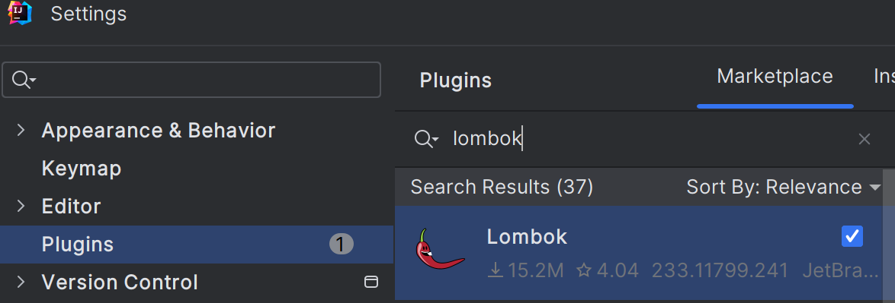
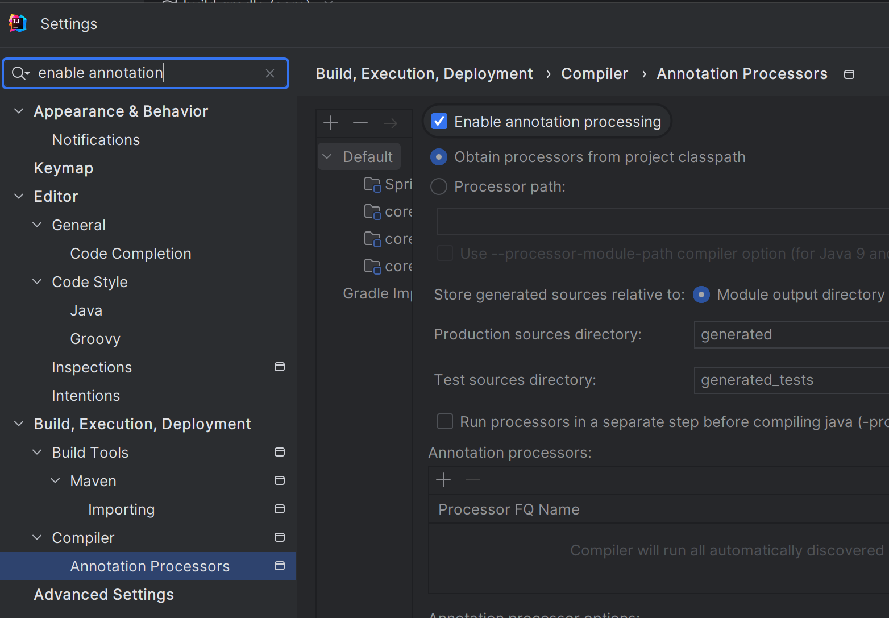

<a href="https://www.inflearn.com/course/%EC%8A%A4%ED%94%84%EB%A7%81-%ED%95%B5%EC%8B%AC-%EC%9B%90%EB%A6%AC-%EA%B8%B0%EB%B3%B8%ED%8E%B8" target="_blank">
  
</a>

```
본 시리즈는 인프런 김영한님의
'스프링 핵심 원리 - 기본편'
을 보고 공부용으로 작성한 것입니다.
```

<br>

<br>

<br>

# <span style="color: #D6ABFA;">⚪의존 관계 주입 방법</span>

<div class="notice--warning" markdown="1">

**참고**   

**@Autowired** 의 기본 동작은 주입할 대상이 없으면 오류가 발생한다. 

주입할 대상이 없어도 동작하게 하려면 **@Autowired(required = false)** 로 지정하면 된다

</div>

<div class="notice--warning" markdown="1">

**참고**   

의존관계 자동 주입은 스프링 컨테이너가 관리하는 스프링 빈이어야 동작한다.  

스프링 빈이 아닌 Member 같은 클래스에서 **@Autowired** 코드를 적용해도 아무 기능도 동작하지 않는다

</div>

## 🔹생성자 주입

```java
@Component
public class OrderServiceImpl implements OrderService {
    
	private final MemberRepository memberRepository;
	private final DiscountPolicy discountPolicy;
    
 	@Autowired
	public OrderServiceImpl(MemberRepository memberRepository, DiscountPolicy discountPolicy) {
 		this.memberRepository = memberRepository;
		this.discountPolicy = discountPolicy;
	}
}
```

- 생성자가 딱 1개만 있으면 @Autowired를 생략해도 자동 주입 됨 (물론 스프링 빈에만 해당)
- 생성자 호출시점에 딱 1번만 호출되는 것이 보장
- **불변, 필수** 의존관계에 사용

## 🔹수정자 주입(setter 주입)

```java
@Component
public class OrderServiceImpl implements OrderService {
    
     private MemberRepository memberRepository;
     private DiscountPolicy discountPolicy;
    
     @Autowired
     public void setMemberRepository(MemberRepository memberRepository) {
     	this.memberRepository = memberRepository;
     }
    
     @Autowired
     public void setDiscountPolicy(DiscountPolicy discountPolicy) {
     	this.discountPolicy = discountPolicy;
     }
}

```

- setter라 불리는 필드의 값을 변경하는 수정자 메서드를 통해서 의존관계를 주입하는 방법
- 특징 
  - **선택, 변경** 가능성이 있는 의존관계에 사용 
  - 자바빈 프로퍼티 규약의 수정자 메서드 방식을 사용하는 방법

## 🔹필드 주입

```java
@Component
public class OrderServiceImpl implements OrderService {
    
     @Autowired
     private MemberRepository memberRepository;
    
     @Autowired
     private DiscountPolicy discountPolicy;
}
```

- DI 프레임워크가 없으면 아무것도 할 수 없다
- 외부에서 변경이 불가능해서 테스트 하기 힘들다는 치명적인 단점
- 사용하지 말자 (테스트코드나 스프링 설정을 목적으로 하는 @Configuration 같은 곳에서만 특별한 용도로 사용)

## 🔹@Bean에서 파라미터

```java
@Bean
OrderService orderService(MemberRepository memberRepoisitory, DiscountPolicy discountPolicy) {
 	return new OrderServiceImpl(memberRepository, discountPolicy);
}
```

- 다음 코드와 같이 @Bean 에서 파라미터에 의존관계는 자동 주입됨

## 🔹일반 메서드 주입

```java
@Component
public class OrderServiceImpl implements OrderService {
    
     private MemberRepository memberRepository;
     private DiscountPolicy discountPolicy;
    
     @Autowired
     public void init(MemberRepository memberRepository, DiscountPolicy discountPolicy) {
         this.memberRepository = memberRepository;
         this.discountPolicy = discountPolicy;
     }
}
```

- 한번에 여러 필드를 주입 받을 수 있다
- 일반적으로 잘 사용하지 않는다

<br>

<br>

<br>

# <span style="color: #D6ABFA;">⚪옵션 처리</span>

주입할 스프링 빈이 없어도 동작해야 할 때,

```@Autowired``` 만 사용하면 ```required``` 옵션의 기본값이 ```true``` 로 되어 있어서 자동 주입 대상이 없으면 오류가 발생한다

<br>

자동 주입 대상을 옵션으로 처리하는 방법은 다음과 같다

- ```@Autowired(required=false)``` : 자동 주입할 대상이 없으면 수정자 메서드 자체가 호출 안됨
- ```org.springframework.lang.@Nullable``` : 자동 주입할 대상이 없으면 null이 입력된다
- ```Optional<>``` : 자동 주입할 대상이 없으면 Optional.empty 가 입력된다

예제)

```java
    @Test
    void ttest(){
        ApplicationContext ac = new AnnotationConfigApplicationContext(AppConfigTest.class);
    }

    @Configuration
    public static class AppConfigTest {

        //호출 안됨
        @Autowired(required = false)
        public void setNoBean1(Member member) {
            System.out.println("setNoBean1 = " + member);
        }
        
        //null 호출
        @Autowired
        public void setNoBean2(@Nullable Member member) {
            System.out.println("setNoBean2 = " + member);
        }
        
        //Optional.empty 호출
        @Autowired(required = false)
        public void setNoBean3(Optional<Member> member) {
            System.out.println("setNoBean3 = " + member);
        }
    }
```

출력)

```
setNoBean2 = null
setNoBean3 = Optional.empty
```

- Member는 스프링 빈이 아님
- ```setNoBean1()``` 은 ```@Autowired(required=false)``` 이므로 호출 자체가 안된다

>**참고**
>
>@Nullable, Optional은 스프링 전반에 걸쳐서 지원된다. 
>
>예를 들어서 생성자 자동 주입에서 특정 필드에만 사용해도 된다.

<br>

<br>

<br>

# <span style="color: #D6ABFA;">⚪생성자 주입을 선택해라!</span>

## 🔹불변

- 대부분의 의존관계 주입은 한번 일어나면 애플리케이션 종료시점까지 의존관계를 변경할 일이 없다. 오히려 대부 분의 의존관계는 애플리케이션 종료 전까지 변하면 안된다.(불변해야 한다.)
- 수정자 주입을 사용하면, setXxx 메서드를 public으로 열어두어야 한다
- 누군가 실수로 변경할 수 도 있고, 변경하면 안되는 메서드를 열어두는 것은 좋은 설계 방법이 아니다
- 생성자 주입은 객체를 생성할 때 딱 1번만 호출되므로 이후에 호출되는 일이 없다. 따라서 **불변**하게 설계할 수 있 다

## 🔹누락

```java
public class OrderServiceImpl implements OrderService {
    
     private MemberRepository memberRepository;
     private DiscountPolicy discountPolicy;
    
     @Autowired
     public void setMemberRepository(MemberRepository memberRepository) {
     	this.memberRepository = memberRepository;
     }
    
     @Autowired
     public void setDiscountPolicy(DiscountPolicy discountPolicy) {
     	this.discountPolicy = discountPolicy;
     }
     //...
}
```

- 수정자 주입을 사용할 경우, @Autowired 가 프레임워크 안에서 동작할 때는 의존관계가 없으면 오류가 발생하지만,  프레임워크 없이 순수한 자바 코드로만 단위 테스트를 할떄는 NPE가 발생할 가능성이 큼
- 반면 생성자 주입의 경우에는, 컴파일 오류가 발생하기 때문에, 누락할 가능성을 원천 차단

## 🔹final 키워드

```java
@Component
public class OrderServiceImpl implements OrderService {
    
     private final MemberRepository memberRepository;
     private final DiscountPolicy discountPolicy;
    
     @Autowired
     public OrderServiceImpl(MemberRepository memberRepository, DiscountPolicy discountPolicy) {
     	this.memberRepository = memberRepository;
     }
     //...
}
```

- 생성자 주입을 사용하면 필드에 ```final``` 키워드를 사용할 수 있다. 그래서 생성자에서 혹시라도 값이 설정되지 않는 오류를 컴파일 시점에 막아준다
- 잘 보면 필수 필드인 ```discountPolicy``` 에 값을 설정해야 하는데, 이 부분이 누락되었다. 자바는 컴파일 시점에 다음 오류를 발생시킨다
- ```java: variable discountPolicy might not have been initialized```
- 기억하자! 컴파일 오류는 세상에서 가장 빠르고, 좋은 오류다!

> **참고**
>
> 수정자 주입을 포함한 나머지 주입 방식은 모두 생성자 이후에 호출되므로, 필드에 final 키워드를 사용 할 수 없다. 
>
> 오직 생성자 주입 방식만 final 키워드를 사용할 수 있다

## 🔹정리

- 생성자 주입 방식을 선택하는 이유는 여러가지가 있지만, 프레임워크에 의존하지 않고, 순수한 자바 언어의 특징 을 잘 살리는 방법이기도 하다. 
- 기본으로 생성자 주입을 사용하고, 필수 값이 아닌 경우에는 수정자 주입 방식을 옵션으로 부여하면 된다. 생성자 주입과 수정자 주입을 동시에 사용할 수 있다. 
- 항상 생성자 주입을 선택해라! 그리고 가끔 옵션이 필요하면 수정자 주입을 선택해라. 필드 주입은 사용하지 않는 게 좋다

<br>

<br>

<br>

# <span style="color: #D6ABFA;">⚪롬복 라이브러리</span>

어노테이션만 추가해주는 것으로

getter, setter등을 자동으로 추가해 줘서 코드가 깔끔해지고

생성자주입도 자동으로 구현해주는등 여러모로 편리해서 사용을 많이 함

## 🔹적용 방법

### 🔸build.gradle에 라이브러리 및 환경 추가

```groovy
plugins {
	id 'java'
	id 'org.springframework.boot' version '3.2.0'
	id 'io.spring.dependency-management' version '1.1.4'
}

group = 'hello'
version = '0.0.1-SNAPSHOT'

java {
	sourceCompatibility = '21'
}

//lombok 설정 추가 시작
configurations {
	compileOnly {
		extendsFrom annotationProcessor
	}
}
//lombok 설정 추가 끝


repositories {
	mavenCentral()
}

dependencies {
	implementation 'org.springframework.boot:spring-boot-starter'

	//lombok 라이브러리 추가 시작
	compileOnly 'org.projectlombok:lombok'
	annotationProcessor 'org.projectlombok:lombok'
	testCompileOnly 'org.projectlombok:lombok'
	testAnnotationProcessor 'org.projectlombok:lombok'
	//lombok 라이브러리 추가 끝

	testImplementation 'org.springframework.boot:spring-boot-starter-test'
}

tasks.named('test') {
	useJUnitPlatform()
}
```

### 🔸file-setting-plugins에 Lombok 추가



### 🔸Preferences -> Annotation Processors 검색 -> Enable annotation processing 체크 (재시작)



### 🔸@Getter, @Setter 사용되는지 확인

<br>

## 🔹유용한 사용법

```java
Component
public class OrderServiceImpl implements OrderService {
    
     private final MemberRepository memberRepository;
     private final DiscountPolicy discountPolicy;

     //@Autowired  생성자가 1개이기 때문에 생략 가능
     public OrderServiceImpl(MemberRepository memberRepository, DiscountPolicy discountPolicy) {
         this.memberRepository = memberRepository;
         this.discountPolicy = discountPolicy;
     }
}
```

이 코드에 롬복 라이브러리를 적용

롬복 라이브러리가 제공하는 ```@RequiredArgsConstructor``` 기능을 사용하면 final이 붙은 필드를 모아서 생 성자를 자동으로 만들어준다. 
 (다음 코드에는 보이지 않지만 실제 호출 가능하다.)

<br>

```java
@Component
@RequiredArgsConstructor
public class OrderServiceImpl implements OrderService {
     private final MemberRepository memberRepository;
     private final DiscountPolicy discountPolicy;
}
```

- 이 최종결과 코드와 이전의 코드는 완전히 동일하다

- 롬복이 자바의 애노테이션 프로세서라는 기능을 이용해서 컴파일 시점에 생성자 코드를 자동으로 생성해준다

- 실제 ```class``` 를 열어보면 다음 코드가 추가되어 있는 것을 확인할 수 있다

  ```java
  public OrderServiceImpl(MemberRepository memberRepository, DiscountPolicy discountPolicy) {
       this.memberRepository = memberRepository;
       this.discountPolicy = discountPolicy;
  }
  ```

## 🔹정리

최근에는 생성자를 딱 1개 두고, @Autowired 를 생략하는 방법을 주로 사용한다. 

여기에 Lombok 라이브러리의 @RequiredArgsConstructor 함께 사용하면 기능은 다 제공하면서, 코드는 깔끔하게 사용할 수 있다

<br>

<br>

<br>

# <span style="color: #D6ABFA;">⚪의존관계 자동주입때 중복 처리</span>

스프링 빈을 수동등록해서 문제를 해결해도 되지만, 의존 관계 자동 주입에서 해결하는 방법

```java
@Autowired
private DiscountPolicy discountPolicy
```

```@Autowired```는 타입으로 조회하기 떄문에 DiscountPolicy의 구현체인 FixDiscountPolicy , RateDiscountPolicy 둘다 스프링 빈으로 등록되어 있을 경우 ```NoUniqueBeanDefinitionException``` 오류가 발생함


## 🔹@Autowired 필드,파라미터 명 매칭

```@Autowired```는 타입 매칭을 시도하고, 이때 여러 빈이 있으면 필드 이름, 파라미터 이름으로 빈 이름을 추가 매칭함

**기존 코드**

```java
@Autowired
private DiscountPolicy discountPolicy
```

**필드명을 빈 이름으로 변경**

```java
@Autowired
private DiscountPolicy rateDiscountPolicy
```

> 타입 매칭을 먼저 한 결과가 2개 이상일때만 필드,파라미터 명으로 빈을 매칭함

## 🔹@Qualifier 사용

추가 구분자를 붙여주는 방법

주입시 추가적인 방법을 제공하는 것이지 빈 이름을 변경하는 것은 아님

**빈 등록시 @Qualifier를 붙여 준다**

```java
@Component
@Qualifier("mainDiscountPolicy")
public class RateDiscountPolicy implements DiscountPolicy {}


@Component
@Qualifier("fixDiscountPolicy")
public class FixDiscountPolicy implements DiscountPolicy {}


//직접 빈 등록시에도 동일하게 사용 간으
@Bean
@Qualifier("mainDiscountPolicy")
public DiscountPolicy discountPolicy() {
	return new ...
}
```

**주입시에 @Qualifier를 붙여주고 등록한 이름을 적어준다**

```java
//생성자 자동 주입 예시
@Autowired
public OrderServiceImpl(MemberRepository memberRepository, @Qualifier("mainDiscountPolicy") DiscountPolicy 		discountPolicy) {
     this.memberRepository = memberRepository;
     this.discountPolicy = discountPolicy;
}


//수정자 자동 주입 예시
@Autowired
public DiscountPolicy setDiscountPolicy(@Qualifier("mainDiscountPolicy") DiscountPolicy discountPolicy) {
     this.discountPolicy = discountPolicy;
}
```

<br>

```@Qualifier``` 로 주입할 때 ```@Qualifier("mainDiscountPolicy")```를 못찾으면 어떻게 될까? 

그러면  mainDiscountPolicy라는 이름의 스프링 빈을 추가로 찾는다. 

하지만 경험상 ```@Qualifier``` 는 ```@Qualifier``` 를 찾는 용도로만 사용하는게 명확하고 좋다

> 1. @Qualifier끼리 매칭
> 2. @Qualifier에 문자로 빈 이름 검색
> 3. NoSuchBeanDefinitionException 예외 발생

## 🔹@Primary 사용

```@Autowired```을 썼을때 여러 빈이 매칭되면 ```@Primary```가 우선권을 가진다

<br>

**rateDiscountPolicy** 가 우선권을 가지도록 한 예시

```java
@Component
@Primary
public class RateDiscountPolicy implements DiscountPolicy {}


@Component
public class FixDiscountPolicy implements DiscountPolicy {}
```

**사용 코드**

```java
//생성자
@Autowired
public OrderServiceImpl(MemberRepository memberRepository, DiscountPolicy discountPolicy) {
     this.memberRepository = memberRepository;
     this.discountPolicy = discountPolicy;
}

//수정자
@Autowired
public DiscountPolicy setDiscountPolicy(DiscountPolicy discountPolicy) {
 	this.discountPolicy = discountPolicy;
}
```

## 🔹@Primary, @Qualifier 활용

코드에서 자주 사용하는 메인 데이터베이스의 커넥션을 획득하는 스프링 빈이 있고, 코드에서 특별한 기능으로 가끔 사용하는 서브 데이터베이스의 커넥션을 획득하는 스프링 빈이 있다고 생각해보자. 

메인 데이터베이스의 커넥션을 획득하는 스프링 빈은 ```@Primary``` 를 적용해서 조회하는 곳에서 ```@Qualifier``` 지정 없이 편리하게 조회하고, 서브 데이터베이스 커넥션 빈을 획득할 때는 ```@Qualifier``` 를 지정해서 명시적으로 획득 하는 방식으로 사용하면 코드를 깔끔하게 유지할 수 있다. 

물론 이때 메인 데이터베이스의 스프링 빈을 등록할 때 ```@Qualifier``` 를 지정해주는 것은 상관없다

## 🔹@Primary, @Qualifier우선 순위

```@Primary``` 는 기본값 처럼 동작하는 것이고, ```@Qualifier``` 는 매우 상세하게 동작한다. 

이런 경우 어떤 것이 우선권을 가져갈까? 

스프링은 자동보다는 수동이, 넒은 범위의 선택권 보다는 좁은 범위의 선택권이 우선 순위가 높다. 

따라서 여기서도 ```@Qualifier``` 가 우선권이 높다

## 🔹애노테이션 직접 만들기 

@Qualifier("mainDiscountPolicy") 이렇게 문자를 적으면 컴파일시 타입 체크가 안된다. 

다음과 같은 애노테이션을 만들어서 문제를 해결할 수 있다.

```java
//사용자 정의 애노테이션 생성
@Target({ElementType.FIELD, ElementType.METHOD, ElementType.PARAMETER, ElementType.TYPE, ElementType.ANNOTATION_TYPE})
@Retention(RetentionPolicy.RUNTIME)
@Inherited
@Documented
@Qualifier("mainDiscountPolicy")
public @interface MainDiscountPolicy {
}


```

